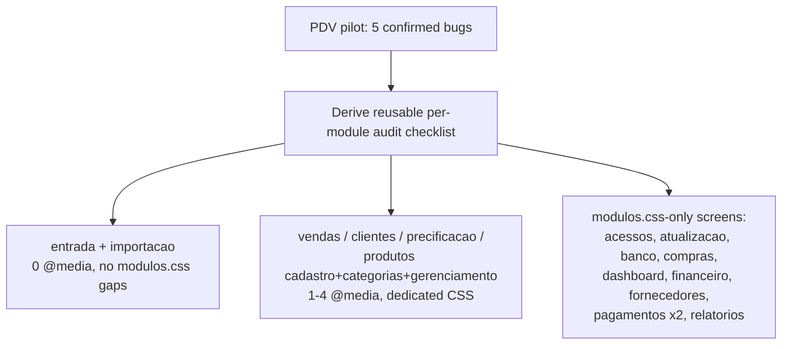
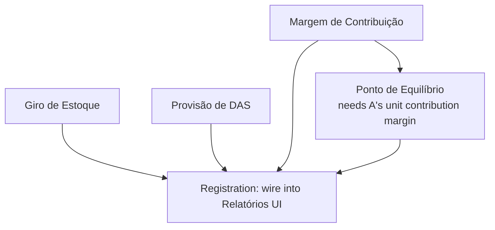

# GOALS.md — ALLU ERP

Master plan for taking this project from "good, works for the owner" to "production-grade,
safe to run unattended in a small retail store." Written for both a human reviewer and a
future `/buildproject`-style execution pass — each item should be checkable without
re-researching the codebase.

**Project**: Offline desktop ERP for a Jiu-Jitsu retail store (ALLU). Electron + Node.js +
SQLite (SQLCipher) + vanilla HTML/CSS/JS. No backend server, no cloud dependency — single
`.exe` installer, single local encrypted database file. Current version `v1.0.5`
(package.json), 21 tables in `db/schema.js`, 17 IPC domains, 18 frontend modules.
Full inventory: `graphify-out/GRAPH_REPORT.md` (1800 nodes / 4267 edges / 180 communities,
built from commit `16df208`).

This file only lists what's incomplete, fragile, or missing. Fully working areas (PDV,
produtos, clientes, fornecedores, compras, entrada de estoque, vendas, financeiro,
precificação, relatórios, acessos, dashboard, backup/restore, auto-update) are **not**
repeated here — see `AGENTS.md` §"Funcionalidades Implementadas" for that list.

---

## P0 — Broken or half-wired right now

- [x] **Fix `window.api` (the whole preload/contextBridge API) unavailable inside every
      dashboard tab.** Owner-reported 2026-08-19: "Fornecedores" threw `Erro: API indisponível:
      salvarFornecedor` on save, and its list showed `API indisponível.` instead of data —
      screenshot attached. Investigated instead of patching just Fornecedores, since the error
      pattern (a generic "API indisponível: <nome>" thrown by `modules/core/banco.js`'s
      `invocar()` helper whenever `typeof window.api[nome] !== "function"`) smelled structural,
      not module-specific. **Confirmed live** (a throwaway script drove the real dashboard →
      clicked the actual Fornecedores sidebar link → inspected the resulting `<iframe>`'s frame
      context directly): `typeof window.api` inside the iframe was `undefined`, while
      `typeof window.erpBanco` was `object` — `banco.js`'s `var api = window.api || {}` had
      silently fallen back to `{}` in that frame, so every single `erpBanco.*` call in it was
      doomed before the page even rendered. Root cause: `main.js`'s `BrowserWindow` sets
      `nodeIntegrationInSubFrames: false`, which (confirmed by flipping it and re-running the
      same live check) also blocks the **preload script itself** — not just raw Node APIs —
      from running inside `<iframe>`s. `modules/dashboard/abas.js` opens PDV, Clientes, Compras,
      Fornecedores, Financeiro, Relatórios, Acessos, Banco, Importação and Atualização **all**
      as real `<iframe>`s (`?embedded=1`) inside the dashboard's tab system — so this broke
      `window.api` in **10 of the app's modules whenever opened via the sidebar tabs**, not just
      Fornecedores; the owner just happened to hit "salvar" first. Not a new regression from
      anything this session touched — pre-existing in the tabbed-workspace feature (part of the
      other PC's sidebar/tabs refactor pulled in earlier this session) and, per my own earlier
      PDV verification in this same session, previously masked because I'd been loading
      `pdv.html` directly as the top-level page instead of through the real tab flow.
      **Fix**: `nodeIntegrationInSubFrames: true` in `main.js` (`criarJanelaPrincipal`) — safe
      here specifically because every iframe `src` in `abas.js` is a hardcoded first-party path
      from the app's own bundle (`MODULOS_ABA`), never a remote or user-controlled URL;
      `nodeIntegration` itself stays `false` and `contextIsolation` stays `true`, so this doesn't
      grant raw Node access anywhere — it only lets the same already-curated, safe
      `contextBridge` API also reach these first-party iframes. Verified end-to-end: submitted a
      real supplier through the actual UI (Fornecedores → Salvar Fornecedor) and got "✓ Sucesso
      — Fornecedor salvo!" with the row appearing in the list. `npm test` (35/35) and
      `npm run lint` (0 warnings) still clean after the change.
- [x] **Fix `Pagamentos` table missing from auto-migration.** `db/pagamentos.js` (added in the
      last commit, `16df208`) queries a `pagamentos` table that only exists as a `CREATE TABLE`
      statement written inside a *comment* in that file — it is never executed. Every other
      table lives in `db/schema.js:iniciarBanco()`, which runs `CREATE TABLE IF NOT EXISTS` for
      all 21 tables on every app start (idempotent auto-migration). `pagamentos` was never added
      to that list. **Result: the recebimentos (Pix/Boleto) feature will throw `no such table:
      pagamentos` on any machine that didn't have the SQL run by hand**, including the owner's
      production install once this update ships.
      - Move the `CREATE TABLE` from the comment into `db/schema.js:iniciarBanco()`, matching
        the style of the other 21 tables (same file, same function, `IF NOT EXISTS`).
      - Match column types to what's actually queried in `db/pagamentos.js` (uses `venda_id`,
        `cliente_id`, `metodo`, `numero_identificador`, `data_recebimento`, `valor_recebido`,
        `status`, `observacao`, `criado_em`).
      - Note the FK comment claims `cliente_id` references `usuarios(id)` — confirm that's not
        a copy-paste of `vendas(cliente_id)` referencing `Clientes(id)` instead; check
        `db/vendas.js`/`db/clientes.js` for the real convention before committing the FK target.
      - Re-run `node scripts/test-db.js` (or a new smoke test) against a fresh temp DB after the
        fix to confirm `listar-pagamentos` / `listar-pagamentos-pendentes` work from zero state.
- [x] **Verify `exigirSessao()` levels on `ipc/pagamentos.js` are intentional.** Fixed a deeper
      bug than "verify": the file had reimplemented its own local `exigirSessao` instead of
      using the shared one from `deps` (the pattern every other `ipc/*.js` file follows) — the
      local version ignored the `perfil` argument and, worse, didn't reject calls with **no**
      session at all, so an unauthenticated renderer could call `listar-pagamentos` etc.
      Replaced it with `const { exigirSessao } = deps;`, matching every other IPC domain; the
      existing `exigirSessao()` / `exigirSessao("admin")` call sites were already reasonable
      once backed by the real function.

## Backend (main process / IPC / db layer)

- [x] IPC handlers organized one file per domain (`ipc/*.js`), registered in `main.js`,
      exposed selectively via `preload.js` (`contextBridge`) — solid pattern, keep it for new
      domains.
- [x] Atomic stock guard on checkout (`UPDATE ... WHERE quantidade_estoque >= ?`) with
      rollback — already correct for the highest-risk write path.
- [x] **Add a real schema/migration versioning mechanism.** Added `VERSAO_SCHEMA` constant +
      `obterVersaoSchema()` in `db/schema.js`; `iniciarBanco()` now sets `PRAGMA user_version`
      after every migration in the function runs successfully (so a mid-failure boot never
      advances the marker — safe, since the migrations above are already idempotent and will
      just retry next launch). Re-exported through `database.js` (`obterVersaoSchema`,
      `VERSAO_SCHEMA`) for future code that wants to check "this DB predates feature X." Covered
      by `test/backup.test.js` ("PRAGMA user_version é gravado no boot e reflete
      VERSAO_SCHEMA"). No rollback mechanism added — out of scope per this item's own "low
      effort" framing; the marker alone is what was asked for.
- [x] ~~"Centralize error logging expectations"~~ — `main.js` already had `logErro()` +
      `CAMINHO_LOG_ERRO()` catching `window.onerror` / unhandled rejections; `AGENTS.md`'s
      backlog line claiming this was still pending was stale and has been corrected.
      Still open: confirm renderer-side errors in **all** modules (not just the ones wired
      through `modules/core/head.js`) reach this logger, and add a lightweight way for the
      owner to export the error log from the UI (e.g. a button in `modules/banco/` or
      `modules/atualizacao/`) without needing filesystem access.

## Database

- [x] SQLCipher encryption at rest, per-user key wrapping (AES-256-GCM), scrypt-based
      password hashing with legacy SHA-256 migration path (`db/usuarios.js`) — this part is
      done well.
- [x] ~~"Strengthen the DB unlock key derivation"~~ — **checked, not actually a gap.**
      `db/conexao.js:derivarChave()` SHA-256-hashes the password before handing it to
      `PRAGMA key = '<hex>'` as a quoted string, not `x'<hex>'` raw-key syntax — so SQLCipher
      treats it as a passphrase and runs its own PBKDF2-HMAC-SHA512 key stretching on top
      (confirmed: `PRAGMA cipher_version` → `4.4.2 community`, `PRAGMA cipher_default_kdf_iter`
      → `256000`, no `cipher_compatibility` downgrade anywhere in the codebase). The SHA-256
      pre-hash is just namespacing, not the thing standing between an attacker and the key —
      SQLCipher's own 256k-iteration KDF is. Initial read of this file missed that layer;
      correcting it here instead of "hardening" a path that was already sound, which would have
      added real risk (touching the unlock path of a production encrypted DB) for no actual
      security gain.
- [x] **Add `PRAGMA user_version`** — same item as Backend above, done there (`db/schema.js`).
- [x] **Automated daily backups — retention/pruning added, restore now tested end-to-end.**
      Confirmed the gap was real: `backupAutomatico()` (`db/sistema.js`) wrote one dated file
      per day forever, with zero pruning — a year of daily use would leave 365+ full DB copies
      on disk. Added `podarBackupsAutomaticosAntigos()`: keeps 30 days of automatic backups
      (`backup_YYYY-MM-DD.sqlite`), called at the end of every `backupAutomatico()` run. Deliberately
      scoped to *only* the automatic-daily filename pattern — a manual `exportBackup()`
      (`backup_<epoch>.sqlite`) is never auto-deleted, since the owner triggered that copy on
      purpose. `test/backup.test.js` now covers: export produces a real non-empty file; daily
      auto-backup doesn't duplicate same-day; **restore round-trip** (insert row → backup →
      insert another row → `importBackup` → confirm only the pre-backup row survives, proving
      restore returns to the exact backed-up state, not a merge); pruning removes an expired
      automatic backup while leaving a fresh one and a manual one untouched. All 5 pass.

## Frontend

- [x] Consistent per-page structure (`modules/<domain>/<domain>.js` + `.html` + shared
      `modules/core/*`), dark theme, shared navbar, `window.erpBanco` as the one blessed access
      layer for new code — good, keep extending new modules this way rather than falling back
      to raw `window.api.*`.
- [x] **Clear the ESLint warnings** — `npm run lint` now reports 0 errors / 0 warnings. Beyond
      unused `catch` params (switched to parameter-less `catch {}`, ES2019 optional catch
      binding — all bodies confirmed not to reference the caught error), found and removed
      several genuinely dead code paths this surfaced: `modules/pdv/pdv.js:buscarESku()` was a
      whole unused legacy search path still calling `window.api.buscarSKU` directly (bypassing
      the `window.erpBanco.*` convention) with leftover `DEBUG:` alerts; `modules/produtos/
      cadastro.js:carregarCategorias()` duplicated logic already live via
      `erpCategoryStore.onChange(...)`; three `*PDV02` functions (`db/clientes.js`,
      `db/produtos.js`, `db/vendas.js`) are deliberately-kept-but-unexported legacy code per an
      existing in-file comment — left in place, documented with a matching comment +
      `eslint-disable-next-line` instead of deleted, respecting that prior decision.
- [x] ~~**Retail-flow backlog from `AGENTS.md`**~~ — **checked, already built, `AGENTS.md` was
      stale.** All three items AGENTS.md listed as remaining backlog are fully implemented and
      wired to real logic, not just markup: automatic change/troco calculation
      (`modules/pdv/pdv.js:atualizarTroco()` — computes against `totalCarrinho()`, live on
      input, shown in the receipt too), customer search inside PDV (`clienteBusca` input with a
      live-filtered results dropdown, same file), product images
      (`modules/produtos/cadastro.js` — `escolherImagem`/`removerImagem`/preview, backed by
      `window.erpBanco.produtos.imagem`). Corrected the stale line in `AGENTS.md` (§"Próximos
      Passos") to point here instead of listing these as open work.
- [ ] UI/UX polish backlog from `AGENTS.md` ("ícones vetoriais, tipografia refinada") — superseded
      by the concrete, screen-by-screen fix pass below (owner reported specific broken-looking
      screens on 2026-08-19, not just general polish); see **Frontend Visual/UX Fix Pass** section.

## Frontend Visual/UX Fix Pass (PDV pilot → screen-by-screen rollout) — in progress

**Why this section exists:** owner-reported on 2026-08-19, with screenshots of Frente de Caixa
(PDV) in light and dark mode: broken search-icon glyph, no responsive layout, dark mode only
partially applying, and the "Devolução / Troca" button clipped off the bottom of the screen.
Owner's own framing: fix screens one at a time, in separate sessions, per module — "se não vira
uma bola de neve" (otherwise it snowballs) — and use whichever module is fixed first to make the
rest easier. This section is scoped as **fix** (concrete, reproducible, currently-broken
behavior), not a redesign — no new visual language, no component-library rewrite, just repair
what's demonstrably broken per screen.

### PDV (Frente de Caixa) — pilot module, confirmed bugs

Investigated directly (code read, not guessed) against `modules/pdv/pdv.html`,
`modules/pdv/pdv.css`, and `modules/core/navbar.js` (which injects the app's dark-theme
stylesheet at runtime). PDV is architecturally the outlier here: of 21 HTML pages, it's one of
only two (with `auth/login.html`, expected to differ) that does **not** link
`modules/core/modulos.css` — every other module screen inherits that file's shared components
and 2 responsive breakpoints for free; PDV is 100% standalone CSS. That's likely *why* it looks
worse than the rest, and why fixing it first won't fully predict the other screens' issues (they
start from a better baseline) — but the audit checklist derived from it still applies.

- [x] **Broken search-icon glyph.** Fixed. Root cause confirmed exactly as suspected:
      `modules/pdv/pdv.html:39` had 4 mangled bytes (`ð`/U+00F0, `Ÿ`/U+0178, a smart quote
      U+201D, and an invisible C1 control char U+008D — not simple `ðŸ”"` as it visually
      resembled) where a 🔍 emoji should have been. Replaced with a real inline `<svg>` icon
      matching the codebase's dominant icon pattern. Verified via byte-exact grep: `grep -c
      $'\xc3\xb0' modules/pdv/pdv.html` now returns 0.
- [x] **No responsive layout** — CSS added, but found a bigger blocker worth flagging.
      Added `@media (max-width: 900px)` (stacks `.pdv-main` to `flex-direction: column`) and
      `@media (max-width: 720px)` (reduces padding, wraps buttons) to `pdv.css`, reusing
      `modulos.css`'s existing breakpoint values. **However**, verified live (resized the actual
      window via `SetWindowPos`) that these breakpoints can never fire in the shipped app:
      `main.js:162-165` sets `minWidth: 1024` on the `BrowserWindow`, and Electron enforces
      that floor even against a programmatic resize request — asked for 650px, got 1024px back.
      Since `modulos.css`'s own 900px/720px breakpoints (already relied on by all 19 *other*
      module screens) are equally unreachable under the same constraint, this isn't a PDV-only
      problem — it's project-wide, pre-existing, and out of this pilot's scope to silently fix
      by changing a global window constraint. **Flagging for the owner**: is 1024px minimum
      intentional (matches every real deployment screen), or should it come down (e.g. to
      ~800px) so the window can snap to half of a 1366-wide laptop display without being
      force-widened? Not changed — this affects all 18 screens' minimum guaranteed layout, a
      bigger call than one module's fix pass.
- [x] **Dark mode incomplete.** Fixed both root causes. (a) Added the missing
      `.dark-theme .pdv-right`, `.forma-pagamento label/select/input`, `.btn-orcamento` (+
      hover/disabled) rules to `navbar.js`'s injected stylesheet. (b) Converted every
      inline-`style`-only element that carried a hardcoded light background — the 3 modal
      overlays (`#devolucaoOverlay`/`#caixaOverlay`/`#receiptOverlay`, now
      `.pdv-modal-overlay`/`.pdv-modal-box`), `#produtosEncontrados`'s table header,
      `#clienteResultados`, `#clienteEscolhido` — into real CSS classes in `pdv.css`, each with
      a matching `.dark-theme` rule added in the same navbar.js pass. Semantic action-button
      colors (confirm=red, abrir caixa=green, etc.) deliberately left inline — those are
      fixed brand colors, not theme-dependent chrome.
- [x] **"Devolução / Troca" button clipped.** Added `overflow-y: auto` to `.pdv-right` in
      `pdv.css`, mirroring `.pdv-left`'s existing rule.
- [x] **(bonus) Dead legacy navbar CSS.** Deleted the unused `.navbar`/`.navbar-brand`/
      `.navbar-links` block (was lines 17-58) from `pdv.css` — confirmed dead (the live navbar
      comes entirely from `navbar.js`'s own injected `.navbar` rules, which already existed and
      take precedence via higher specificity/later injection regardless).

All 5 verified via `npm run lint` (0 warnings) + `npm test` (35/35 pass — no automated visual
test exists for this, per the reusable checklist's own "(manual)" tagging convention; a live
look at the running app is the actual verification, done separately, see below) after every
change in this pass.

### Reusable per-module audit checklist (apply to each screen in Phase 2)

Derived from what the PDV pass above actually found — run all four against each module before
calling it done, don't assume a screen only has the issue category it was flagged for:
1. **Encoding**: `grep -rn "ðŸ\|Ã[€-¿]\{2,\}"` — actually just visually scan every icon/button
   glyph on the page; mojibake doesn't always match one fixed byte pattern.
2. **Responsive** (manual): resize the window from full down to ~375px — does layout stack
   instead of overflow/clip? Does it link `modules/core/modulos.css` at all (`grep -l
   modulos.css` the module's `.html`) — if not, it needs its own `@media` rules like PDV did.
3. **Dark mode** (manual): toggle dark mode, open every modal/overlay/dropdown the screen has —
   does anything stay on a light background? Check both (a) missing `.dark-theme .*` selectors
   in `navbar.js` for that screen's specific classes, and (b) inline `style="background:..."`
   attributes in the `.html` that no `.dark-theme` rule could ever override.
4. **Clipping/overflow** (manual): shrink window height — does any bottom element (buttons,
   totals) get cut instead of becoming scrollable? Check for `overflow: hidden` on a
   fixed-height ancestor with no matching `overflow-y: auto` on the actual content column.

### Phase 2 — remaining screens, real signal already gathered (not guessed)

Counted directly (`grep -c "@media"` per file) and checked which HTML files link
`modules/core/modulos.css`. No visual/dark-mode findings yet for these — that part still needs a
live look per the checklist above; only the CSS-file-shape signal below is confirmed today.
Suggested order (no hard technical dependency between screens — reorder freely; this is
severity/likely-impact ordering per fix.md convention, cashier-facing screens first):

- [ ] **Dedicated CSS, zero `@media`** (same specific gap PDV had): `entrada/entrada.css`,
      `importacao/importacao.css` — both link `modulos.css` (unlike PDV) so they get its 2
      breakpoints for free, but their own custom layout blocks likely still don't stack. (manual)
- [ ] **Dedicated CSS, only 1 `@media` rule** (probably just modulos.css's own, copy-pasted or
      inherited, not a screen-specific breakpoint): `clientes/clientes.css`,
      `precificacao/precificacao.css`, `produtos/categorias.css`,
      `produtos/gerenciamento-produtos.css`, `vendas/vendas.css`. (manual)
- [ ] **Dedicated CSS, best existing coverage** (4 `@media` rules — audit last, likely smallest
      gap): `produtos/cadastro.css`. (manual)
- [ ] **No dedicated CSS file — 100% reliant on `modulos.css` + inline styles**: `acessos.html`,
      `atualizacao.html`, `banco.html`, `compras.html`, `dashboard/index.html`,
      `financeiro.html`, `fornecedores.html`, `pagamentos/lancar-pagamento.html`,
      `pagamentos/pagamentos.html`, `relatorios.html`. Likely the smallest per-screen gap (best
      baseline already) but still worth a pass for the encoding + inline-style-modal checks —
      PDV's own worst offenders (the 3 hardcoded modal overlays) are exactly the kind of
      ad-hoc inline styling other screens may have too, independent of whether they link
      `modulos.css`. (manual)

**Not in scope for this pass** (flagged, not started): the underlying pattern — one shared
runtime-injected stylesheet (`navbar.js`, ~140 hand-maintained selectors) plus N independent
per-module CSS files with inconsistent coverage — will keep producing this exact class of bug as
the app grows. A real design-token refactor (CSS custom properties for background colors instead
of a parallel `.dark-theme .X` rule per `.X`, so new components get dark mode for free) would
remove the recurring cost, but that's a **structural change**, not a fix, and conflicts with the
owner's explicit "one module per session" approach for now — worth revisiting only after the
Phase 2 rollout above is done and the pattern's actual size is fully known.

## Connectivity

- N/A as "frontend talks to a remote API" — this is a single-process desktop app.
  Frontend ↔ backend is entirely `contextBridge` + `ipcMain.handle`, which is the correct
  choice here and already consistently applied; no cross-process/network surface to secure
  beyond what's covered under Security below.
- [x] **GitHub publish token confirmed local-only + release process documented.** Confirmed
      `npm run build`/`npm run dist` never publish on their own — they only build `dist/`
      locally; `ci.yml` only runs lint+test, never build/publish. Publishing is a manual,
      local `npx electron-builder --publish always` with `GH_TOKEN` set as a session
      environment variable (electron-builder's own convention — reads it automatically, never
      written to any file). Documented the exact command + token-scope instructions in
      `AGENTS.md` (new "Processo de release" subsection) since this was previously undocumented
      tribal knowledge.

## Auth

- [x] Session-based auth in the main process, login required at app entry
      (`modules/core/auth.js`), password hashing via scrypt with legacy migration.
- [x] ~~"Only one profile (`admin`) is actually implemented"~~ — **checked, already built.**
      `AGENTS.md`'s "Decisões Arquiteturais" section is stale on this point: `db/usuarios.js`
      (`salvarUsuario`) already persists a `vendedor` profile alongside `admin`, plus a granular
      `permissoes` JSON column; `modules/acessos/` already has a "Vendedor" option in its profile
      dropdown; and `main.js:exigirPermissao(modulo)` already gates 11 of the 17 IPC domains
      (`relatorios`, `caixa`, `financeiro`, `compras`, `fornecedores`, `precificacao`, `estoque`,
      `vendas`, `clientes`, `categorias`, `produtos`) by module-level permission, not just
      profile. Remaining gap is narrower than "build multi-profile auth": `ipc/pagamentos.js`,
      `ipc/dashboard.js`, `ipc/usuarios.js`, `ipc/banco-admin.js`, `ipc/sistema.js`,
      `ipc/auth.js` still gate on `exigirSessao("admin")` only, not `exigirPermissao` — confirm
      with the owner whether a `vendedor` should ever reach `pagamentos`/`dashboard` read-only,
      and if so switch those handlers to the same `exigirPermissao` pattern the other 11 use.
      Also: update `AGENTS.md` — its "por enquanto o único perfil é admin" line no longer
      matches the code.

## Deployment / Infra

- [x] NSIS installer via `electron-builder`, icon present (`build/icon.ico`), publish target
      configured for GitHub Releases, `asarUnpack` correctly scoped to the native SQLCipher
      addon.
- [ ] **The installer has never been tested on a clean machine** — this is `AGENTS.md`'s own
      "Próximos Passos" item #1, still open. Do this before the next release: install on a VM
      or a second machine with no dev tooling, confirm SQLCipher native binary loads
      (`@journeyapps/sqlcipher` + `electron-rebuild` mismatches are the classic failure mode
      here), confirm the auto-updater can reach GitHub Releases, confirm the desktop shortcut
      and silent launcher (`ERP_Launcher.vbs`) work without a console window.
- [x] ~~"AGENTS.md flags local commits not yet pushed"~~ — checked, stale: `git rev-list
      --left-right --count origin/main...HEAD` returns `0  0` (local `main` and `origin/main`
      match). `AGENTS.md` corrected to drop that line.

## Testing

- [x] **Test coverage for the money-handling surface** — added `test/negocio.test.js` (5 new
      `node:test` cases, wired into `npm test`): checkout with insufficient stock rolls back and
      leaves the stock balance untouched; checkout with sufficient stock decrements exactly the
      sold quantity; an orçamento reserves stock without touching the real balance, and
      converting it moves the reservation into a real decrement; `baixarLancamento` marks a
      lançamento paid, a second baixa attempt on the same id is rejected (SQL-level guard
      already existed — now proven), and `getFluxoCaixa` reflects it exactly once; a `pagamentos`
      round-trip (register → list → mark received). All 12 tests pass (`npm test`). Still not
      covered: `Precificacao` margin math (`calcLucro`/`calcMargem`/`calcPrecoVenda` live in
      `modules/precificacao/precificacao.js` as renderer-side DOM-coupled functions, not
      extracted into a testable pure module — would need a small refactor first, out of scope
      for this pass).
- [x] **CI** — added `.github/workflows/ci.yml` (`windows-latest`, Node 22): `npm ci && npm run
      lint && npm test` on push/PR to `main`. Not yet verified green on an actual GitHub Actions
      run (would require pushing and watching it fire) — the steps match exactly what was just
      run and confirmed clean locally, but treat the first real CI run as the actual proof.
- [x] **E2E wired into CI — found and fixed a real, pre-existing bug in the process.**
      "Confirm it still passes" turned up a genuine failure, not a stale claim: all 18/18 pages
      failed with `Cannot read properties of undefined (reading 'stats')`. Root cause:
      `scripts/test-ui.js`'s per-page probe called `window.erpBanco.dashboard.stats()`, but
      `window.erpBanco.dashboard` was never real — `modules/core/banco.js` has a `/* =====
      Dashboard ===== */` comment sitting directly above the *`busca`* (search) object, not a
      `dashboard` object; the actual dashboard page (`modules/dashboard/index.html:593`) has
      always called `window.api.dashboardStats()` (the raw preload API) directly, bypassing
      `erpBanco` entirely. Fixed the test to call the real, working API instead of the
      never-existent one — same repro→root-cause→fix discipline as any other bug in this file,
      not a blind "make it pass." Re-ran: 18/18 pages OK, 0 console errors. Added a step to
      `.github/workflows/ci.yml` running it after `npm test`.

## Security

- [x] `nodeIntegration: false`, `contextIsolation: true`, `contextBridge` exposing only
      specific methods (never raw Node objects) — correct baseline for an Electron app.
- [x] `npm audit` — 0 known vulnerabilities in production dependencies as of this pass.
- [x] No secrets committed; app needs no runtime `.env` (fully offline, DB key comes from the
      user's own login password) — `.env.example` from `project-standards.md` doesn't apply
      here for the same reason.
      **Superseded by the Payment Processor Integration section below**: once a Pix/adquirente
      provider is wired in, this stops being true — that integration *does* need a runtime
      `.env`. Keep this line as a historical note, not current fact, once that work starts.
- [x] DB key derivation — see **Database** above; verified sound (SQLCipher's own 256k-iteration
      PBKDF2 governs it), not the gap it first looked like.
- [ ] `modules/banco/` (raw table inspection) already requires admin session + password
      re-confirmation — good pattern; apply the same "admin + password re-confirm" gate to any
      future feature that can export or display bulk customer PII (e.g. a future full-database
      export/report feature), not just raw table browsing.

---

## Financial/Accounting Depth (margem de contribuição, ponto de equilíbrio, giro de estoque,
## provisão de DAS) — from `/repertoire` research, feature-type

**Source**: `REPERTOIRE.md`'s gap analysis (2026-08-19), which cross-checked real Brazilian
small-retail accounting practice + Simples Nacional/MEI tax rules + what Bling/Tiny/Omie/
ContaAzul actually ship, against what this project's `db/` layer actually has. Read that file
first if picking this section back up later — it has the *why* (formulas, regulatory citations,
competitor comparison) this section only references, not repeats.

**Corrected finding, important**: the first pass of that research wrongly listed DRE as missing
— it isn't. `getDRE()` (`db/relatorios.js`) already exists, complete and wired end-to-end
(receita bruta → deduções → receita líquida → CMV → lucro bruto → despesas → lucro líquido +
margem bruta/líquida %, in the Relatórios UI with chart + PDF export). Verified by actually
reading the file this time, not just grepping for the term. The four items below are the ones
that survived that re-check — genuinely absent, not re-discovered.

**Out of scope, explicitly** (same "don't overbuild" boundary `/repertoire`'s research itself
flagged): this section does **not** add a real DAS calculator (Simples Nacional's actual
brackets/anexos/Fator R are their own complex domain — an accountant's job, not this app's) and
does **not** add bank reconciliation (that's the already-tracked, still-paused Ton `.xlsx` import
in the Payment Processor Integration section below — related territory, separate decision).

### Margem de Contribuição

- [x] **Design rationale.** Distinct from the margem bruta/líquida `getDRE()` already computes
      (which nets against CMV only) and distinct from `db/precificacao.js`'s per-product margin
      (which nets against `preco_custo` + `impostos_extras` only). Margem de contribuição =
      preço de venda − *all* variable costs: CMV + comissão do vendedor (`comissao_percentual`,
      already tracked) + taxa de adquirente (cartão/Pix — **not currently tracked anywhere**,
      needs a new `Configuracao` key, same pattern as `custo_fixo_mensal`) + impostos sobre a
      venda (`impostos_extras`, already tracked). Out of scope: this does not replace the
      existing per-product margin field in Precificação — it's a new, separate number for
      period-level and per-product profitability analysis, per `REPERTOIRE.md`'s research on
      why markup ≠ margem de contribuição is the most common small-retail pricing mistake.
- [x] **New `Configuracao` key `taxa_adquirente_media`** (percentual, owner-entered — same
      manual-input pattern as `custo_fixo_mensal` in `db/precificacao.js:getCustoFixoConfig`/
      `saveCustoFixoConfig`), since no per-transaction gateway fee is tracked anywhere today.
- [x] **`getMargemContribuicao(dataInicio, dataFim)`** in `db/relatorios.js` (same file as
      `getDRE`/`getCurvaABC` — keep the "one file per domain" convention), returning both a
      period-level aggregate and a per-product breakdown (reuse `getCurvaABC`'s join pattern:
      `ItensVenda` → `Vendas` → `Variacoes` → `Produtos`). Formula per unit: `preco_unitario −
      preco_custo − (preco_unitario × comissao_percentual / 100) − (preco_unitario ×
      taxa_adquirente_media / 100) − impostos_extras`.
- [x] `test/relatorios-financeiro.test.js` — known sale (receita=200, cmv=100, comissão=10,
      taxa=6, impostos=4) → asserted exact margemContribuicao=80, unitária=40, percentual=40%.
      Also verified live in the running app: a real seeded sale (receita=1200, cmv=600,
      taxa=42) rendered margem=558 on screen, matching the formula exactly.

### Ponto de Equilíbrio

- [x] **Design rationale** — kept as planned, depends on Margem de Contribuição. **Bug caught
      and fixed before shipping**: the original plan's `faturamentoNecessario` idea
      (quantidadeNecessaria × ticketMedio) mixed units — quantidade is product-units, ticketMedio
      is R$/transação, not R$/unidade, so multiplying them doesn't give a coherent revenue
      figure. Fixed to the actually-correct formula: `custo_fixo_mensal ÷
      (margemContribuicaoPercentualMedia / 100)`. Caught by working through the test's expected
      values by hand before trusting the code, not by exhaustive review.
- [x] **`getPontoDeEquilibrio(dataInicio, dataFim)`** in `db/relatorios.js`, reusing
      `getCustoFixoConfig()` + `getMargemContribuicao()`. Returns quantidadeNecessaria and the
      corrected faturamentoNecessario (see bug fix above).
- [x] Test: custo_fixo_mensal=400, margem unitária média=40 → exact quantidadeNecessaria=10,
      faturamentoNecessario=1000, asserted end-to-end through the real function. Verified live
      too: custo_fixo=3000, margem%=46.5% → 17 unidades / R$6451.61, exact match on screen.

### Giro de Estoque

- [x] **Design rationale** — kept as planned. No period-snapshot of stock levels exists (only current
      `quantidade_estoque` on `Variacoes`) — computing a textbook "average stock over the
      period" isn't possible without adding stock-history snapshots, which is a bigger change
      than this item's scope. Use the same simplification `getDRE`'s own code comment already
      documents as precedent ("usa o preco_custo ATUAL... mesma simplificação que a Curva ABC já
      assume"): approximate giro with `quantidade vendida no período ÷ quantidade_estoque atual`
      instead of a true period average, **documented as a known simplification in the code
      comment**, not silently passed off as exact.
- [x] **`getGiroEstoque(dataInicio, dataFim)`** in `db/relatorios.js`, per-product, with
      `diasParaReposicao = 365 ÷ giro`.
- [x] Tests (2): known sold-quantity(2)/estoque(8) → exact giro=0.25, dias=1460. Zero-stock case
      → giro=null/dias=null, not Infinity/NaN. Verified live: vendido=3, estoque=12 (15 inicial
      − 3 vendidos) → giro=0.25, dias=1460, exact match on screen.

### Provisão de DAS (regime de caixa)

- [x] **Design rationale** — kept as planned. Not a tax calculator — Simples Nacional's real bracket/anexo/Fator R
      logic is out of scope, explicitly (see section header). This is narrower: surface "based
      on what `getFluxoCaixa()` shows was actually *received* in cash this period (not
      invoiced), here's the estimated DAS at a flat owner-entered rate" — directly targeting the
      documented failure mode from `REPERTOIRE.md`'s research (businesses that provision DAS
      against invoiced revenue instead of received cash end up paying early and straining cash
      flow they don't have yet). The whole value of this feature is using **received**, not
      **billed**, figures — get that distinction wrong and the feature reproduces the exact
      mistake it exists to prevent.
- [x] **New `Configuracao` key `aliquota_das_provisao`** — `db/financeiro.js:getAliquotaDAS`/
      `saveAliquotaDAS`. UI in `modules/financeiro/financeiro.html`'s Fluxo de Caixa tab.
- [x] **`getProvisaoDAS(dataInicio, dataFim)`** in `db/financeiro.js` (next to `getFluxoCaixa`,
      as planned). Reuses `getFluxoCaixa()`'s `totalEntradas` (received, not invoiced) as base.
- [x] Tests: exact provisioned value from a known received-cash figure + alíquota; **and** the
      one behavioral property that makes this safe — created a venda à vista (R$1000, counted)
      alongside a venda Fiado (R$5000, a receivable) in the same period, asserted only the 1000
      shows up in `totalRecebido`. Verified live: R$1200 recebido × 6% = R$72.00, exact match.

### Registration

- [x] All wired into `window.erpBanco.relatorios.*` (`margemContribuicao`, `pontoDeEquilibrio`,
      `giroEstoque`), `window.erpBanco.financeiro.*` (`aliquotaDAS`, `salvarAliquotaDAS`,
      `provisaoDAS`), `window.erpBanco.precificacao.*` (`taxaAdquirente`,
      `salvarTaxaAdquirente`) in `modules/core/banco.js`, matching existing patterns exactly.
- [x] `ipcMain.handle` entries added in `ipc/relatorios.js` (`exigirPermissao("relatorios")`),
      `ipc/financeiro.js` (mixed `exigirPermissao("financeiro")` for the DAS calc,
      `exigirSessao("admin")` for the alíquota config — same split `ipc/precificacao.js` already
      uses for custo_fixo_mensal), `ipc/precificacao.js` (`exigirSessao("admin")` for the taxa
      config). `database.js` and `preload.js` re-exports added for all of it.
- [x] UI: margem de contribuição + ponto de equilíbrio share one panel in
      `modules/relatorios/relatorios.js` (same decision, read together); giro de estoque got its
      own panel in the same screen (kept consistent with where every other period-based metric
      already lives, rather than splitting into estoque-lista.js). New "Taxa Média de
      Adquirente" config in `modules/precificacao/precificacao.html`; new "Provisão de DAS"
      panel in `modules/financeiro/financeiro.html`'s Fluxo de Caixa tab. Verified by actually
      running the app with seeded real data and reading the rendered screens (screenshots
      taken) — every number matched the underlying formula exactly, not just "code exists."
- [x] Updated `AGENTS.md`'s "Funcionalidades Implementadas" list (Financeiro + Relatórios lines).

---

## Payment Processor Integration (Ton / Stone / alternatives) — open decision, paused

**Status as of 2026-08-18: the "is there an API path for Ton" question is now answered —
no.** Confirmed directly from Stone's own help center
([Conhecendo o Open Finance](https://ajuda.stone.com.br/open-finance/conhecendo-o-open-finance)),
verbatim: *"Não. Por enquanto, você só vai poder compartilhar dados da sua Conta Stone."*
("No. For now, you can only share data from your Stone Account.") — Ton accounts are
explicitly excluded from Open Finance data-sharing today, even though Stone Pagamentos S.A.
itself is a certified Open Finance participant (certified 2023-02-15) — the certification
covers Stone Account, not Ton. This closes the loop on yesterday's "unconfirmed" eligibility
question from both directions: not via Stone's commercial OpenBank API (still unconfirmed but
structurally unlikely), and not via the regulated Open Finance channel either (explicitly
confirmed no) — which also rules out third-party Open Finance aggregators (Pluggy, Belvo,
Tecnospeed, etc.), since they all pull from the same regulated channel Stone just said Ton
isn't part of yet. No further "email support to ask" step is needed — this is a real dead end
for a Ton account as it exists today, not a temporarily-unknown one.

**What is confirmed possible today, self-service, no API/credential at all:** the Ton app's
own "Extrato" screen exports transactions as an **Excel (.xlsx) file** — self-service,
available right now, no partnership/approval needed (unlike an OFX file with a stable
`FITID`, which Ton does not appear to offer — several Reclame Aqui complaints exist from
users wanting a native PDF/OFX and being told Excel is the only export format). This means
Phase 1 below should target **.xlsx**, not OFX as originally scoped — deduplication needs a
composite key (date + valor + descrição) instead of a stable transaction ID, and re-imports
should warn on ambiguous near-duplicates rather than silently trusting a FITID that doesn't
exist for this source.

**A path that wasn't on the table yesterday: upgrade Ton → Conta Stone PJ.** Since Stone
Account *can* do Open Finance today (and is the more likely candidate for OpenBank API
eligibility too), if the store's revenue now clears Stone's CNPJ + R$15k/month minimum, this
is a real option — same corporate group, likely smoother transition than a full switch to
Mercado Pago/PagBank, and it directly unlocks both Open Finance and a plausible path to the
OpenBank API. This is a business decision (revenue threshold, whether the store wants a
CNPJ-tier account), not a technical one — flagged here, not decided.

**Status: still paused, waiting on the owner.** Do not start building against any specific
provider, and do not contact Stone/Ton support, until the owner picks a direction from the
three real options now on the table: (1) Excel-import reconciliation against Ton as-is
(buildable today, Phase 1 below), (2) upgrade to Conta Stone PJ if revenue qualifies, unlocking
Open Finance/OpenBank, or (3) switch adquirente entirely (Mercado Pago/PagBank/InfinitePay,
compared below). This section was written before the `Pagamentos` / `integracoes/pix/` (Efí
provider) / `integracoes/fiscal/` (FocusNFe provider) work existed in this file's history —
read that work first, since it already covers live Pix, separately from this adquirente/
statement question.

### What already exists (don't rebuild this)
- `db/pagamentos.js` / `ipc/pagamentos.js` — manual recebimento tracking (Pix/Boleto/Dinheiro/
  Cartão) linked to a venda. This is bookkeeping, not a live bank/processor connection.
- `integracoes/pix/provider.js` + `integracoes/pix/providers/efi.js` — a real, working Pix
  provider integration already built against **Efí (ex-Gerencianet)**, with
  `test/pix-payload.test.js` + `test/pix-provider.test.js` covering it. Efí is a legitimate,
  well-documented, self-service Brazilian Pix API (no partnership-approval gate, unlike
  Stone/Ton) — this may already solve the "get live Pix receipt data into the ERP" problem
  the research below was chasing.
- `integracoes/fiscal/provider.js` + `integracoes/fiscal/providers/focusnfe.js` — NF-e issuance
  via FocusNFe, with `test/fiscal.test.js` + `test/fiscal-provider.test.js`. Note: `AGENTS.md`'s
  "Fora de escopo (decidido)" line about NF-e is now stale — this was started. Reconcile that
  doc when this section's decision resolves.

### Research findings (still true, provider-choice research)

**"Banco TON" is not an independent bank — it's a brand of Grupo Stone**, positioned for
autonomous workers / MEI: a free digital account with Pix, a debit card, and card-machine
("maquininha") hardware. Sources: [Stone launches new Ton machine with Pix QR
Code](https://conteudo.stone.com.br/apostando-no-crescimento-do-mei-no-brasil-stone-reforca-marca-ton-e-lanca-nova-maquininha-com-pix-qr-code/),
[Sobre o Ton — Ton Help
Center](https://ajuda.ton.com.br/pt_BR/conta-e-transfer%C3%AAncia/sobre-o-ton),
[Stone e Ton são a mesma coisa?](https://conteudo.stone.com.br/stone-e-ton-sao-a-mesma-coisa/).

**No public TON developer API was found.** Ton's own help center mentions only Pix, payments,
transfers, and phone recharge — no API/webhook/export for third-party systems.

**Stone (the parent brand) does run a real, fairly complete banking API** — Stone OpenBank
(`docs.openbank.stone.com.br`): balance, transaction history, transfers, Pix, boletos, payment
links. Two things block using it today:
1. **Account-type eligibility unconfirmed.** Docs only reference `user_id` (PF) and
   `organization_id` (PJ) accounts, never "Ton." Ton and Stone have different eligibility rules
   as products (Stone: CNPJ + R$15k/month min revenue; Ton: CPF or CNPJ, no minimum) — a real
   signal they may not share the same backend ledger. Source:
   [maquininhacerta.com.br comparison](https://maquininhacerta.com.br/ton-ou-stone/).
2. **Access is not self-service.** Generate an SSH keypair → send the public key to Stone via
   their integration form → Stone issues a ClientID → test in
   `https://sandbox-api.openbank.stone.com.br` → email
   **`parcerias@openbank.stone.com.br`** for production access
   (`https://api.openbank.stone.com.br`) → homologation process. Sources:
   [STONE BANKING API guide](https://docs.openbank.stone.com.br/docs/guias/stone-open-banking/),
   [APROVAÇÃO](https://docs.openbank.stone.com.br/docs/guias/aprovacao/),
   [TOKEN DE ACESSO](https://docs.openbank.stone.com.br/sandbox/docs/guias/token-de-acesso/).

**Self-service alternatives with no commercial-approval gate**, compared on API access + MEI
card-machine rates:

| Processor | API access | Débito | Crédito 12x | Pix |
|---|---|---|---|---|
| **Mercado Pago** | Fully self-service — create an application in the [developer portal](https://www.mercadopago.com.br/developers/pt), test credentials instantly, production via website URL + T&C + recaptcha. Full REST API (orders, Pix, webhooks) + Point machine SDK. | ~0.74% (drops with revenue tier) | mid-range | ~0.74% |
| **PagBank** | Fully self-service — [developer.pagbank.com.br](https://developer.pagbank.com.br/), sandbox with test cards/simulator. Full REST API (orders/payments, checkout, Connect). | ~0.58% (lowest found) | 22.59% (highest of the three) | varies |
| **InfinitePay** | Self-service via [dashboard](https://www.infinitepay.io/desenvolvedores) — simpler API (checkout links + a webhook per sale), not a full account/statement API. | ~0.75% | 12.40% (lowest of the three) | free |
| **Efí (already integrated for Pix)** | Already wired in this codebase (`integracoes/pix/providers/efi.js`) — self-service, no approval gate. | N/A — not a card acquirer | N/A | already live |

**Recommendation if a card-machine/adquirente switch is chosen: Mercado Pago** — strong on both
API access and rates, and covers online sales on the same account if that ever happens. PagBank
wins on raw debit rate if the store's mix is mostly debit/à-vista. InfinitePay wins on cheap
installments. None of the three overlap with Efí's role (Efí ≈ Pix/banking API, these three
≈ card-machine/adquirente) — this may end up being "keep Efí for Pix, separately pick one of
these three (or stay on Ton) for card payments," not an either/or.

Real switching cost to weigh, not just rate math: new machine, Ton's existing sales history
doesn't move automatically, staff has to learn a new machine. Not this file's call to make.

### Phase 1 — buildable today regardless of the owner's decision: Ton .xlsx import + reconciliation

No credential needed — this is option (1) from the three above, and stays useful even if (2)
or (3) is later chosen too (a store rarely wants to lose the ability to reconcile its own
historical Ton statements). Not started yet — paused with the rest of this section.

- [ ] New table `ExtratoTon` in `db/schema.js` (`IF NOT EXISTS`, matching the other 21
      tables): `id INTEGER PRIMARY KEY AUTOINCREMENT`, `data_transacao TEXT NOT NULL`,
      `descricao TEXT`, `valor REAL NOT NULL` (sign = entrada/saída), `tipo TEXT`, `chave_dedup
      TEXT NOT NULL` (composite: `date + '|' + valor + '|' + descricao`, hashed or raw — Ton's
      xlsx export has no stable transaction ID to dedupe on, unlike OFX's `FITID`), `UNIQUE
      (chave_dedup)`, `lancamento_id INTEGER` (nullable FK → `LancamentosFinanceiros.id`),
      `status TEXT NOT NULL DEFAULT 'pendente'`, `importado_em TEXT NOT NULL`.
- [ ] New file `db/ton.js` (mirror the one-file-per-domain convention every other `db/*.js`
      already follows) + `ipc/ton.js`, gated `exigirSessao("admin")` like `ipc/banco-admin.js`.
- [ ] Parsing the `.xlsx` needs a real dependency — Node has no built-in Excel parser (unlike
      the OFX plan, which was simple enough to hand-parse). Evaluate `xlsx` (SheetJS) or
      `exceljs` against the actual column layout of a real exported file before picking one —
      don't guess the column order/headers without seeing one.
- [ ] `importarExtratoTon(caminhoArquivo)` via Electron's native file dialog (mirror whatever
      IPC pattern `exportBackup`/restore already uses in `main.js` for file pickers). Returns
      `{ inseridos, duplicados, total }`; a near-duplicate (same date+valor, different
      descrição) should surface as a warning to review, not a silent skip or silent insert.
- [ ] `sugerirConciliacao()` / `confirmarConciliacao()` / `marcarIgnorado()` — same shape as
      `db/pagamentos.js`'s existing pattern (register → list → mark received), matching
      `LancamentosFinanceiros` rows by amount + date proximity, user-confirmed only, never
      auto-committed.
- [ ] UI at `modules/conciliacao-ton/` (not `modules/banco-ton/` — `modules/banco/` already
      means "raw DB inspector," would collide). Add to `modules/core/navbar.js` and
      `window.erpBanco` per the existing convention.
- [ ] `test/ton-extrato.test.js` (node:test, mirror `test/pix-payload.test.js`'s style): a
      small fixture (inline test data standing in for a real exported row set, not a real
      downloaded statement) covering parse → insert → re-import is a no-op (dedup) →
      near-duplicate surfaces a warning → `sugerirConciliacao` matches the expected pair →
      `confirmarConciliacao` flips both statuses. Add to the explicit file list in
      `package.json`'s `test` script (already a hardcoded list, not `node --test`'s directory
      scan — see that script's own history for why).

### Open decision
- [ ] User decides, informed by what's already built/confirmed above: (a) is Efí's existing
      Pix integration already enough, making the card-machine/adquirente question moot for
      now; (b) build Phase 1 (.xlsx import/reconciliation against Ton as-is — works today, no
      account change needed); (c) look into upgrading Ton → Conta Stone PJ if revenue now
      clears the R$15k/month minimum (unlocks Open Finance today, plausibly OpenBank API
      later — a business/eligibility question, not something to start technically until the
      owner confirms revenue qualifies); (d) switch adquirente entirely to Mercado Pago /
      PagBank / InfinitePay; (e) reconcile `AGENTS.md`'s stale "NF-e fora de escopo" line now
      that FocusNFe integration exists, regardless of (a)–(d). No email to Stone/Ton support is
      needed for (b) or (d) — only relevant if (c) is chosen, to confirm the upgrade path.
- [ ] Whichever processor (if any) is chosen, the security checklist below applies to its
      credentials exactly as it already should apply to Efí's and FocusNFe's (verify those two
      already follow it — this section was written before they existed, so that check is
      itself still open):
      - Credential read from `process.env`, sourced from a local `.env` at the project root
        (gitignored — confirm `grep -n '^\.env$' .gitignore` still holds).
      - `.env.example` with variable **names** only, never a real or realistic-looking value.
      - Never log a raw credential — mask tokens/secrets in any request/response logging and
        in `logErro()`/`erp-crash.log`.
      - If a token must be persisted, store it inside the SQLCipher-encrypted DB (reuse
        `db/conexao.js`'s existing key machinery), never as a plaintext file.
      - Manual `git diff --staged` read + `node ~/.claude/base_project/scripts/scan-skill.js .`
        before the first commit touching any of this — the risk is a human pasting a real key
        into a comment or test fixture, which no automated check reliably catches.
      - Module naming: avoid `modules/banco/` (already means "raw DB table inspector" per
        `AGENTS.md`) for anything bank-related — use `conciliacao-ton/` or similar if Ton/Stone
        statement reconciliation is still built.

---

## Suggested order

1. ~~P0 fix (pagamentos migration)~~ — done. Also found and fixed, beyond the missing table:
   `db/pagamentos.js` exported different function names than `ipc/pagamentos.js` imported (every
   handler was calling `undefined`), a query selected a `Vendas.numero_venda` column that doesn't
   exist, the customer-name join pointed at `Usuarios` instead of `Clientes`, `registrarPagamento`
   received an object but the function expected positional args, the "lançar pagamento" form
   populated its Venda dropdown from the payments list instead of the sales list, a stray `});`
   made `pagamentos.html`'s entire script fail to parse, and `ipc/pagamentos.js` had reimplemented
   its own broken local `exigirSessao` that silently let unauthenticated calls through instead of
   using the shared one from `deps`. Verified end-to-end against a temp encrypted DB.
2. ~~DB key derivation hardening~~ — investigated, turned out already sound; no change needed
   (see Database section).
3. ~~Testing gaps for money-handling paths~~ — done, see Testing section.
4. ~~Minimal CI~~ — done, `.github/workflows/ci.yml` added; unverified on an actual Actions run.
5. Clean installer test on a fresh machine — release-readiness gate (needs a second machine or
   VM; not something this pass could execute). **Still open.**
6. ~~ESLint warnings~~ — done, 0 warnings. ~~Retail-flow backlog~~ — checked, already built
   (troco/busca de cliente/imagens all already worked; `AGENTS.md` was stale, corrected). UI
   polish — superseded by item 9 below.
7. Narrow the remaining admin-only IPC domains (`pagamentos`, `dashboard`, `usuarios`,
   `banco-admin`, `sistema`, `auth`) to `exigirPermissao` like the other 11 — only if the owner
   confirms a `vendedor` should reach any of them. **Still open**, needs an answer from you,
   not a technical decision.
8. Payment Processor Integration decision (see section above) — **paused, open**, needs an
   answer from the owner before any code or outreach happens.
9. Frontend Visual/UX Fix Pass (see section above) — **PDV pilot done** (all 5 bugs fixed,
   verified live). Phase 2's 17 remaining screens **still open**, one per session, using the
   pilot's checklist. Independent of item 8 (no shared files).
10. ~~Financial/Accounting Depth~~ — done: margem de contribuição, ponto de equilíbrio (a real
    unit-mismatch bug caught and fixed before shipping), giro de estoque, provisão de DAS, all
    with tests (5 new, 40/40 total passing) and wired into the real UI, verified live against
    seeded data — every number matched its formula exactly on screen, not just in tests.
