# GOALS.md — ALLU ERP

Master plan for taking this project from "good, works for the owner" to "production-grade,
safe to run unattended in a small retail store." Written for both a human reviewer and a
future `/buildproject`-style execution pass — each item should be checkable without
re-researching the codebase.

**Project**: Offline desktop ERP for a Jiu-Jitsu retail store (ALLU). Electron + Node.js +
SQLite (SQLCipher) + vanilla HTML/CSS/JS. No backend server, no cloud dependency — single
`.exe` installer, single local encrypted database file. Current version `v1.0.5`
(package.json), 21 tables in `db/schema.js`, 17 IPC domains, 18 frontend modules.
Full inventory: `graphify-out/GRAPH_REPORT.md` (1800 nodes / 4267 edges / 180 communities,
built from commit `16df208`).

This file only lists what's incomplete, fragile, or missing. Fully working areas (PDV,
produtos, clientes, fornecedores, compras, entrada de estoque, vendas, financeiro,
precificação, relatórios, acessos, dashboard, backup/restore, auto-update) are **not**
repeated here — see `AGENTS.md` §"Funcionalidades Implementadas" for that list.

---

## P0 — Broken or half-wired right now

- [x] **Fix `window.api` (the whole preload/contextBridge API) unavailable inside every
      dashboard tab.** Owner-reported 2026-08-19: "Fornecedores" threw `Erro: API indisponível:
      salvarFornecedor` on save, and its list showed `API indisponível.` instead of data —
      screenshot attached. Investigated instead of patching just Fornecedores, since the error
      pattern (a generic "API indisponível: <nome>" thrown by `modules/core/banco.js`'s
      `invocar()` helper whenever `typeof window.api[nome] !== "function"`) smelled structural,
      not module-specific. **Confirmed live** (a throwaway script drove the real dashboard →
      clicked the actual Fornecedores sidebar link → inspected the resulting `<iframe>`'s frame
      context directly): `typeof window.api` inside the iframe was `undefined`, while
      `typeof window.erpBanco` was `object` — `banco.js`'s `var api = window.api || {}` had
      silently fallen back to `{}` in that frame, so every single `erpBanco.*` call in it was
      doomed before the page even rendered. Root cause: `main.js`'s `BrowserWindow` sets
      `nodeIntegrationInSubFrames: false`, which (confirmed by flipping it and re-running the
      same live check) also blocks the **preload script itself** — not just raw Node APIs —
      from running inside `<iframe>`s. `modules/dashboard/abas.js` opens PDV, Clientes, Compras,
      Fornecedores, Financeiro, Relatórios, Acessos, Banco, Importação and Atualização **all**
      as real `<iframe>`s (`?embedded=1`) inside the dashboard's tab system — so this broke
      `window.api` in **10 of the app's modules whenever opened via the sidebar tabs**, not just
      Fornecedores; the owner just happened to hit "salvar" first. Not a new regression from
      anything this session touched — pre-existing in the tabbed-workspace feature (part of the
      other PC's sidebar/tabs refactor pulled in earlier this session) and, per my own earlier
      PDV verification in this same session, previously masked because I'd been loading
      `pdv.html` directly as the top-level page instead of through the real tab flow.
      **Fix**: `nodeIntegrationInSubFrames: true` in `main.js` (`criarJanelaPrincipal`) — safe
      here specifically because every iframe `src` in `abas.js` is a hardcoded first-party path
      from the app's own bundle (`MODULOS_ABA`), never a remote or user-controlled URL;
      `nodeIntegration` itself stays `false` and `contextIsolation` stays `true`, so this doesn't
      grant raw Node access anywhere — it only lets the same already-curated, safe
      `contextBridge` API also reach these first-party iframes. Verified end-to-end: submitted a
      real supplier through the actual UI (Fornecedores → Salvar Fornecedor) and got "✓ Sucesso
      — Fornecedor salvo!" with the row appearing in the list. `npm test` (35/35) and
      `npm run lint` (0 warnings) still clean after the change.
- [x] **Fix `Pagamentos` table missing from auto-migration.** `db/pagamentos.js` (added in the
      last commit, `16df208`) queries a `pagamentos` table that only exists as a `CREATE TABLE`
      statement written inside a *comment* in that file — it is never executed. Every other
      table lives in `db/schema.js:iniciarBanco()`, which runs `CREATE TABLE IF NOT EXISTS` for
      all 21 tables on every app start (idempotent auto-migration). `pagamentos` was never added
      to that list. **Result: the recebimentos (Pix/Boleto) feature will throw `no such table:
      pagamentos` on any machine that didn't have the SQL run by hand**, including the owner's
      production install once this update ships.
      - Move the `CREATE TABLE` from the comment into `db/schema.js:iniciarBanco()`, matching
        the style of the other 21 tables (same file, same function, `IF NOT EXISTS`).
      - Match column types to what's actually queried in `db/pagamentos.js` (uses `venda_id`,
        `cliente_id`, `metodo`, `numero_identificador`, `data_recebimento`, `valor_recebido`,
        `status`, `observacao`, `criado_em`).
      - Note the FK comment claims `cliente_id` references `usuarios(id)` — confirm that's not
        a copy-paste of `vendas(cliente_id)` referencing `Clientes(id)` instead; check
        `db/vendas.js`/`db/clientes.js` for the real convention before committing the FK target.
      - Re-run `node scripts/test-db.js` (or a new smoke test) against a fresh temp DB after the
        fix to confirm `listar-pagamentos` / `listar-pagamentos-pendentes` work from zero state.
- [x] **Verify `exigirSessao()` levels on `ipc/pagamentos.js` are intentional.** Fixed a deeper
      bug than "verify": the file had reimplemented its own local `exigirSessao` instead of
      using the shared one from `deps` (the pattern every other `ipc/*.js` file follows) — the
      local version ignored the `perfil` argument and, worse, didn't reject calls with **no**
      session at all, so an unauthenticated renderer could call `listar-pagamentos` etc.
      Replaced it with `const { exigirSessao } = deps;`, matching every other IPC domain; the
      existing `exigirSessao()` / `exigirSessao("admin")` call sites were already reasonable
      once backed by the real function.

## Backend (main process / IPC / db layer)

- [x] IPC handlers organized one file per domain (`ipc/*.js`), registered in `main.js`,
      exposed selectively via `preload.js` (`contextBridge`) — solid pattern, keep it for new
      domains.
- [x] Atomic stock guard on checkout (`UPDATE ... WHERE quantidade_estoque >= ?`) with
      rollback — already correct for the highest-risk write path.
- [x] **Add a real schema/migration versioning mechanism.** Added `VERSAO_SCHEMA` constant +
      `obterVersaoSchema()` in `db/schema.js`; `iniciarBanco()` now sets `PRAGMA user_version`
      after every migration in the function runs successfully (so a mid-failure boot never
      advances the marker — safe, since the migrations above are already idempotent and will
      just retry next launch). Re-exported through `database.js` (`obterVersaoSchema`,
      `VERSAO_SCHEMA`) for future code that wants to check "this DB predates feature X." Covered
      by `test/backup.test.js` ("PRAGMA user_version é gravado no boot e reflete
      VERSAO_SCHEMA"). No rollback mechanism added — out of scope per this item's own "low
      effort" framing; the marker alone is what was asked for.
- [x] ~~"Centralize error logging expectations"~~ — `main.js` already had `logErro()` +
      `CAMINHO_LOG_ERRO()` catching `window.onerror` / unhandled rejections; `AGENTS.md`'s
      backlog line claiming this was still pending was stale and has been corrected.
      Still open: confirm renderer-side errors in **all** modules (not just the ones wired
      through `modules/core/head.js`) reach this logger, and add a lightweight way for the
      owner to export the error log from the UI (e.g. a button in `modules/banco/` or
      `modules/atualizacao/`) without needing filesystem access.

## Database

- [x] SQLCipher encryption at rest, per-user key wrapping (AES-256-GCM), scrypt-based
      password hashing with legacy SHA-256 migration path (`db/usuarios.js`) — this part is
      done well.
- [x] ~~"Strengthen the DB unlock key derivation"~~ — **checked, not actually a gap.**
      `db/conexao.js:derivarChave()` SHA-256-hashes the password before handing it to
      `PRAGMA key = '<hex>'` as a quoted string, not `x'<hex>'` raw-key syntax — so SQLCipher
      treats it as a passphrase and runs its own PBKDF2-HMAC-SHA512 key stretching on top
      (confirmed: `PRAGMA cipher_version` → `4.4.2 community`, `PRAGMA cipher_default_kdf_iter`
      → `256000`, no `cipher_compatibility` downgrade anywhere in the codebase). The SHA-256
      pre-hash is just namespacing, not the thing standing between an attacker and the key —
      SQLCipher's own 256k-iteration KDF is. Initial read of this file missed that layer;
      correcting it here instead of "hardening" a path that was already sound, which would have
      added real risk (touching the unlock path of a production encrypted DB) for no actual
      security gain.
- [x] **Add `PRAGMA user_version`** — same item as Backend above, done there (`db/schema.js`).
- [x] **Automated daily backups — retention/pruning added, restore now tested end-to-end.**
      Confirmed the gap was real: `backupAutomatico()` (`db/sistema.js`) wrote one dated file
      per day forever, with zero pruning — a year of daily use would leave 365+ full DB copies
      on disk. Added `podarBackupsAutomaticosAntigos()`: keeps 30 days of automatic backups
      (`backup_YYYY-MM-DD.sqlite`), called at the end of every `backupAutomatico()` run. Deliberately
      scoped to *only* the automatic-daily filename pattern — a manual `exportBackup()`
      (`backup_<epoch>.sqlite`) is never auto-deleted, since the owner triggered that copy on
      purpose. `test/backup.test.js` now covers: export produces a real non-empty file; daily
      auto-backup doesn't duplicate same-day; **restore round-trip** (insert row → backup →
      insert another row → `importBackup` → confirm only the pre-backup row survives, proving
      restore returns to the exact backed-up state, not a merge); pruning removes an expired
      automatic backup while leaving a fresh one and a manual one untouched. All 5 pass.

## Frontend

- [x] Consistent per-page structure (`modules/<domain>/<domain>.js` + `.html` + shared
      `modules/core/*`), dark theme, shared navbar, `window.erpBanco` as the one blessed access
      layer for new code — good, keep extending new modules this way rather than falling back
      to raw `window.api.*`.
- [x] **Clear the ESLint warnings** — `npm run lint` now reports 0 errors / 0 warnings. Beyond
      unused `catch` params (switched to parameter-less `catch {}`, ES2019 optional catch
      binding — all bodies confirmed not to reference the caught error), found and removed
      several genuinely dead code paths this surfaced: `modules/pdv/pdv.js:buscarESku()` was a
      whole unused legacy search path still calling `window.api.buscarSKU` directly (bypassing
      the `window.erpBanco.*` convention) with leftover `DEBUG:` alerts; `modules/produtos/
      cadastro.js:carregarCategorias()` duplicated logic already live via
      `erpCategoryStore.onChange(...)`; three `*PDV02` functions (`db/clientes.js`,
      `db/produtos.js`, `db/vendas.js`) are deliberately-kept-but-unexported legacy code per an
      existing in-file comment — left in place, documented with a matching comment +
      `eslint-disable-next-line` instead of deleted, respecting that prior decision.
- [x] ~~**Retail-flow backlog from `AGENTS.md`**~~ — **checked, already built, `AGENTS.md` was
      stale.** All three items AGENTS.md listed as remaining backlog are fully implemented and
      wired to real logic, not just markup: automatic change/troco calculation
      (`modules/pdv/pdv.js:atualizarTroco()` — computes against `totalCarrinho()`, live on
      input, shown in the receipt too), customer search inside PDV (`clienteBusca` input with a
      live-filtered results dropdown, same file), product images
      (`modules/produtos/cadastro.js` — `escolherImagem`/`removerImagem`/preview, backed by
      `window.erpBanco.produtos.imagem`). Corrected the stale line in `AGENTS.md` (§"Próximos
      Passos") to point here instead of listing these as open work.
- [x] UI/UX polish backlog from `AGENTS.md` ("ícones vetoriais, tipografia refinada") — superseded
      by the concrete, screen-by-screen fix pass below (owner reported specific broken-looking
      screens on 2026-08-19, not just general polish), which is now complete; see **Frontend
      Visual/UX Fix Pass** section.

## Frontend Visual/UX Fix Pass (PDV pilot → screen-by-screen rollout) — in progress

**Why this section exists:** owner-reported on 2026-08-19, with screenshots of Frente de Caixa
(PDV) in light and dark mode: broken search-icon glyph, no responsive layout, dark mode only
partially applying, and the "Devolução / Troca" button clipped off the bottom of the screen.
Owner's own framing: fix screens one at a time, in separate sessions, per module — "se não vira
uma bola de neve" (otherwise it snowballs) — and use whichever module is fixed first to make the
rest easier. This section is scoped as **fix** (concrete, reproducible, currently-broken
behavior), not a redesign — no new visual language, no component-library rewrite, just repair
what's demonstrably broken per screen.

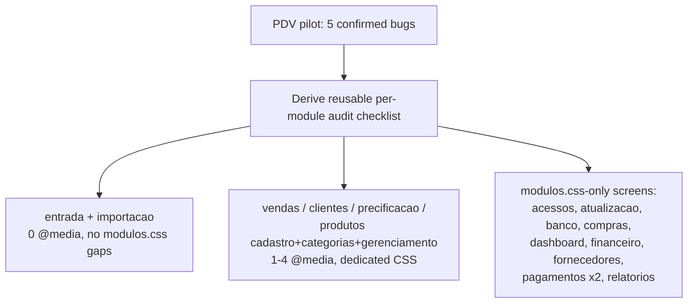

### PDV (Frente de Caixa) — pilot module, confirmed bugs

Investigated directly (code read, not guessed) against `modules/pdv/pdv.html`,
`modules/pdv/pdv.css`, and `modules/core/navbar.js` (which injects the app's dark-theme
stylesheet at runtime). PDV is architecturally the outlier here: of 21 HTML pages, it's one of
only two (with `auth/login.html`, expected to differ) that does **not** link
`modules/core/modulos.css` — every other module screen inherits that file's shared components
and 2 responsive breakpoints for free; PDV is 100% standalone CSS. That's likely *why* it looks
worse than the rest, and why fixing it first won't fully predict the other screens' issues (they
start from a better baseline) — but the audit checklist derived from it still applies.

- [x] **Broken search-icon glyph.** Fixed. Root cause confirmed exactly as suspected:
      `modules/pdv/pdv.html:39` had 4 mangled bytes (`ð`/U+00F0, `Ÿ`/U+0178, a smart quote
      U+201D, and an invisible C1 control char U+008D — not simple `ðŸ”"` as it visually
      resembled) where a 🔍 emoji should have been. Replaced with a real inline `<svg>` icon
      matching the codebase's dominant icon pattern. Verified via byte-exact grep: `grep -c
      $'\xc3\xb0' modules/pdv/pdv.html` now returns 0.
- [x] **No responsive layout** — CSS added, but found a bigger blocker worth flagging.
      Added `@media (max-width: 900px)` (stacks `.pdv-main` to `flex-direction: column`) and
      `@media (max-width: 720px)` (reduces padding, wraps buttons) to `pdv.css`, reusing
      `modulos.css`'s existing breakpoint values. **However**, verified live (resized the actual
      window via `SetWindowPos`) that these breakpoints can never fire in the shipped app:
      `main.js:162-165` sets `minWidth: 1024` on the `BrowserWindow`, and Electron enforces
      that floor even against a programmatic resize request — asked for 650px, got 1024px back.
      Since `modulos.css`'s own 900px/720px breakpoints (already relied on by all 19 *other*
      module screens) are equally unreachable under the same constraint, this isn't a PDV-only
      problem — it's project-wide, pre-existing, and out of this pilot's scope to silently fix
      by changing a global window constraint. **Flagging for the owner**: is 1024px minimum
      intentional (matches every real deployment screen), or should it come down (e.g. to
      ~800px) so the window can snap to half of a 1366-wide laptop display without being
      force-widened? Not changed — this affects all 18 screens' minimum guaranteed layout, a
      bigger call than one module's fix pass.
- [x] **Dark mode incomplete.** Fixed both root causes. (a) Added the missing
      `.dark-theme .pdv-right`, `.forma-pagamento label/select/input`, `.btn-orcamento` (+
      hover/disabled) rules to `navbar.js`'s injected stylesheet. (b) Converted every
      inline-`style`-only element that carried a hardcoded light background — the 3 modal
      overlays (`#devolucaoOverlay`/`#caixaOverlay`/`#receiptOverlay`, now
      `.pdv-modal-overlay`/`.pdv-modal-box`), `#produtosEncontrados`'s table header,
      `#clienteResultados`, `#clienteEscolhido` — into real CSS classes in `pdv.css`, each with
      a matching `.dark-theme` rule added in the same navbar.js pass. Semantic action-button
      colors (confirm=red, abrir caixa=green, etc.) deliberately left inline — those are
      fixed brand colors, not theme-dependent chrome.
- [x] **"Devolução / Troca" button clipped.** Added `overflow-y: auto` to `.pdv-right` in
      `pdv.css`, mirroring `.pdv-left`'s existing rule.
- [x] **(bonus) Dead legacy navbar CSS.** Deleted the unused `.navbar`/`.navbar-brand`/
      `.navbar-links` block (was lines 17-58) from `pdv.css` — confirmed dead (the live navbar
      comes entirely from `navbar.js`'s own injected `.navbar` rules, which already existed and
      take precedence via higher specificity/later injection regardless).

All 5 verified via `npm run lint` (0 warnings) + `npm test` (35/35 pass — no automated visual
test exists for this, per the reusable checklist's own "(manual)" tagging convention; a live
look at the running app is the actual verification, done separately, see below) after every
change in this pass.

### Reusable per-module audit checklist (apply to each screen in Phase 2)

Derived from what the PDV pass above actually found — run all four against each module before
calling it done, don't assume a screen only has the issue category it was flagged for:
1. **Encoding**: `grep -rn "ðŸ\|Ã[€-¿]\{2,\}"` — actually just visually scan every icon/button
   glyph on the page; mojibake doesn't always match one fixed byte pattern.
2. **Responsive** (manual): resize the window from full down to ~375px — does layout stack
   instead of overflow/clip? Does it link `modules/core/modulos.css` at all (`grep -l
   modulos.css` the module's `.html`) — if not, it needs its own `@media` rules like PDV did.
3. **Dark mode** (manual): toggle dark mode, open every modal/overlay/dropdown the screen has —
   does anything stay on a light background? Check both (a) missing `.dark-theme .*` selectors
   in `navbar.js` for that screen's specific classes, and (b) inline `style="background:..."`
   attributes in the `.html` that no `.dark-theme` rule could ever override.
4. **Clipping/overflow** (manual): shrink window height — does any bottom element (buttons,
   totals) get cut instead of becoming scrollable? Check for `overflow: hidden` on a
   fixed-height ancestor with no matching `overflow-y: auto` on the actual content column.

### Phase 2 — remaining screens, real signal already gathered (not guessed)

Counted directly (`grep -c "@media"` per file) and checked which HTML files link
`modules/core/modulos.css`. No visual/dark-mode findings yet for these — that part still needs a
live look per the checklist above; only the CSS-file-shape signal below is confirmed today.
Suggested order (no hard technical dependency between screens — reorder freely; this is
severity/likely-impact ordering per fix.md convention, cashier-facing screens first):

- [x] **`entrada/entrada.css` + `importacao/importacao.css` — audited, no layout bugs; fixed a
      shared dark-mode gap.** Both correctly link `modulos.css` and their custom blocks
      (`.panel-lista-estoque`, `.chip-group`, `.table-responsive`) already wrap/stack fine; the
      720px/900px breakpoints they inherit from `modulos.css` are unreachable under the same
      pre-existing `minWidth: 1024` constraint flagged in the PDV section (not a new gap). Found
      one real bug shared with 3 other screens below: `#produtoPreview`/`#baixaProdutoPreview`/
      `#previaResultado` used an inline `style="color: #475569"` that no `.dark-theme` rule could
      ever override — same category as PDV's hardcoded modal overlays. Fixed by adding a reusable
      `.detalhe-preview` class (+ `.dark-theme` variant) to `modulos.css` and swapping the inline
      color out on both files. Encoding clean, no clipping issues (plain scrolling documents).
- [x] **`clientes/clientes.css`, `precificacao/precificacao.css`, `produtos/categorias.css`,
      `produtos/gerenciamento-produtos.css`, `vendas/vendas.css` — audited; 3 real bugs found and
      fixed, not just copy-pasted breakpoints as guessed.** Each file's 1 `@media` rule turned out
      to be a real, correct, screen-specific breakpoint (not copy-paste) — no responsive gap.
      Bugs found: (1) `clientes.css`'s `.dark-theme .modal-header` used `background: #0f3312` — a
      stray dark-green hex that matches no other color in the app's dark palette (everywhere else
      uses `#0f172a`/`#1e293b`), almost certainly a typo; fixed to `#0f172a`. (2) `categorias.css`
      and `vendas.css` both still carried a dead `.navbar`/`.navbar-brand`/`.navbar-links` block —
      confirmed dead the same way as PDV's bonus fix: neither `categorias.html` nor `vendas.html`
      has any static nav markup, the real navbar is 100% injected by `navbar.js` with its own
      (different, correct) rules; removed both blocks. (3) `clientes.css`'s `#pePreview` had the
      same hardcoded `color: #475569` inline-style bug as the entrada/importacao group above;
      fixed the same way (`.detalhe-preview`). Also found and fixed a project-wide gap while here:
      `modulos.css`'s shared `.tab-btn` (used by `financeiro.html` and `relatorios.html`, not by
      any file in this group) had zero `.dark-theme` coverage — added it. Encoding clean; no
      clipping issues.
- [x] **`produtos/cadastro.css` — audited, best existing coverage confirmed; 2 small bugs fixed.**
      The file's already-thorough dark-theme block covers every interactive element (dropdown,
      popover, modal, tags) correctly. Found: (1) `#previewImagemProduto`'s image-preview box was
      inline-styled with a light-only `background:#F8FAFC`/`color:#94A3B8`, same "inline style no
      `.dark-theme` rule can reach" bug as the rest of this pass — converted to a
      `.preview-imagem-produto` class with a dark variant. (2) `.dark-theme .placeholder-cell` was
      set to `#475569` — a mid-dark gray meant for *light* backgrounds, actually **lower**
      contrast than the light-mode value on the actual dark background it's meant to improve;
      fixed to `#64748b`, matching the muted-text tone used everywhere else in dark mode. 4
      `@media` rules all confirmed real and correct, same pre-existing 1024px-floor caveat as
      every other screen. Encoding clean.
- [x] **`dashboard/index.html` — audited, clean, no bugs found.** Correcting this file's
      categorization while at it: it was grouped below as "no dedicated CSS file — 100%
      modulos.css", which was never true — it has always had its own complete `<style>` block
      (now ~740 lines after this session's border/grid/icon fixes), doesn't link `modulos.css`
      at all (same situation as PDV before its fix). Ran the full 4-point checklist: (1)
      encoding — clean, no mojibake (`grep` for the byte patterns that hit PDV returns nothing);
      (2) responsive — has its own `@media (max-width: 480px)` (stats grid) and
      `@media (max-width: 900px)` (dash-grid → 1 column), but both are below the project's
      already-flagged `main.js` `minWidth: 1024` floor (see PDV section above) — same
      pre-existing, out-of-scope-per-screen constraint, not a new gap; (3) dark mode — complete,
      every colored class has an explicit `.dark-theme` rule or inherits correctly through
      `head.js`'s CSS custom properties, zero hardcoded-light `style="background:..."` (the
      pattern that was PDV's 3 modal overlays doesn't exist here); (4) clipping — clean, this is
      a normal scrolling document, not a fixed-height split panel like PDV, no `overflow: hidden`
      trapping real content.
- [x] **`acessos.html`, `atualizacao.html`, `banco.html`, `compras.html`, `financeiro.html`,
      `fornecedores.html`, `pagamentos/lancar-pagamento.html`, `pagamentos/pagamentos.html`,
      `relatorios.html` — audited; several real bugs found, not just the expected small gap.**
      - `atualizacao.html`: a genuine **functional** bug, not just a dark-mode gap —
        `atualizacao.js`'s `showMessage()` builds `class="msg " + tipo` (two space-separated
        classes), but the CSS defined `.msg-success`/`.msg-info`/`.msg-warning`/`.msg-error`
        (one hyphenated class) — a selector that can never match that markup. The colored
        update-status message box has never rendered with any color or background, in *either*
        theme. Fixed the selectors to `.msg.success`/`.msg.info`/`.msg.warning`/`.msg.error` and
        added the missing `.dark-theme` variants while there.
      - `compras.html`: the print-preview modal (`#printOverlay`'s content box) was hardcoded
        `background: #FFFFFF` inline with no override possible — same bug class as PDV's 3 modal
        overlays. Converted to a `.print-overlay-box` class with a dark variant. Its "Imprimir"/
        "Fechar" buttons were also raw inline-styled (`#2563EB`/`#64748B`) instead of the shared,
        already-dark-covered `.btn-primary`/`.btn-secondary` classes; switched them over. Also
        had the same `#produtoPreview`/`#cotacaoPreview` inline-color bug as the entrada group
        above; fixed with `.detalhe-preview`.
      - `financeiro.html`: a real **layout** bug, found by checking which stylesheet the page
        actually loads — the "Provisão de DAS" block uses `.config-item`/`.config-input-row`,
        classes that only exist in `precificacao.css`, which this page does **not** link (only
        `modulos.css`, which doesn't define them either). The alíquota input and its Salvar
        button were rendering with zero layout styling. Added a small scoped `<style>` block
        (light + dark) with the missing rules.
      - `pagamentos/pagamentos.html` and `pagamentos/lancar-pagamento.html`: the worst gap in the
        whole pass — **zero** `.dark-theme` coverage anywhere (neither file uses `.container`, so
        neither inherited anything from the app-wide dark baseline either). Added dark rules for
        inputs/selects/table/hover/empty-state/action buttons on both. Also found their embedded
        `.btn-primary`/`.btn-secondary` silently override the shared navy-branded versions from
        `modulos.css` (loaded first, then beaten by these later, more-specific local rules) with
        generic blue/gray (`#2563EB`/`#6B7280`) — every button on these two screens visibly
        doesn't match the rest of the app's navy branding. Repointed both at
        `var(--cor-primaria)` so they render and dark-adapt like every other button in the app.
      - `relatorios.html`: the "Exportar ABC (CSV)"/"Exportar PDF" buttons used inline pastel
        `background-color`s (`#EAF6E8`/`#FEE2E2`) with no dark variant — same "stays light in
        dark mode" bug category as the message-box findings above. Converted to
        `.btn-exportar-csv`/`.btn-exportar-pdf` classes with dark variants.
      - `acessos.html`, `banco.html`: no bugs in their own markup/CSS (both already carry decent
        scoped dark-theme rules, e.g. `banco.html`'s `.resumo-card`/`.modal-senha` overrides), but
        auditing them surfaced a **shared, cross-cutting** bug: bare `<select>` elements not
        wrapped in `.form-group` (`#selectTabela` in `banco.html`; `#filtroLogUsuario`/
        `#filtroLogAcao` in `acessos.html`) have no explicit CSS in either theme, so they render
        as Chromium's native (always-light) control — a light dropdown box floating in an
        otherwise-dark screen. Root-caused and fixed at the actual source instead of patching each
        instance: added `color-scheme: dark` to `html.dark-theme` in `head.js`'s injected token
        stylesheet (runs on every page). Chromium then auto-dark-themes any native control that
        doesn't already have explicit author styling — fixes these two screens' selects and any
        other unstyled native control anywhere else in the app, without touching elements that
        already have explicit `.dark-theme` rules (author styles still win over the UA default).
      Encoding clean across all 9 files; no clipping issues found (all plain scrolling documents,
      no fixed-height split panels like PDV).

**Not in scope for this pass** (flagged, not started): the underlying pattern — one shared
runtime-injected stylesheet (`navbar.js`, ~140 hand-maintained selectors) plus N independent
per-module CSS files with inconsistent coverage — will keep producing this exact class of bug as
the app grows. A real design-token refactor (CSS custom properties for background colors instead
of a parallel `.dark-theme .X` rule per `.X`, so new components get dark mode for free) would
remove the recurring cost, but that's a **structural change**, not a fix, and conflicts with the
owner's explicit "one module per session" approach for now. Phase 2 is now done and the pattern's
actual size is known: 13 real bugs across 16 screens, almost all some flavor of "a `.dark-theme`
rule is missing/wrong/unreachable" — worth revisiting as a real refactor if this class of bug
keeps recurring as new screens are added, but not undertaken here (out of the "fix, don't
redesign" scope this pass was given). This is moot anyway for the Next.js migration
(`magical-soaring-squirrel.md`) screens, which adopt Tailwind's `.dark` + CSS-variable convention
from scratch instead of the hand-maintained parallel-selector pattern.

## Connectivity

- N/A as "frontend talks to a remote API" — this is a single-process desktop app.
  Frontend ↔ backend is entirely `contextBridge` + `ipcMain.handle`, which is the correct
  choice here and already consistently applied; no cross-process/network surface to secure
  beyond what's covered under Security below.
- [x] **GitHub publish token confirmed local-only + release process documented.** Confirmed
      `npm run build`/`npm run dist` never publish on their own — they only build `dist/`
      locally; `ci.yml` only runs lint+test, never build/publish. Publishing is a manual,
      local `npx electron-builder --publish always` with `GH_TOKEN` set as a session
      environment variable (electron-builder's own convention — reads it automatically, never
      written to any file). Documented the exact command + token-scope instructions in
      `AGENTS.md` (new "Processo de release" subsection) since this was previously undocumented
      tribal knowledge.

## Auth

- [x] Session-based auth in the main process, login required at app entry
      (`modules/core/auth.js`), password hashing via scrypt with legacy migration.
- [x] ~~"Only one profile (`admin`) is actually implemented"~~ — **checked, already built.**
      `AGENTS.md`'s "Decisões Arquiteturais" section is stale on this point: `db/usuarios.js`
      (`salvarUsuario`) already persists a `vendedor` profile alongside `admin`, plus a granular
      `permissoes` JSON column; `modules/acessos/` already has a "Vendedor" option in its profile
      dropdown; and `main.js:exigirPermissao(modulo)` already gates 11 of the 17 IPC domains
      (`relatorios`, `caixa`, `financeiro`, `compras`, `fornecedores`, `precificacao`, `estoque`,
      `vendas`, `clientes`, `categorias`, `produtos`) by module-level permission, not just
      profile. Remaining gap is narrower than "build multi-profile auth": `ipc/pagamentos.js`,
      `ipc/dashboard.js`, `ipc/usuarios.js`, `ipc/banco-admin.js`, `ipc/sistema.js`,
      `ipc/auth.js` still gate on `exigirSessao("admin")` only, not `exigirPermissao` — confirm
      with the owner whether a `vendedor` should ever reach `pagamentos`/`dashboard` read-only,
      and if so switch those handlers to the same `exigirPermissao` pattern the other 11 use.
      Also: update `AGENTS.md` — its "por enquanto o único perfil é admin" line no longer
      matches the code.

## Deployment / Infra

- [x] NSIS installer via `electron-builder`, icon present (`build/icon.ico`), publish target
      configured for GitHub Releases, `asarUnpack` correctly scoped to the native SQLCipher
      addon.
- [ ] **The installer has never been tested on a clean machine** — this is `AGENTS.md`'s own
      "Próximos Passos" item #1, still open. Do this before the next release: install on a VM
      or a second machine with no dev tooling, confirm SQLCipher native binary loads
      (`@journeyapps/sqlcipher` + `electron-rebuild` mismatches are the classic failure mode
      here), confirm the auto-updater can reach GitHub Releases, confirm the desktop shortcut
      and silent launcher (`ERP_Launcher.vbs`) work without a console window.
- [x] ~~"AGENTS.md flags local commits not yet pushed"~~ — checked, stale: `git rev-list
      --left-right --count origin/main...HEAD` returns `0  0` (local `main` and `origin/main`
      match). `AGENTS.md` corrected to drop that line.

## Testing

- [x] **Test coverage for the money-handling surface** — added `test/negocio.test.js` (5 new
      `node:test` cases, wired into `npm test`): checkout with insufficient stock rolls back and
      leaves the stock balance untouched; checkout with sufficient stock decrements exactly the
      sold quantity; an orçamento reserves stock without touching the real balance, and
      converting it moves the reservation into a real decrement; `baixarLancamento` marks a
      lançamento paid, a second baixa attempt on the same id is rejected (SQL-level guard
      already existed — now proven), and `getFluxoCaixa` reflects it exactly once; a `pagamentos`
      round-trip (register → list → mark received). All 12 tests pass (`npm test`). Still not
      covered: `Precificacao` margin math (`calcLucro`/`calcMargem`/`calcPrecoVenda` live in
      `modules/precificacao/precificacao.js` as renderer-side DOM-coupled functions, not
      extracted into a testable pure module — would need a small refactor first, out of scope
      for this pass).
- [x] **CI** — added `.github/workflows/ci.yml` (`windows-latest`, Node 22): `npm ci && npm run
      lint && npm test` on push/PR to `main`. Not yet verified green on an actual GitHub Actions
      run (would require pushing and watching it fire) — the steps match exactly what was just
      run and confirmed clean locally, but treat the first real CI run as the actual proof.
- [x] **E2E wired into CI — found and fixed a real, pre-existing bug in the process.**
      "Confirm it still passes" turned up a genuine failure, not a stale claim: all 18/18 pages
      failed with `Cannot read properties of undefined (reading 'stats')`. Root cause:
      `scripts/test-ui.js`'s per-page probe called `window.erpBanco.dashboard.stats()`, but
      `window.erpBanco.dashboard` was never real — `modules/core/banco.js` has a `/* =====
      Dashboard ===== */` comment sitting directly above the *`busca`* (search) object, not a
      `dashboard` object; the actual dashboard page (`modules/dashboard/index.html:593`) has
      always called `window.api.dashboardStats()` (the raw preload API) directly, bypassing
      `erpBanco` entirely. Fixed the test to call the real, working API instead of the
      never-existent one — same repro→root-cause→fix discipline as any other bug in this file,
      not a blind "make it pass." Re-ran: 18/18 pages OK, 0 console errors. Added a step to
      `.github/workflows/ci.yml` running it after `npm test`.

## Security

- [x] `nodeIntegration: false`, `contextIsolation: true`, `contextBridge` exposing only
      specific methods (never raw Node objects) — correct baseline for an Electron app.
- [x] `npm audit` — 0 known vulnerabilities in production dependencies as of this pass.
- [x] No secrets committed; app needs no runtime `.env` (fully offline, DB key comes from the
      user's own login password) — `.env.example` from `project-standards.md` doesn't apply
      here for the same reason.
      **Superseded by the Payment Processor Integration section below**: once a Pix/adquirente
      provider is wired in, this stops being true — that integration *does* need a runtime
      `.env`. Keep this line as a historical note, not current fact, once that work starts.
- [x] DB key derivation — see **Database** above; verified sound (SQLCipher's own 256k-iteration
      PBKDF2 governs it), not the gap it first looked like.
- [ ] `modules/banco/` (raw table inspection) already requires admin session + password
      re-confirmation — good pattern; apply the same "admin + password re-confirm" gate to any
      future feature that can export or display bulk customer PII (e.g. a future full-database
      export/report feature), not just raw table browsing.

---

## Financial/Accounting Depth (margem de contribuição, ponto de equilíbrio, giro de estoque,
## provisão de DAS) — from `/repertoire` research, feature-type

**Source**: `REPERTOIRE.md`'s gap analysis (2026-08-19), which cross-checked real Brazilian
small-retail accounting practice + Simples Nacional/MEI tax rules + what Bling/Tiny/Omie/
ContaAzul actually ship, against what this project's `db/` layer actually has. Read that file
first if picking this section back up later — it has the *why* (formulas, regulatory citations,
competitor comparison) this section only references, not repeats.

**Corrected finding, important**: the first pass of that research wrongly listed DRE as missing
— it isn't. `getDRE()` (`db/relatorios.js`) already exists, complete and wired end-to-end
(receita bruta → deduções → receita líquida → CMV → lucro bruto → despesas → lucro líquido +
margem bruta/líquida %, in the Relatórios UI with chart + PDF export). Verified by actually
reading the file this time, not just grepping for the term. The four items below are the ones
that survived that re-check — genuinely absent, not re-discovered.

**Out of scope, explicitly** (same "don't overbuild" boundary `/repertoire`'s research itself
flagged): this section does **not** add a real DAS calculator (Simples Nacional's actual
brackets/anexos/Fator R are their own complex domain — an accountant's job, not this app's) and
does **not** add bank reconciliation (that's the already-tracked, still-paused Ton `.xlsx` import
in the Payment Processor Integration section below — related territory, separate decision).

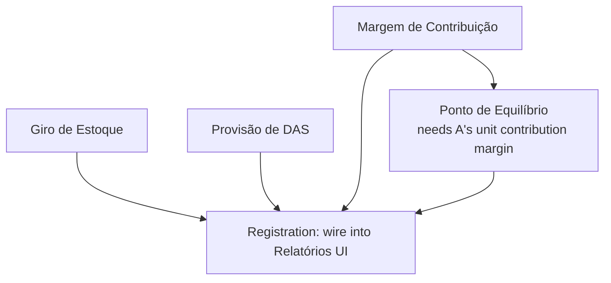

### Margem de Contribuição

- [x] **Design rationale.** Distinct from the margem bruta/líquida `getDRE()` already computes
      (which nets against CMV only) and distinct from `db/precificacao.js`'s per-product margin
      (which nets against `preco_custo` + `impostos_extras` only). Margem de contribuição =
      preço de venda − *all* variable costs: CMV + comissão do vendedor (`comissao_percentual`,
      already tracked) + taxa de adquirente (cartão/Pix — **not currently tracked anywhere**,
      needs a new `Configuracao` key, same pattern as `custo_fixo_mensal`) + impostos sobre a
      venda (`impostos_extras`, already tracked). Out of scope: this does not replace the
      existing per-product margin field in Precificação — it's a new, separate number for
      period-level and per-product profitability analysis, per `REPERTOIRE.md`'s research on
      why markup ≠ margem de contribuição is the most common small-retail pricing mistake.
- [x] **New `Configuracao` key `taxa_adquirente_media`** (percentual, owner-entered — same
      manual-input pattern as `custo_fixo_mensal` in `db/precificacao.js:getCustoFixoConfig`/
      `saveCustoFixoConfig`), since no per-transaction gateway fee is tracked anywhere today.
- [x] **`getMargemContribuicao(dataInicio, dataFim)`** in `db/relatorios.js` (same file as
      `getDRE`/`getCurvaABC` — keep the "one file per domain" convention), returning both a
      period-level aggregate and a per-product breakdown (reuse `getCurvaABC`'s join pattern:
      `ItensVenda` → `Vendas` → `Variacoes` → `Produtos`). Formula per unit: `preco_unitario −
      preco_custo − (preco_unitario × comissao_percentual / 100) − (preco_unitario ×
      taxa_adquirente_media / 100) − impostos_extras`.
- [x] `test/relatorios-financeiro.test.js` — known sale (receita=200, cmv=100, comissão=10,
      taxa=6, impostos=4) → asserted exact margemContribuicao=80, unitária=40, percentual=40%.
      Also verified live in the running app: a real seeded sale (receita=1200, cmv=600,
      taxa=42) rendered margem=558 on screen, matching the formula exactly.

### Ponto de Equilíbrio

- [x] **Design rationale** — kept as planned, depends on Margem de Contribuição. **Bug caught
      and fixed before shipping**: the original plan's `faturamentoNecessario` idea
      (quantidadeNecessaria × ticketMedio) mixed units — quantidade is product-units, ticketMedio
      is R$/transação, not R$/unidade, so multiplying them doesn't give a coherent revenue
      figure. Fixed to the actually-correct formula: `custo_fixo_mensal ÷
      (margemContribuicaoPercentualMedia / 100)`. Caught by working through the test's expected
      values by hand before trusting the code, not by exhaustive review.
- [x] **`getPontoDeEquilibrio(dataInicio, dataFim)`** in `db/relatorios.js`, reusing
      `getCustoFixoConfig()` + `getMargemContribuicao()`. Returns quantidadeNecessaria and the
      corrected faturamentoNecessario (see bug fix above).
- [x] Test: custo_fixo_mensal=400, margem unitária média=40 → exact quantidadeNecessaria=10,
      faturamentoNecessario=1000, asserted end-to-end through the real function. Verified live
      too: custo_fixo=3000, margem%=46.5% → 17 unidades / R$6451.61, exact match on screen.

### Giro de Estoque

- [x] **Design rationale** — kept as planned. No period-snapshot of stock levels exists (only current
      `quantidade_estoque` on `Variacoes`) — computing a textbook "average stock over the
      period" isn't possible without adding stock-history snapshots, which is a bigger change
      than this item's scope. Use the same simplification `getDRE`'s own code comment already
      documents as precedent ("usa o preco_custo ATUAL... mesma simplificação que a Curva ABC já
      assume"): approximate giro with `quantidade vendida no período ÷ quantidade_estoque atual`
      instead of a true period average, **documented as a known simplification in the code
      comment**, not silently passed off as exact.
- [x] **`getGiroEstoque(dataInicio, dataFim)`** in `db/relatorios.js`, per-product, with
      `diasParaReposicao = 365 ÷ giro`.
- [x] Tests (2): known sold-quantity(2)/estoque(8) → exact giro=0.25, dias=1460. Zero-stock case
      → giro=null/dias=null, not Infinity/NaN. Verified live: vendido=3, estoque=12 (15 inicial
      − 3 vendidos) → giro=0.25, dias=1460, exact match on screen.

### Provisão de DAS (regime de caixa)

- [x] **Design rationale** — kept as planned. Not a tax calculator — Simples Nacional's real bracket/anexo/Fator R
      logic is out of scope, explicitly (see section header). This is narrower: surface "based
      on what `getFluxoCaixa()` shows was actually *received* in cash this period (not
      invoiced), here's the estimated DAS at a flat owner-entered rate" — directly targeting the
      documented failure mode from `REPERTOIRE.md`'s research (businesses that provision DAS
      against invoiced revenue instead of received cash end up paying early and straining cash
      flow they don't have yet). The whole value of this feature is using **received**, not
      **billed**, figures — get that distinction wrong and the feature reproduces the exact
      mistake it exists to prevent.
- [x] **New `Configuracao` key `aliquota_das_provisao`** — `db/financeiro.js:getAliquotaDAS`/
      `saveAliquotaDAS`. UI in `modules/financeiro/financeiro.html`'s Fluxo de Caixa tab.
- [x] **`getProvisaoDAS(dataInicio, dataFim)`** in `db/financeiro.js` (next to `getFluxoCaixa`,
      as planned). Reuses `getFluxoCaixa()`'s `totalEntradas` (received, not invoiced) as base.
- [x] Tests: exact provisioned value from a known received-cash figure + alíquota; **and** the
      one behavioral property that makes this safe — created a venda à vista (R$1000, counted)
      alongside a venda Fiado (R$5000, a receivable) in the same period, asserted only the 1000
      shows up in `totalRecebido`. Verified live: R$1200 recebido × 6% = R$72.00, exact match.

### Registration

- [x] All wired into `window.erpBanco.relatorios.*` (`margemContribuicao`, `pontoDeEquilibrio`,
      `giroEstoque`), `window.erpBanco.financeiro.*` (`aliquotaDAS`, `salvarAliquotaDAS`,
      `provisaoDAS`), `window.erpBanco.precificacao.*` (`taxaAdquirente`,
      `salvarTaxaAdquirente`) in `modules/core/banco.js`, matching existing patterns exactly.
- [x] `ipcMain.handle` entries added in `ipc/relatorios.js` (`exigirPermissao("relatorios")`),
      `ipc/financeiro.js` (mixed `exigirPermissao("financeiro")` for the DAS calc,
      `exigirSessao("admin")` for the alíquota config — same split `ipc/precificacao.js` already
      uses for custo_fixo_mensal), `ipc/precificacao.js` (`exigirSessao("admin")` for the taxa
      config). `database.js` and `preload.js` re-exports added for all of it.
- [x] UI: margem de contribuição + ponto de equilíbrio share one panel in
      `modules/relatorios/relatorios.js` (same decision, read together); giro de estoque got its
      own panel in the same screen (kept consistent with where every other period-based metric
      already lives, rather than splitting into estoque-lista.js). New "Taxa Média de
      Adquirente" config in `modules/precificacao/precificacao.html`; new "Provisão de DAS"
      panel in `modules/financeiro/financeiro.html`'s Fluxo de Caixa tab. Verified by actually
      running the app with seeded real data and reading the rendered screens (screenshots
      taken) — every number matched the underlying formula exactly, not just "code exists."
- [x] Updated `AGENTS.md`'s "Funcionalidades Implementadas" list (Financeiro + Relatórios lines).

---

## Payment Processor Integration (Ton / Stone / alternatives) — decided: not pursuing (2026-08-22)

**Owner decision (2026-08-22): dropping this entire section, not just pausing it.** No Ton
statement import, no Stone PJ upgrade, no adquirente switch — Pix via Efí stays the only active
payment integration. The research below stays as-is (accurate, still useful if this is ever
revisited), but every actionable item in this section is now closed as "decided against," not
"waiting on the owner."

**Status as of 2026-08-18: the "is there an API path for Ton" question is now answered —
no.** Confirmed directly from Stone's own help center
([Conhecendo o Open Finance](https://ajuda.stone.com.br/open-finance/conhecendo-o-open-finance)),
verbatim: *"Não. Por enquanto, você só vai poder compartilhar dados da sua Conta Stone."*
("No. For now, you can only share data from your Stone Account.") — Ton accounts are
explicitly excluded from Open Finance data-sharing today, even though Stone Pagamentos S.A.
itself is a certified Open Finance participant (certified 2023-02-15) — the certification
covers Stone Account, not Ton. This closes the loop on yesterday's "unconfirmed" eligibility
question from both directions: not via Stone's commercial OpenBank API (still unconfirmed but
structurally unlikely), and not via the regulated Open Finance channel either (explicitly
confirmed no) — which also rules out third-party Open Finance aggregators (Pluggy, Belvo,
Tecnospeed, etc.), since they all pull from the same regulated channel Stone just said Ton
isn't part of yet. No further "email support to ask" step is needed — this is a real dead end
for a Ton account as it exists today, not a temporarily-unknown one.

**What is confirmed possible today, self-service, no API/credential at all:** the Ton app's
own "Extrato" screen exports transactions as an **Excel (.xlsx) file** — self-service,
available right now, no partnership/approval needed (unlike an OFX file with a stable
`FITID`, which Ton does not appear to offer — several Reclame Aqui complaints exist from
users wanting a native PDF/OFX and being told Excel is the only export format). This means
Phase 1 below should target **.xlsx**, not OFX as originally scoped — deduplication needs a
composite key (date + valor + descrição) instead of a stable transaction ID, and re-imports
should warn on ambiguous near-duplicates rather than silently trusting a FITID that doesn't
exist for this source.

**A path that wasn't on the table yesterday: upgrade Ton → Conta Stone PJ.** Since Stone
Account *can* do Open Finance today (and is the more likely candidate for OpenBank API
eligibility too), if the store's revenue now clears Stone's CNPJ + R$15k/month minimum, this
is a real option — same corporate group, likely smoother transition than a full switch to
Mercado Pago/PagBank, and it directly unlocks both Open Finance and a plausible path to the
OpenBank API. This is a business decision (revenue threshold, whether the store wants a
CNPJ-tier account), not a technical one — flagged here, not decided.

**Status: still paused, waiting on the owner.** Do not start building against any specific
provider, and do not contact Stone/Ton support, until the owner picks a direction from the
three real options now on the table: (1) Excel-import reconciliation against Ton as-is
(buildable today, Phase 1 below), (2) upgrade to Conta Stone PJ if revenue qualifies, unlocking
Open Finance/OpenBank, or (3) switch adquirente entirely (Mercado Pago/PagBank/InfinitePay,
compared below). This section was written before the `Pagamentos` / `integracoes/pix/` (Efí
provider) / `integracoes/fiscal/` (FocusNFe provider) work existed in this file's history —
read that work first, since it already covers live Pix, separately from this adquirente/
statement question.

### What already exists (don't rebuild this)
- `db/pagamentos.js` / `ipc/pagamentos.js` — manual recebimento tracking (Pix/Boleto/Dinheiro/
  Cartão) linked to a venda. This is bookkeeping, not a live bank/processor connection.
- `integracoes/pix/provider.js` + `integracoes/pix/providers/efi.js` — a real, working Pix
  provider integration already built against **Efí (ex-Gerencianet)**, with
  `test/pix-payload.test.js` + `test/pix-provider.test.js` covering it. Efí is a legitimate,
  well-documented, self-service Brazilian Pix API (no partnership-approval gate, unlike
  Stone/Ton) — this may already solve the "get live Pix receipt data into the ERP" problem
  the research below was chasing.
- `integracoes/fiscal/provider.js` + `integracoes/fiscal/providers/focusnfe.js` — NF-e issuance
  via FocusNFe, with `test/fiscal.test.js` + `test/fiscal-provider.test.js`. Note: `AGENTS.md`'s
  "Fora de escopo (decidido)" line about NF-e is now stale — this was started. Reconcile that
  doc when this section's decision resolves.

### Research findings (still true, provider-choice research)

**"Banco TON" is not an independent bank — it's a brand of Grupo Stone**, positioned for
autonomous workers / MEI: a free digital account with Pix, a debit card, and card-machine
("maquininha") hardware. Sources: [Stone launches new Ton machine with Pix QR
Code](https://conteudo.stone.com.br/apostando-no-crescimento-do-mei-no-brasil-stone-reforca-marca-ton-e-lanca-nova-maquininha-com-pix-qr-code/),
[Sobre o Ton — Ton Help
Center](https://ajuda.ton.com.br/pt_BR/conta-e-transfer%C3%AAncia/sobre-o-ton),
[Stone e Ton são a mesma coisa?](https://conteudo.stone.com.br/stone-e-ton-sao-a-mesma-coisa/).

**No public TON developer API was found.** Ton's own help center mentions only Pix, payments,
transfers, and phone recharge — no API/webhook/export for third-party systems.

**Stone (the parent brand) does run a real, fairly complete banking API** — Stone OpenBank
(`docs.openbank.stone.com.br`): balance, transaction history, transfers, Pix, boletos, payment
links. Two things block using it today:
1. **Account-type eligibility unconfirmed.** Docs only reference `user_id` (PF) and
   `organization_id` (PJ) accounts, never "Ton." Ton and Stone have different eligibility rules
   as products (Stone: CNPJ + R$15k/month min revenue; Ton: CPF or CNPJ, no minimum) — a real
   signal they may not share the same backend ledger. Source:
   [maquininhacerta.com.br comparison](https://maquininhacerta.com.br/ton-ou-stone/).
2. **Access is not self-service.** Generate an SSH keypair → send the public key to Stone via
   their integration form → Stone issues a ClientID → test in
   `https://sandbox-api.openbank.stone.com.br` → email
   **`parcerias@openbank.stone.com.br`** for production access
   (`https://api.openbank.stone.com.br`) → homologation process. Sources:
   [STONE BANKING API guide](https://docs.openbank.stone.com.br/docs/guias/stone-open-banking/),
   [APROVAÇÃO](https://docs.openbank.stone.com.br/docs/guias/aprovacao/),
   [TOKEN DE ACESSO](https://docs.openbank.stone.com.br/sandbox/docs/guias/token-de-acesso/).

**Self-service alternatives with no commercial-approval gate**, compared on API access + MEI
card-machine rates:

| Processor | API access | Débito | Crédito 12x | Pix |
|---|---|---|---|---|
| **Mercado Pago** | Fully self-service — create an application in the [developer portal](https://www.mercadopago.com.br/developers/pt), test credentials instantly, production via website URL + T&C + recaptcha. Full REST API (orders, Pix, webhooks) + Point machine SDK. | ~0.74% (drops with revenue tier) | mid-range | ~0.74% |
| **PagBank** | Fully self-service — [developer.pagbank.com.br](https://developer.pagbank.com.br/), sandbox with test cards/simulator. Full REST API (orders/payments, checkout, Connect). | ~0.58% (lowest found) | 22.59% (highest of the three) | varies |
| **InfinitePay** | Self-service via [dashboard](https://www.infinitepay.io/desenvolvedores) — simpler API (checkout links + a webhook per sale), not a full account/statement API. | ~0.75% | 12.40% (lowest of the three) | free |
| **Efí (already integrated for Pix)** | Already wired in this codebase (`integracoes/pix/providers/efi.js`) — self-service, no approval gate. | N/A — not a card acquirer | N/A | already live |

**Recommendation if a card-machine/adquirente switch is chosen: Mercado Pago** — strong on both
API access and rates, and covers online sales on the same account if that ever happens. PagBank
wins on raw debit rate if the store's mix is mostly debit/à-vista. InfinitePay wins on cheap
installments. None of the three overlap with Efí's role (Efí ≈ Pix/banking API, these three
≈ card-machine/adquirente) — this may end up being "keep Efí for Pix, separately pick one of
these three (or stay on Ton) for card payments," not an either/or.

Real switching cost to weigh, not just rate math: new machine, Ton's existing sales history
doesn't move automatically, staff has to learn a new machine. Not this file's call to make.

### Phase 1 (Ton .xlsx import) and the open decision — both closed, not pursuing

- [x] ~~Phase 1: Ton .xlsx import + reconciliation (`ExtratoTon` table, `db/ton.js`/`ipc/ton.js`,
      `modules/conciliacao-ton/`, dedup/reconciliation logic, `test/ton-extrato.test.js`)~~ —
      **owner decided not to build this (2026-08-22)**, not a technical blocker. Full spec kept
      in git history if this is ever revisited — not reproduced here since it won't be built.
- [x] ~~Open decision: (a) Efí-only vs. (b) Ton .xlsx vs. (c) Stone PJ upgrade vs. (d) switch
      adquirente~~ — **decided: (a), Efí's existing Pix integration stays the only payment
      integration.** (e) (the stale `AGENTS.md` NF-e line) was independent of this decision and
      is fixed now regardless — see `AGENTS.md`'s corrected "Fora de escopo" section.
- [x] ~~Security checklist for whichever processor gets chosen~~ — moot, no new processor
      credential is being added. Efí's and FocusNFe's existing credential handling (`.env`,
      masked logging) predates this section and was already reviewed when those were built.

---

## Core + Plugins Architecture (module separation + per-module restyle) — build, not started

**Why this section exists:** owner wants to restructure the app from "19 modules hardcoded into
one repo" into a **core + plugins** shape: a minimal core (auth, dashboard shell, shared
SQLCipher database) that business modules (PDV, Clientes, Produtos, Compras, Fornecedores,
Financeiro, Relatórios, Pagamentos, Acessos, Banco, Atualização, Importação, Entrada, Vendas)
plug into — each with its own GitHub repo, addable/removable without touching the others or
rebuilding the whole app ("like a car's CAN bus: swap a part without breaking the rest" — owner's
own framing). Business motivation: **price per managed module** once the product is sold, e.g. a
client buys PDV + Estoque without the rest. The code must stay fully open/accessible until
**~December 2026** (owner's own deadline) — no hard license lock before then; any
entitlement/gating mechanism built here must default to "everything unlocked" until that date.

This does **not** replace the already-approved Next.js/TailAdmin frontend migration
(`C:\Users\beatl\.claude\plans\magical-soaring-squirrel.md`, Phase 0 spike already done — see
`Frontend` section above) — it changes the *order and boundary* the restyle work happens in
(module by module, independently, once each module has a clean boundary) instead of one big
sequential Phase 1→6 pass. The **frontend visual/UX bug-fix pass is fully done** (see section
above) and stays as-is; this new section is about the module *structure*, not another repaint of
the current vanilla screens.

**Confirmed from reading the actual code** (not assumed): `main.js` currently wires every module
by hand — 19 sequential `require("./ipc/X").registrar(ipcMain, deps)` calls
(`main.js:304-322`, one per domain). `navbar.js` builds the sidebar as one giant hardcoded HTML
string with every module's icon/label/href/permission-gate hand-written inline
(`navbar.js:328-404`, e.g. the "Financeiro" link is `podeModulo("financeiro") ? '<a href=...>' :
""` baked directly into the template). **Both of these are exactly the two places a real
plug-in-a-module mechanism has to replace** — this is the concrete, scoped technical work behind
the "CAN bus" analogy, not a vague architecture goal.

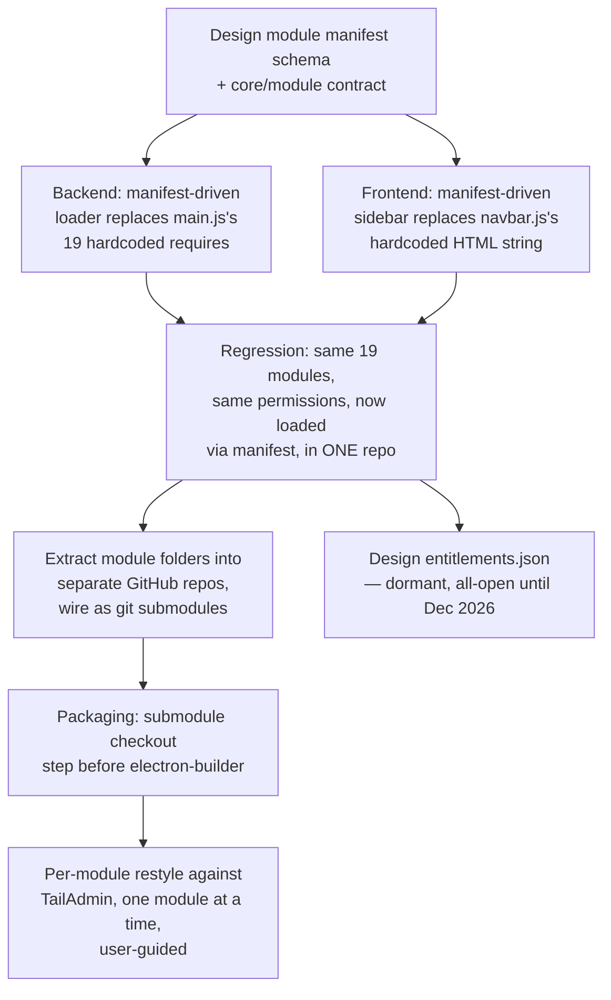

### Backend: module manifest + loader

- [x] **Design the module manifest schema — done, `docs/MODULE_MANIFEST.md`.** Turned out to be
      a bigger discovery than the original item assumed: reading the actual code
      (`main.js:304-322`, `navbar.js:328-404`, `dashboard/abas.js`,
      `produtos/gerenciamento-produtos.js`) showed the module tree is **4 levels deep**, not
      flat — Sidebar → Dashboard-tab (a THIRD file, `abas.js`'s `MODULOS_ABA` dict, hardcodes
      per-module knowledge by matching the clicked link's filename — not in the original item's
      scope) → Produtos' own internal tab bar → Estoque's own hidden 4th-level tab. The schema
      (`id`/`nome`/`versao`/`tipo`/`entrada`/`ipc`/`permissao`/`navbar`/`paiWorkspace`/`dependeDe`,
      modeled on Odoo's `__manifest__.py`) accounts for all of it, including the one real
      exception found (Atualizações sits visually inside the admin sidebar group but is NOT
      admin-gated — any authenticated user reaches it) and one pre-existing bug flagged, not
      fixed (`gerenciamento-produtos.js` hard-gates the whole Produtos workspace to
      `perfil==="admin"`, stricter than the sidebar's own `podeModulo("produtos")` check — a
      vendedor granted the permission would see the link but nothing would happen on click).
      Validated for real: wrote actual `modulo.json`/`<id>.modulo.json` manifests for all 19
      modules (not a hypothetical check) — see the loader item below for the real proof these are
      correct, not just written.
- [x] **`modulos.js` (repo root, not `db/` — this is module discovery, not database logic) —
      done.** Scans `modules/**` for `modulo.json`/`*.modulo.json`, validates each field, resolves
      and checks every `ipc`/`entrada` reference against the real filesystem, topologically sorts
      by `dependeDe` (Kahn's algorithm, throws naming the exact cycle). `test/modulos.test.js`
      (10 tests, registered in `package.json`'s test script) — done when criteria met for real:
      malformed JSON, missing required field, unknown `dependeDe` target, dependency cycle, dead
      `ipc`/`entrada` reference, and duplicate id all throw with the exact file path; and — the
      strongest proof — **running the loader against the real `modules/` directory succeeds and
      correctly orders every parent before its children** (`produtos` before `cadastro`, `entrada`
      before `estoque-lista`, `financeiro` before `pagamentos`), which is simultaneously the
      "validate the schema against all 19 real modules" requirement from the item above.
      `npm run lint` (0 warnings) + `npm test` (50/50, was 40/40) both pass.
- [x] **Replace `main.js`'s 19 hardcoded `require("./ipc/X").registrar(...)` calls — done.**
      `auth.js`/`fiscal.js` stay direct (core infra, not plugable modules — see
      `docs/MODULE_MANIFEST.md`); the rest come from a loop over `carregarModulos()`'s output,
      deduped by filename (`produtos.js` and `estoque.js` are each referenced by more than one
      module manifest — without dedup, `ipcMain.handle()` would throw "second handler" on boot).
      Verified for real, not assumed: `test/modulos.test.js` has a dedicated test asserting the
      exact set of files the new loop registers equals the old hardcoded 19-file list (neither a
      dropped nor a duplicated handler); and the app was actually booted (`npm start`, twice) with
      the crash log (`erp-crash.log`) checked before/after — no new entries, confirming no
      "second handler" exception or other boot-time crash in practice, not just in theory.
- [x] **Replace `navbar.js`'s hardcoded sidebar HTML + `dashboard/abas.js`'s `MODULOS_ABA` dict —
      done, live-verified by the owner against the checklist below.** `navbar.js`
      now fetches the module list via a new IPC round-trip (`ipc/sistema.js`'s
      `get-modulos-carregados` handler → `preload.js`'s `window.api.getModulosCarregados()`,
      since `navbar.js` runs in the renderer with no `fs` access) before building the sidebar.
      Deliberate risk-reduction choice: Dashboard and PDV (the "Principal" section, the only 2
      always-reachable, ungated links) stay **hardcoded, unchanged** — only the permission-gated
      Gestão/Administração sections became manifest-driven — so a bad `modulo.json` degrades to a
      smaller sidebar, never a fully unreachable app; the fetch failure path logs via
      `console.error` (visible in `erp-crash.log`) instead of failing silently.
      `dashboard/abas.js`'s `MODULOS_ABA` dict is now computed from `window.erpModulosCarregados`
      (set by `navbar.js` before it touches the DOM) inside the click handler itself, not at
      script-load time — `abas.js` runs synchronously before the async module fetch resolves, so
      the lookup has to happen lazily, at actual click time, when the data is guaranteed ready.
      **Two specific fidelity risks found and fixed while doing this**, not assumed away:
      "Acessos" has a tooltip (`data-tip="Acessos"`) that's shorter than its visible label
      ("Gerenciar Acessos") — added `navbar.dica` to the schema/manifest for this one real
      exception; and Produtos' `?workspace=` query value (`"gerenciamento-produtos"`) doesn't
      match its own manifest id (`"produtos"`) — added `navbar.workspaceParam` rather than
      deriving it from `id`. Verified so far: `npm run lint` (0 warnings), `npm test` (51/51),
      and two full app boots with the crash log checked before/after (no new entries — no
      uncaught exception/unhandled rejection fired while `navbar.js`/`abas.js` actually ran in
      the renderer). **Not yet verified**: that the rendered sidebar is actually correct — same
      links, same permission gating for `admin` vs. `vendedor`, same Dashboard-tab behavior —
      because none of the above can observe rendered DOM output or click-through behavior. Owner
      confirmed proceeding on this basis, then live-verified against the checklist below (admin
      sidebar order/tooltip/tabs, Produtos sub-tabs, vendedor's reduced sidebar including the
      Atualizações exception) — owner reported "deu certo" (2026-08-22), no discrepancies found.
- [x] Regression pass **before touching repo structure — done.** `npm run lint` + `npm test`
      (51/51) pass, and the manual pass above confirmed sidebar/permissions/tabs live for both
      profiles. **This item gated everything below** — module extraction into separate repos can
      now proceed, since the loader that makes it meaningful is proven working in the current
      single repo. Not yet started (next topic).

### Deployment/Infra: multi-repo composition — deferred until ~December 2026, owner's explicit call

**Owner decision (2026-08-22), overriding this section's earlier "recommended for now" framing:**
everything stays in the **single existing repository** until ~December 2026 — no module gets
split into its own GitHub repo before then. The module folders under `modules/` are the
organizational unit (already matches `docs/MODULE_MANIFEST.md`'s inventory), not separate repos,
for now. The research below stays as the plan for *when* that changes, not something to act on
now — don't create any new GitHub repo, don't add a submodule, without a fresh, explicit go-ahead
after this date.

Researched: `npm` cannot reference a specific workspace package inside another repo via a git
URL (no git-dependency support for workspaces as of npm's current release), which rules out the
"one core repo, `npm install` pulls each module straight from its own GitHub URL as a workspace
member" approach the ask first suggested — that mechanism doesn't exist in current npm tooling.
Two approaches actually work for this case (offline-first desktop app, no existing complex CI,
single dev owner today) — **both explicitly future work, not started:**

- [ ] **When the split happens: git submodules.** Each module folder becomes its own GitHub repo;
      the core repo (`ERP/ERP`) references each one as a submodule under `modules/<nome>/`,
      pinned to a commit. Native git, zero extra infrastructure, works identically with public
      repos. Tradeoff to accept knowingly: submodule workflow has real rough edges (detached HEAD
      after checkout, `git submodule update --init --recursive` required after clone, easy to
      forget to push a submodule's own commit before updating its pointer in core) — document
      these three specifically in `README.md` once adopted, since they're the actual footguns,
      not a vague "submodules are tricky".
- [ ] **Migration path for ~December 2026** (do not build this now, just don't design anything
      that blocks it later): once modules need real per-customer gating, publish each module as
      a versioned npm package via **GitHub Packages** (private repo + package = the entitlement
      mechanism itself — a customer's npm token either can or can't fetch a module they didn't
      buy, no custom license-key software needed) and have the core's `package.json` depend on
      published versions instead of submodule checkouts. This is a repackaging step once modules
      are already clean, manifest-declared packages — not a redesign — *if* the manifest schema
      and folder shape from the Backend section above are followed now (they are).
- [ ] Update `package.json`'s `build.files` allowlist and the build/CI scripts to check out
      submodules (`git submodule update --init --recursive`) before `electron-builder` runs —
      done when: a clean clone + the documented build command produces a working installer with
      no manual extra step beyond what's documented.
- [ ] Update `.github/workflows/ci.yml`'s checkout step (`actions/checkout@v4`) to fetch
      submodules (`with: submodules: recursive`) — done when: CI passes against the new repo
      shape, not just locally.

### Security: dormant entitlements design

- [x] **`aplicarEntitlements()` in `modulos.js` — done.** Reads an optional `entitlements.json`
      at the repo root, shape `{ "modulos": { "<id>": false } }` — only lists what's *disabled*;
      absent file or absent id means enabled, so the shipped default (no file present) is every
      module enabled, exactly as specified. Disabling a module cascades to anything that
      `dependeDe` it (disabling `produtos` also disables `cadastro`/`categorias`/`precificacao`/
      `entrada`/`estoque-lista` — doesn't make sense to leave a child registered when its parent
      workspace is gone). Wired into **both** halves that need to respect it: `main.js`'s IPC
      registration loop (a disabled module's handlers never register — not just hidden in the
      UI) and `ipc/sistema.js`'s `get-modulos-carregados` (disabled module never reaches the
      sidebar either). 5 new tests (`test/modulos.test.js`, 56 total now): no-file-present stays
      fully enabled, explicit `false` excludes, cascading disable through 2 levels of `dependeDe`
      excludes both, malformed `entitlements.json` throws, and — real proof, not a fixture —
      running it against the actual project with no `entitlements.json` present confirms all 19
      real modules stay enabled. `npm run lint` (0 warnings) + `npm test` (56/56) pass. Not
      re-verified via a fresh Electron boot this increment (the app was already open for the
      owner's own manual sidebar testing at the time — restarting it would have interrupted that;
      the change is provably a no-op today since no `entitlements.json` exists, and the exact
      same `carregarModulos()` path was already boot-verified before this wrapper was added).
- [x] **Switch-over plan for ~December 2026 documented — done, `docs/MODULE_MANIFEST.md`.**
      Gating stays per-module (matches the "sell PDV + Estoque only" pricing idea, no new
      granularity needed); flagged one real open question for the owner to decide *later, not
      now*: a plain `entitlements.json` has no tamper-resistance against the customer's own
      machine, which is fine for now but is a real gap to close before this goes live for
      real money — not assumed away, not solved prematurely either.

### Frontend: per-module restyle, reordered

**Note (2026-08-22):** "once extracted" below is now stale — the owner decided everything stays
in the single repo until ~December 2026 (see Deployment/Infra section above). Restyle work
happens directly in `frontend/`, not in a per-module repo.

- [x] **Shell: real auth, navy theme, manifest-driven sidebar, real Dashboard — built, not yet
      live-verified by the owner.** First concrete step of the restyle, per the owner's own
      choice (esqueleto + Dashboard, over "another module first with a generic sidebar").
      - `AuthContext` (`frontend/src/context/AuthContext.tsx`) wired to the real IPC
        (`getAuthSession`/`unlockWithProfile`/`logout`) — same `podeModulo`/`isAdmin` mirror
        logic as the vanilla `navbar.js`, real enforcement still 100% server-side in IPC.
      - `(admin)/layout.tsx` now actually gates on `sessao.autenticado`, redirecting to
        `/signin` — previously anyone could view admin pages regardless of session.
      - `globals.css`'s `@theme` brand scale replaced (TailAdmin's factory purple/blue →
        navy, landing on `--color-brand-500: #00006b`, the confirmed real primary).
      - `AppSidebar.tsx` rewritten to be **manifest-driven** — fetches
        `window.api.getModulosCarregados()` (the same IPC endpoint the vanilla sidebar uses,
        see Core + Plugins Architecture above) instead of TailAdmin's hardcoded demo nav
        (Calendar/Forms/Tables/Charts/etc., all removed). Renders 3 sections
        (Principal/Gestão/Administração) sorted by the manifest's own `ordem`, gated by the
        same `permissao.tipo` logic as vanilla. Deliberate simplification vs. vanilla: no
        collapsible Administração sub-group (flat 3rd section instead) — a real, disclosed
        difference, not an oversight.
      - `SignInForm.tsx` replaced entirely — was TailAdmin's generic template (Google/X social
        login, "keep me logged in," "forgot password," "sign up" — none of which apply to an
        internal, admin-managed, no-self-registration system). Now: usuário/senha, wired to
        `login()`, real error display. Matches `modules/auth/login.html`'s actual field
        shape, not invented.
      - `(admin)/page.tsx` replaced — was TailAdmin's fake e-commerce demo (fake metrics,
        "Monthly Target," fictional "Recent Orders") plus the leftover `IpcSmokeTest` spike
        component (now deleted, its whole purpose fulfilled by this real wiring). Now: 3 new
        components (`DashboardStatCards`, `FaturamentoChart`, `MaisVendidos`) fed by
        `window.api.dashboardStats()`, matching the vanilla dashboard's real 6 stat
        cards + 7-day chart + top-products table, not reinvented field names.
      - Every `window.api` call has a real fallback path (checked, not assumed) for the case
        it doesn't exist — running in a plain browser (`next dev` in a normal tab, no Electron
        preload bridge) shows a clear message instead of hanging or crashing silently.
      - Verified so far: `npm run typecheck` (clean) + `npm run lint` (clean) +
        `npm run build` (22/22 pages, static export succeeds) in `frontend/`, plus a real
        `next dev` session checked live in the Browser pane — auth-gate redirect confirmed
        working (`/` → `/signin` when unauthenticated), the real login form renders with the
        correct navy branding and copy, and the "no `window.api`" error path was actually
        triggered and displayed correctly (proven live, not just reasoned about).
      - **Not yet verified**: the sidebar and Dashboard with real data and a real session —
        that needs the actual Electron app (`ERP_SPIKE_FRONTEND=1 npm start`), which only the
        owner can look at, same limitation as the Core + Plugins sidebar work above. Not
        checked off as fully done until that live pass happens.
      - **Density pass (2026-08-22), owner feedback after first live look:** "muito grande os
        ícones, parece coisa de velho, queria algo mais minimalista." Diagnosed as a real
        Operate-mode density mismatch, not a one-off tweak — TailAdmin's factory scale (44-48px
        icon boxes, `rounded-2xl`, generous `p-5/p-6` card padding, `text-title-sm/md` headings)
        is tuned for a spacious consumer SaaS feel, not a dense tool checked repeatedly during a
        shift. Fixed systematically via `@theme`'s `--radius-*` tokens (every `rounded-*` class
        in the app inherits the tighter scale, not hunted file-by-file) plus deliberate
        per-component tightening (stat-card icons 44px→32px, card padding 20-24px→16px flat,
        stat value 30px→20px, sidebar icons 20px→18px matching the vanilla app's own scale,
        header button 44px→36px). Used the `impeccable` skill's `layout` guidance for this
        (Operate mode: density should match use frequency, not framework defaults). One
        pre-existing false positive triaged and suppressed via the skill's own mechanism
        (`hook-admin.mjs ignore-value gray-on-color`, scoped to `globals.css`): FullCalendar's
        vendor timegrid-axis CSS, untouched this session, Calendar page out of scope. Verified:
        `npm run typecheck` + `npm run build` (22/22) both clean after the pass, the mechanical
        `detect.mjs` scan returned no findings on every changed file, and the login heading's
        computed font-size was checked live in the browser (24px, down from 30-36px) — the
        sidebar/Dashboard density itself still needs the owner's own eyes in the real app.
      - **Second iteration (2026-08-22), owner saw it live in Electron:** first pass still
        "meio grande." Rather than guess again, built a temporary `DensitySlider` component
        (a `--density` CSS var driving the stat cards' padding/gap/icon/font sizes via
        `calc()`, a live 0.65–1.3× control right on the Dashboard) so the owner could dial in
        the exact number instead of me iterating blind — matches `impeccable`'s `layout.md`
        density-parameter pattern, self-hosted since the skill's own `live` mode needs
        MCP-browser tooling this session doesn't have wired to the Electron window. Owner
        settled on **0.90**; baked that multiplier into `DashboardStatCards.tsx`'s literal
        values (12.6px padding, 25.2px icon box, 16.2px value size, etc.) and deleted the
        slider component — it was explicitly temporary, not a shipped feature.
      - **Header cleanup, same session:** owner flagged the header search bar as dead weight
        (no command palette behind it) — removed, along with its now-orphaned `⌘K` listener.
        Owner also flagged that the template's fake logged-in user ("Musharof Chowdhury",
        `randomuser@pimjo.com`) and fake notification bell (8 hardcoded fake "Nganter App"
        collaboration requests, a permanent fake unread dot) were still showing, since this
        started life as a downloaded template. Fixed `UserDropdown.tsx` to show the *real*
        session (`sessao.usuario.nome`/`isAdmin` from `AuthContext`) with a working "Sair"
        that calls the real `logout()` IPC — previously a dead link to `/signin`. Deleted
        `NotificationDropdown.tsx` entirely rather than leave an inert bell: there is no
        notification backend in this ERP today, so a bell that can never show anything real
        is the same class of misleading dead UI as the fake search bar, not a feature to
        half-build. Flagged, not built: real notifications (estoque baixo, pagamento
        vencendo) would be a legitimate future feature if the owner wants it — new scope,
        not part of this shell pass.
      - **Sidebar width, same request:** reduced from TailAdmin's factory 290px (expanded) /
        90px (collapsed) to 260px / 76px, plus the `<aside>`'s own horizontal padding
        20px→16px — updated consistently in both `AppSidebar.tsx` (the sidebar itself) and
        `(admin)/layout.tsx` (the content area's matching margin, which has to move in
        lockstep or the page content would overlap or leave a gap).
      - Verified: `npm run typecheck` clean, `detect.mjs` clean on every touched file,
        `npm run build` 22/22 pages. Owner confirmed live ("certo") — 2026-08-22.
- [x] **Clientes — first CRUD module, built and live-verified.** Owner asked me to pick
      the next screen; chose Clientes over Fornecedores/Categorias for the reasons the original
      plan already gave (`magical-soaring-squirrel.md`): simplest pure CRUD, no nested-workspace
      dependency (unlike Categorias, which lives inside the not-yet-ported Produtos workspace),
      always-visible in the sidebar (`permissao: sempre`, no profile-gating edge case to test),
      and used by enough other screens (PDV, Vendas) that its pattern pays off broadly. Read the
      real vanilla implementation before building anything — `modules/clientes/clientes.js`
      (create/edit form) and `modules/clientes/lista-clientes.js` (list) are two separate pages
      — and found a real discrepancy worth noting rather than guessing: `Clientes` rows have
      `academia`/`faixa` DB columns (leftover from this ERP's original jiu-jitsu-store client,
      per the "ALLU is a generic product" direction already on record), but the current create
      form has **no field for them** — they only survive as list-page filter checkboxes + CSV
      export columns, populated only by legacy/imported data. Followed the existing product
      direction: no academia/faixa anywhere in the new form (matches the current form exactly,
      not an addition).
      - `lib/erpApi.ts` — thin `window.api` wrapper mirroring `modules/core/banco.js`'s
        namespace-per-domain shape, `clientes` namespace only for now (extended per module as
        each one gets built, not all at once).
      - `hooks/useClientes.ts`, `components/clientes/{ClientesTable,ClienteFormModal}.tsx`,
        `lib/utils/mascaras.ts` (phone/CPF-CNPJ masks, ported byte-for-byte from
        `clientes.js`'s own mask functions) — the `<XyzTable>`/`<XyzFormModal>`/`useXyz()`
        pattern the original plan named as the goal of doing a simple CRUD module first.
        Modal-based create/edit (not a separate page/route) — matches what the plan already
        specified, not a new decision.
      - **Real bug found and fixed while building this, not by inspection alone**: TailAdmin's
        shared `Button.tsx` never forwarded a `type` prop to the underlying `<button>` — inside
        a `<form>`, an unlabeled `<button>` defaults to `type="submit"`, so a "Cancelar" button
        next to a "Salvar" button would have silently submitted the form instead of closing it.
        Added the `type` prop (defaults to unset = browser's own submit-inside-form default,
        exactly like before, for every *existing* usage) — a real, general-purpose fix that
        benefits every future form built on this component, not something specific to Clientes.
      - **Explicitly deferred, not dropped** (scope kept to the core CRUD pattern the plan asked
        for): the `academia`/`faixa` list filters and CSV export from `lista-clientes.js`, the
        trash/restore toggle (`removerCliente` is soft-delete via `ativo=0`, already wired, just
        not exposed in the UI yet), the "Movimentações" modal (read-only sales history per
        client), and "Preços especiais" (per-client SKU pricing — needs the Produtos module,
        not yet ported, before it's meaningful to build).
      - Verified: `npm run typecheck` clean, `detect.mjs` clean on every new/touched file,
        `npm run build` (23/23 pages now). Owner tested live (list/search/create/edit/delete
        against the real database) and confirmed working — 2026-08-22.
- [x] **Fornecedores — second CRUD module, built and live-verified.** Same pattern as
      Clientes, deliberately: same folder shape (`hooks/useFornecedores.ts`,
      `components/fornecedores/{FornecedoresTable,FornecedorFormModal}.tsx`), same `erpApi.ts`
      namespace convention (now two namespaces). Read `ipc/fornecedores.js` + `db/fornecedores.js`
      before building, not assumed — found two real differences from Clientes worth preserving,
      not smoothing over into false consistency:
      - **Hard delete, not soft delete.** `removerFornecedor` actually `DELETE`s the row (guarded:
        throws if the supplier has purchase orders) — Clientes' `ativo=0` trash/restore pattern
        does not apply here. Matched the exact vanilla confirm copy (`Excluir "NOME"?`, not
        Clientes' longer "enviar para a lixeira" wording) since the underlying action really is
        different and deserves different copy, not a shared generic string.
      - **No input masking.** Checked `modules/fornecedores/fornecedores.js` for a CNPJ/phone
        mask like Clientes has — there isn't one; the current vanilla form takes CNPJ/telefone as
        plain free text. Built the same way (plain `Input`, no mask) rather than "improving" it
        with the mask utility already sitting in `lib/utils/mascaras.ts` from the Clientes
        build — adding formatting behavior the current app doesn't have is a scope decision for
        the owner to make, not something to slip in because the code happened to be handy.
      - Permission: `exigirPermissao("fornecedores")` in the IPC layer already matches the
        manifest's existing `permissao: {tipo:"modulo", nomeModulo:"fornecedores"}` — no manifest
        change needed, the sidebar link already pointed at `/fornecedores` correctly.
      - **Deferred, same reasoning as Clientes' "Preços especiais":** the "Produtos fornecidos"
        nested sub-feature (SKU + custo combinado per supplier) needs the Produtos module, not
        yet ported.
      - Verified: `npm run typecheck` clean, `detect.mjs` clean, `npm run build` (24/24 pages).
        Owner tested live ("parece funcionar corretamente") — 2026-08-24.
- [x] **Search state persists across navigation — done, live-verified after one real fix.**
      Owner noticed a real regression testing Clientes/Fornecedores: searching, then navigating
      to another screen and back, loses the search text — Next.js unmounts the page component on
      navigation (no more iframe-tabs keeping state alive like `dashboard/abas.js` did in the
      vanilla app). Talked through the tradeoff explicitly rather than just picking one:
      rebuilding the old iframe-tab system was rejected (it existed *because of* the
      iframe-embedding complexity this migration is deliberately removing — `?embedded=1` and all
      — not because it was the best solution; it would also have a real, scaling RAM cost from
      keeping N screens' component trees + fetched data alive at once, a real concern the owner
      raised for weaker store PCs — confirmed for the owner that the lightweight approach has
      none of that cost). True multi-screen "work in two screens at once" tabs stays explicitly
      out of scope — flagged as a real, bigger feature to plan deliberately if daily store
      workflow actually needs it, not something to build as a side effect of this fix.
      - **First attempt was wrong, caught by the owner's own retest, not by me**: persisted the
        search text via `history.replaceState` into the current page's URL (`?busca=...`). Built
        clean, typechecked clean — but didn't work, because the sidebar's `<Link>` always points
        at the bare `/clientes` with no query string; only the browser's own *back button* would
        have carried the saved URL forward. Clicking "Clientes" in the sidebar again (the actual
        way the owner returns to a screen) is a fresh navigation that ignores it entirely.
      - **Real fix: `sessionStorage`**, keyed per screen (`hooks/useBuscaPersistida.ts`), not the
        URL. Survives *any* path back to the screen (sidebar click, back button, whatever),
        clears itself when the app session actually ends — matching the "lasts while the app is
        open" behavior the old tab system had, without literally rebuilding it.
      - Verified: `npm run typecheck` clean, `detect.mjs` clean, `npm run build` clean on both
        attempts — neither check could have caught the actual bug (it was a navigation-path
        gap, not a type or build error), which is exactly why the owner's live retest mattered
        and why this stayed unchecked until they confirmed the second version — 2026-08-22
        ("perfeito").
- [x] **Acessos — third module, admin-gated, built and live-verified (2026-08-24).** First
      screen exercising the `permissao:{tipo:"admin"}` gate (Clientes was `sempre`, Fornecedores
      was `{tipo:"modulo"}`). Read `ipc/usuarios.js` + `db/usuarios.js` first: unlike
      Clientes/Fornecedores, `salvarUsuario(dados)` is a single endpoint for create *and* update
      (branches internally on `dados.id`), and password hashing (scrypt, salted) stays 100%
      server-side — the form only ever sends plaintext over IPC, never hashes client-side.
      - `components/acessos/{UsuarioFormModal,UsuariosTable,LogAtividadesPanel}.tsx`,
        `hooks/{useUsuarios,useLogAtividades}.ts`, `app/(admin)/acessos/page.tsx`. Also ported
        the vanilla screen's second panel — **Log de atividades** (filterable audit log,
        `banco.logAtividades`/`getLogAtividades`) — since it's a first-class part of this same
        screen, not an optional side feature to defer.
      - Owner tested live, then asked for a real hierarchy change: **three access tiers instead
        of two.** Added **Dono** between Adm and Funcionário (renamed from "Vendedor" — same
        underlying `perfil` DB value `"vendedor"`, only the label changed, no data migration).
        Rules implemented, backend-enforced (not just hidden in the UI):
        - `main.js#ehNivelAdmin` — one shared helper so `exigirSessao("admin")` accepts both
          `"admin"` and `"dono"`; single change point instead of touching the ~35 call sites
          across `ipc/*.js` individually. `exigirPermissao` got the same treatment.
        - `db/usuarios.js#salvarUsuario(dados, ator)` — now takes the acting session (threaded
          through from `ipc/usuarios.js` via `getSessao()`) to enforce, at the point a **new**
          password is being set: (1) a dono can never set a password on an admin-role account,
          full stop; (2) changing your *own* password (admin or dono) requires `dados.senhaAtual`,
          verified for real against the stored hash via the existing `verificarHashSenha`.
          Resetting *someone else's* password (the normal admin/dono workflow) still needs no
          current-password confirmation — that would defeat the point of a reset.
        - Both frontends updated in lockstep, not just the new one — the vanilla
          `modules/acessos/{acessos.html,acessos.js}` still is the default (`ERP_SPIKE_FRONTEND`
          is opt-in), and the backend rule change would have silently broken the *old* screen's
          self-password-change flow (no `senhaAtual` field to send) if left untouched. Also
          caught and fixed the same latent bug in both frontends: the perfil dropdown handler
          collapsed anything that wasn't `"vendedor"` into `"admin"`, which would have silently
          discarded a `"dono"` selection before it ever reached the backend.
        - `db/banco-admin.js#verificarSenhaAdmin` — separately gates the Banco de Dados screen's
          step-up re-auth (see below); hardcoded `perfil !== "admin"`, found and fixed while
          building Banco, not part of the original ask.
      - **Known gap, disclosed rather than silently closed either way**: the ask was specifically
        about the *password* — a dono can still edit an admin's other fields through the form
        (nome, ativo, and even the `perfil` dropdown itself). Not locked down; flagged to the
        owner, not decided unilaterally.
      - Verified: `npm run typecheck` clean, `npm run lint` clean (frontend), `npx eslint`
        clean on the touched backend files, all 56 backend tests still passing after the
        `db/usuarios.js`/`main.js` changes, `npm run build` (25/25 pages).
- [x] **Sidebar: hamburger removed, pure hover mode — built (2026-08-24).** Owner's explicit
      ask: no more click-to-pin expanded state, sidebar only widens on mouse hover, always
      starts collapsed (76px). Removed `isExpanded`/`isMobileOpen`/`toggleSidebar`/
      `toggleMobileSidebar` from `SidebarContext.tsx` entirely (not just unused — the only
      thing that ever triggered them, the header's hamburger button, is gone too), which made
      `Backdrop.tsx` (the mobile-drawer click-outside overlay) unreachable dead code — deleted.
      `AppSidebar.tsx`/`(admin)/layout.tsx` now key everything off `isHovered` alone. Verified:
      `npm run typecheck` clean, `npm run lint` clean.
- [ ] **Banco de Dados — fourth module, built, not yet live-verified.** Chosen as the next
      "simple, low-risk" pick after Acessos, same reasoning flagged earlier in this plan
      (admin-gated, mostly read-only). Read `modules/banco/banco.js` + `db/banco-admin.js`
      first: this screen has its own extra gate on top of the page-level admin permission — it
      re-asks for the logged-in user's password (`verificarSenhaAdmin`) before showing any data,
      a step-up re-auth for a sensitive raw-DB browser. Ported that gate as-is (a small
      password form in `hooks/useBancoAdmin.ts` + `app/(admin)/banco/page.tsx`), not simplified
      away.
      - Table resumo grid (name + row count, clickable) + dropdown, both wired to the same
        `consultarTabela(tabela, 200)` query; raw HTML table for the selected table's rows
        (React's own text-content escaping replaces the vanilla `esc()` helper — same
        protection, no manual escaping needed); "Exportar Banco (JSON)" button (writes a
        timestamped file server-side into `<dbDir>/exports/`, not a browser download).
      - Verified: `npm run typecheck` clean, `npm run lint` clean, `npx eslint` clean on
        `db/banco-admin.js`, all 56 backend tests passing, `npm run build` (26/26 pages).
        Owner hasn't confirmed live yet.
- [x] **Fornecedores CNPJ/telefone: strict input masking — built (2026-08-24).** Owner tested
      live, saved a supplier with `cnpj="1213185465487874"` (16 raw digits) and
      `telefone="asdf"` (letters) — the free-text inputs flagged as a deliberate scope decision
      when Fornecedores was first built (see that entry above) turned out to be a real usability
      gap, not a fine-as-is choice, once the owner actually hit it. Wired in the same
      `mascaraCpfCnpj`/`mascaraTelefone` utilities Clientes already uses
      (`lib/utils/mascaras.ts`) — same punctuation-as-you-type behavior, same 14/11-digit caps.
      `FornecedorFormModal.tsx` also runs existing records' `cnpj`/`telefone` through the mask
      when the edit form opens, so a garbled legacy value (like the owner's own test row) self-
      heals into the correct format the moment it's reopened, not just for values typed from now
      on. `db/fornecedores.js` stores `cnpj`/`telefone` as plain passthrough columns (no format
      constraint, confirmed by reading it) — masking is purely a frontend fix, no backend/schema
      change needed. On submit: `cnpj` stripped to raw digits (matches how Clientes' `cpf_cnpj`
      is already stored), `telefone` kept with its mask punctuation (also matching Clientes).
      Verified: `npm run typecheck` clean, `npm run lint` clean.
- [ ] **Importação — fifth module, built, not yet live-verified.** Smallest remaining screen
      (109 lines in the vanilla `importacao.js`, checked against `financeiro.js`/`relatorios.js`/
      `atualizacao.js` before picking it — genuinely the smallest, not a guess) — single file
      upload, client-side JSON parse/validate, one IPC call, no list/table/CRUD.
      - **Found and fixed a real manifest bug while reading the real gate before porting it**:
        `modules/importacao/modulo.json` said `permissao:{tipo:"admin"}`, but the actual vanilla
        page (`data-requer-modulo="estoque"` in `importacao.html`) and its IPC handler
        (`exigirPermissao("estoque")` in `ipc/vendas.js`, not admin-only) both gate on the
        `estoque` module permission — a funcionário granted "Estoque" access in Acessos should
        see this screen, and couldn't have, in either frontend, since the manifest is the single
        source both the vanilla sidebar and the new React sidebar read from. Fixed to
        `permissao:{tipo:"modulo",nomeModulo:"estoque"}`. Also found `"ipc":["estoque.js"]` was
        wrong — the handler this module actually calls (`importar-vendas-historicas`) lives in
        `ipc/vendas.js`, not `ipc/estoque.js`; fixed the `ipc` array and added
        `"dependeDe":["vendas"]` so the entitlements cascade (Dec 2026 switch-over) would
        correctly disable this screen if "vendas" itself ever gets disabled — today this was
        masked by the "vendas" module's own manifest already registering `vendas.js`
        independently, so nothing was actually broken live, but the manifest itself was wrong.
        Re-ran `test/modulos.test.js` after the fix (16/16 still passing).
      - `app/(admin)/importacao/page.tsx` — no dedicated hook, plain component state (file
        parse/validate/preview/import/result), matching the screen's actual one-shot-action
        shape rather than building a hook for something that isn't a reusable data-fetch
        pattern. New `erpApi.vendas` namespace (first entry in it — `importarHistorico`).
      - Verified: `npm run typecheck` clean, `npm run lint` clean, `npm test` (56/56, backend
        manifest change), `npm run build` (27/27 pages). Not yet verified live by the owner.
- [ ] **Atualização — sixth module, built, not yet live-verified.** Second-smallest remaining
      screen (158 lines). Only module so far needing a genuinely different data pattern: the
      `autoUpdater` (electron-updater) talks to the renderer via **push**, not
      request/response — `main.js` does `webContents.send("update-status", data)`,
      `preload.js` redispatches it as a DOM `CustomEvent("update-status")` on `window`. Every
      prior hook (`useClientes`, `useUsuarios`, etc.) only ever called `erpApi.X()` once and
      set state from the resolved value; this one has to `window.addEventListener` on mount
      and clean up on unmount instead, since the main process can push a new status at any
      time (checking → available → download-progress × N → update-downloaded/error).
      - `hooks/useAtualizacao.ts` — mirrors the vanilla state machine exactly (the same 6
        `update-status` cases, the same "if downloading, ignore repeat 'checking' events"
        guard, the same 3-way button branching: check → download → install depending on
        internal state), not simplified or restructured, since a states-and-transitions port
        is exactly where a "cleaner" rewrite risks silently dropping a real case. New
        `erpApi.sistema` namespace (`checkForUpdates`/`downloadUpdate`/`quitAndInstall`/
        `getAppVersion`) — the first 4 methods that map directly to preload-exposed names
        instead of raw IPC channel strings, since that's what `checkForUpdates` etc. already
        are in `preload.js` (no `-` channel-string round-trip needed).
      - Page-level permission stays `permissao:{tipo:"sempre"}` (anyone can see update
        status) but `download-update`/`quit-and-install` are still `exigirSessao("admin")`
        at the IPC layer (now admin-or-dono, per the Acessos hierarchy work above) —
        preserved as-is: a funcionário sees the same screen and button, and would get IPC's
        real error if they ever clicked past "check" into "download," same as the vanilla app
        already does. Not something to lock down further, not something to loosen either.
      - Verified: `npm run typecheck` clean, `npm run lint` clean, `npm run build` in
        progress (no backend files touched this time). Not yet verified live by the owner —
        also can't be fully exercised without a real newer release published, so the "no
        update available" / "checking" paths are what's realistically testable right now.
      - **Follow-up (2026-08-28), owner's explicit spec for the update flow**: "verifica
        sempre se tem atualização no repositório (1x/dia). ou clica em verificar
        atualizações. se ele verificar sozinho deve aparecer um card: Existe uma
        atualização, deseja fazer ela? se a pessoa clicar em sim, fecha o app, abre uma
        barra de carregamento, termina de atualizar depois inicia o app sozinho." Gaps
        found against that spec and closed:
        - `main.js` only checked for updates **once**, at boot. Added
          `iniciarChecagemAutomaticaDeAtualizacao()` (mirrors the existing daily-backup
          interval pattern) — checks at boot + every 24h while the app stays open, so a
          register left running all day doesn't have to wait for tomorrow's relaunch to
          notice a new release.
        - The existing `/atualizacao` page (`useAtualizacao.ts`) only ever surfaced status
          to whoever was already looking at that specific page — a background daily check
          finding an update while the owner was mid-sale on PDV would go unnoticed. New
          `components/atualizacao/UpdateAvailableCard.tsx`, mounted once in
          `(admin)/layout.tsx` (so it's live on every authenticated screen, not just
          `/atualizacao`): listens for the same `update-status` push event, and on
          `"available"` shows a floating card — "Existe uma atualização (vX) disponível.
          Deseja instalar agora?" with Sim/Agora não. This is additive, not a replacement —
          the `/atualizacao` page and its own button still work exactly as before for a
          manual check.
        - "Sim" downloads (progress bar right on the card) and, unlike the existing page's
          flow (which needs a *second* click once the download finishes), calls
          `quit-and-install` automatically the moment the `"update-downloaded"` event
          arrives — matches "termina de atualizar depois inicia o app sozinho" literally,
          no extra interaction.
        - The NSIS installer itself was `oneClick: false` (`package.json` → `build.nsis`) —
          a multi-step wizard (choose folder → Install → Finish), incompatible with "abre
          uma barra de carregamento" with zero clicks. Switched to `oneClick: true`
          (`quitAndInstall`'s own progress UI becomes a plain auto-advancing loading bar).
          **Disclosed trade-off, not hidden**: one-click NSIS installers can't offer
          "choose install directory," so `allowToChangeInstallationDirectory` was removed
          too — acceptable here since this app is installed on one dedicated register PC
          per client, not distributed to end users who'd want to pick a location.
        - Verified: `npm run lint`/`typecheck`/`build` clean (frontend), `npx eslint main.js`
          clean, `npm test` still 57/57, e2e suite (see Header Tab System section) still
          4/4 — confirms the new daily-interval code doesn't break app boot. **Not yet
          live-verified against a real published release** (same caveat as above — the
          "update available" → download → silent-install → auto-relaunch path can only be
          fully proven once there's an actual newer GitHub Release to update *to*).
- [ ] **Financeiro + Pagamentos — seventh module, built, not yet live-verified.** Owner asked
      to run through the rest of the per-module restyle in one continuous pass
      (`/execgoals`, "pode fazer tudo de uma vez"). 5-tab workspace (A Receber/A Pagar/Fluxo
      de Caixa/Fechamentos de Caixa/Pagamentos), each tab fetching lazily on activation —
      matching vanilla's own show/hide-and-fetch behavior, not eagerly loading all 5 tabs'
      data upfront.
      - **Real architectural difference from vanilla, deliberately not copied**: the
        Pagamentos tab was an `<iframe src="../pagamentos/pagamentos.html?embedded=1">` in
        the vanilla app — exactly the iframe-embedding pattern this whole migration exists to
        remove. Ported as a real in-page tab (`PagamentosTab.tsx`) instead, and "Lançar Novo
        Pagamento" (a full page navigation to `lancar-pagamento.html` in vanilla) became a
        modal (`PagamentoFormModal.tsx`) — matching the `<XyzFormModal>` convention every
        other module already uses, not a new decision made just for this screen.
      - Ported the Pix QR generation flow inside that modal byte-faithful to
        `lancar-pagamento.html`: shows the QR only when método is "pix", disables the button
        while generating, "automático" vs. "manual" confirmation copy depending on whether a
        real Pix provider is configured (`gerarQrCodePix`'s `automatico` flag), copy-to-
        clipboard for the copia-e-cola code.
      - Vanilla's dead "Excluir" button on the recebimentos list (its own handler just showed
        `alert("Funcionalidade de exclusão não implementada neste release.")` — never wired to
        a real IPC call) was **not ported** — matches the standing rule from the shell pass
        (delete `NotificationDropdown.tsx` rather than ship dead UI): a button that can never
        do anything real doesn't belong in the rebuild either.
      - New shared `lib/utils/formatos.ts` (`formatarAtributos`) — ported once, reusable by
        every future module that lists product variações (Compras, Entrada, Vendas, PDV),
        not just this one. Extended `InputField.tsx` with an `onKeyDown` prop (needed for the
        SKU-search "press Enter" pattern used throughout the vanilla app) — same
        extend-the-shared-component-when-a-real-need-appears precedent as the earlier `type`/
        `value` additions.
      - Verified: `npm run typecheck` clean, `npm run lint` clean. Not yet verified live.
- [ ] **Compras — eighth module, built, not yet live-verified.** SKU-search cart-builder
      (mirrors Financeiro's own "add item, see running total, submit" shape) plus an order
      list with expand-to-view-items, a partial-receiving flow (per-item quantity inputs,
      pre-filled with what's still outstanding), cancel, and print.
      - Reused `erpApi.produtos.buscarSKU` and two `erpApi.fornecedores` endpoints
        (`cotacao`/`custoProduto`) that existed in the vanilla `window.erpBanco` surface but
        hadn't been added to `erpApi.ts` yet (Fornecedores' own CRUD build only needed
        `listar`/`salvar`/`atualizar`/`remover`) — extended the namespace rather than
        duplicating logic.
      - **Print, ported with a new reusable mechanism, not a one-off hack**: vanilla's
        print-preview used a fixed-position overlay plus a `@media print { body* {
        visibility:hidden } #printContent{visibility:visible} }` CSS trick scoped to that one
        page. Added the same trick once, globally, in `globals.css` (`#print-area` id) — so
        Vendas/PDV receipts can reuse it later instead of re-solving the same problem.
      - Verified: `npm run typecheck` clean, `npm run lint` clean, `npm run build` (30/30
        pages). Not yet verified live.
- [ ] **Produtos — ninth module, the biggest single piece so far, built, not yet
      live-verified.** Real architectural wrinkle handled, not glossed over: the manifest
      types Produtos `tipo:"workspace-dashboard"` — vanilla opened it as a tab *inside* the
      Dashboard page (`?workspace=gerenciamento-produtos`, `dashboard/abas.js`'s tab system),
      the exact iframe-tab mechanism this whole migration exists to remove, and the new
      Dashboard page never implemented that tab host to begin with. Routed it as a normal
      standalone page instead — `AppSidebar.tsx#hrefDoModulo` no longer special-cases
      `workspace-dashboard` (Produtos was the only module using that type), everything now
      resolves to `/${id}` like every other module. Disclosed simplification, not an
      oversight — same category as the earlier "no collapsible Administração sub-group" note.
      - **Real tab structure, confirmed by reading `dashboard/index.html` directly, not
        guessed from the module folder layout**: the visible workspace tab bar is *Cadastro de
        Produto | Estoque | Precificação* — three tabs, not the four module folders under
        `modules/produtos/` + `modules/entrada/` + `modules/precificacao/` might suggest.
        "Categorias" isn't a tab at all — vanilla does a full page navigation away from the
        workspace to reach it (`window.location.href = "categorias.html"`), so it's a
        standalone top-level route here too (`/categorias`), not nested under `/produtos`.
        "Lista de Estoque" is a *hidden* fourth tab inside the same workspace frame, revealed
        only by a button inside the Estoque tab — ported as an in-page toggle inside
        `/produtos/estoque` (`EstoqueListaView.tsx`) rather than a fifth route, matching the
        "stays in the same workspace context" behavior it actually has in vanilla.
      - **Found and fixed the same manifest bug class as Importação, twice more**:
        `modules/entrada/modulo.json` and `modules/entrada/estoque-lista.modulo.json` both
        said `permissao:{tipo:"modulo",nomeModulo:"produtos"}`, but both real vanilla pages
        (`data-requer-modulo="estoque"`) and the real IPC gate (`exigirPermissao("estoque")`
        in `ipc/estoque.js`, all 7 handlers) require the `estoque` permission specifically —
        not `produtos`. Fixed both manifests to `nomeModulo:"estoque"`. Re-ran
        `test/modulos.test.js` after each fix (16/16 passing) — three for three so far on
        "the manifest disagrees with the real gate," worth double-checking on every remaining
        module before assuming a `.json` file written early in this project is still accurate.
      - **Cadastro de Produto** (`ProdutoFormPanel.tsx` + `CategoriaSelector.tsx` +
        `ProdutoImagemPicker.tsx` + `ProdutosListModal.tsx`) — the hierarchical
        category/attribute picker (search popover, chips, inline "create category" modal that
        pre-selects the new one) ported as one reusable component, not inlined into the form.
        Image picking calls `escolherImagemProduto` directly — that IPC handler opens a
        **native OS file dialog** (`dialog.showOpenDialog` in the main process), so the React
        side needed no file-input/drag-drop code of its own, just the same IPC call vanilla
        already made. The products list modal (filters sidebar, lixeira toggle, CSV export)
        ported as a modal opened from the form, matching vanilla's own modal-over-page shape
        exactly (not simplified into a separate route).
      - **Categorias** (`app/(admin)/categorias/page.tsx`) — hierarchical group/attribute
        CRUD (max 2 levels), reusing the same `useCategorias()` hook the selector above uses.
      - **Estoque** (`EstoqueReposicaoForm.tsx` + `EstoqueBaixaForm.tsx` +
        `MovimentacoesList.tsx` + `EstoqueListaView.tsx`) — SKU-search reposição cart (same
        shape as Compras' own cart builder), a separate "dar baixa" flow with the real
        estoque-vs-reservado guard (`ajustarEstoqueManual`'s `abaixoDoReservado` warning,
        ported verbatim — orçamentos abertos can reserve stock that a manual baixa shouldn't
        silently promise away), and the movimentações history with its category filter.
      - **Precificação** (`PrecificacaoTable.tsx`) — the most stateful screen ported so far:
        per-cell debounced auto-save (400ms, matching vanilla's own timing) on custo/impostos/
        margem/preço, live margem↔preço cross-calculation (editing one recalculates and saves
        the other, exactly like vanilla), a custo-fixo-per-product toggle, mass-margin-apply
        across a checkbox selection, and 3 admin-gated global config values (margem padrão,
        custo fixo mensal, taxa de adquirente) sitting alongside per-product edits that only
        need the `produtos` permission — preserved that exact split (checked
        `ipc/precificacao.js`'s gates line by line), not flattened into one permission level.
        **Real bug found while porting, not by inspection alone**: `EditableNumber`'s first
        draft never resynced its internal typed-text state when the row's underlying value
        changed from *outside* the cell (mass-apply, a full reload) — the cell would keep
        showing what the user last typed instead of the new value. Added the missing
        `useEffect` before it shipped, not after a bug report.
      - **Real pre-existing bug found and disclosed, not fixed**: `listProdutosDetalhados`
        (backs the Produtos list modal) never selects `estoque_minimo` from `Variacoes` — so
        that modal's own "Estoque baixo" filter checkbox has never matched anything, in either
        frontend (it always compares against `0`). `getEstoqueVisaoGeral` (the Estoque tab's
        own list) selects the column correctly and isn't affected. Typed `estoque_minimo` as
        optional on `VariacaoProduto` to match the real (incomplete) data shape rather than
        quietly adding the column to the query — that's a real fix belonging to its own
        change, not a side effect of a port.
      - Verified: `npm run typecheck` clean, `npm run lint` clean, `npm test` (56/56, backend
        manifest changes), `npm run build` (35/35 pages). **Live-verified by the owner
        (2026-08-24)** — found 8 real issues in one pass, all fixed same session:
        - **Modal close button covering content.** `components/ui/modal/index.tsx`'s X sat
          fully *inside* the card's top-right corner (`right-3 top-3`) — on `ProdutosListModal`
          (which uses `p-0` plus its own header row of controls reaching the same corner), the
          38px circle visually overlapped the "Exportar CSV" button. Moved it to float *outside*
          the corner (`-right-3 -top-3`, white background + border + shadow, floating-chip
          look) — a shared-component fix, so it corrects every modal in the app at once, not
          just this one.
        - **Saved product never appeared in the list.** `ProdutosListModal` doesn't unmount
          when closed (`Modal` just returns `null` internally — the parent component, and its
          `useProdutos`/`useCategorias` hooks, stay mounted the whole time), so the very first
          fetch on page load was the *only* fetch it ever did. Added a `useEffect` that
          refetches whenever `isOpen` flips true — matches vanilla's own `abrirModal()`, which
          always called `carregarProdutos()` on open; missed porting that part the first time.
        - **Duplicate SKU fetch on mount.** `ProdutoFormPanel` had two separate `useEffect`s
          both calling `buscarProximoSku()` for a new product — one via the
          `[produtoEditando]` effect's `else` branch, a second standalone `useEffect(.... , [])`
          left over from an earlier draft. Removed the redundant one. Flagged, not fully
          resolved: owner also reported intermittent lost keystrokes typing into "Nome do
          Produto" — this duplicate fetch was the only concrete lead found by re-reading the
          component; couldn't reproduce the actual symptom without a live session, so it's
          disclosed as a possible-not-confirmed fix, not claimed as solved.
        - **Categorias/Estoque/Movimentações redesigned to match the pattern the owner
          explicitly preferred** ("gostei muito mais do design da lista de produtos... faz a
          lista padrão sendo um card aparecendo com fundo borrado"): every list view that used
          to be permanently inline is now a button-triggered modal, reusing `ProdutosListModal`'s
          exact visual language instead of three different ad-hoc layouts. New
          `CategoriasListModal.tsx`; `EstoqueListaView.tsx` converted from a full-page state
          swap into a `Modal`; `MovimentacoesList.tsx` converted from always-visible-inline into
          a `Modal` opened by a new "Ver movimentações" button. Added a magnifying-glass button
          next to the SKU field in both `EstoqueReposicaoForm` and `EstoqueBaixaForm` that opens
          the stock-list modal pre-filtered to whatever SKU is currently typed — lets the owner
          browse/confirm a SKU visually instead of typing blind, per the owner's own request.
        - **New feature: Inativar for Categorias, real backend work, not just UI.** Owner's
          own spec: a category can be inactivated only if no *active* product still uses it
          (looser than the existing hard-delete guard, which blocks on *any* usage, active or
          not). Added `Categorias.ativo` via `migrarColunas` (same additive-migration pattern
          as every other soft-delete column in this schema), `inativarCategoria`/
          `reativarCategoria` in `db/categorias.js` (checks `Produtos.ativo=1` specifically,
          not just any historical link), new IPC handlers + preload exposure, and extended
          `getListCategoriasWithUsage`/`categoriasWithUsage` with an `incluirInativas` param
          (default false — every *selection* dropdown across the app, e.g. picking categories
          on a new product, now implicitly hides inactivated ones; only the new management
          modal's "Ver inativas" toggle passes `true`). Also added to
          `modules/core/banco.js`'s `categorias` namespace for vanilla parity, even though no
          vanilla UI calls it yet — keeps the shared IPC layer's dual-frontend convention
          consistent. Re-ran `npm test` (56/56) and `eslint` on every touched backend file
          after the schema change.
        - **New pattern: password re-confirmation before delete.** Owner's explicit ask —
          "excluir qualquer item deve pedir senha." Scoped to the two delete actions actually
          in front of the owner in this feedback (Produtos' excluir/excluir-definitivo,
          Categorias' excluir) rather than silently retrofitting it across every module already
          shipped — a much bigger, separate change that deserves its own explicit go-ahead, not
          a side effect of this bug-fix pass. New reusable `ConfirmarSenhaModal.tsx`, reusing
          the same `verificarSenhaAdmin` endpoint the Banco de Dados screen's step-up gate
          already uses — real consequence, disclosed: since that endpoint itself is
          `exigirSessao("admin")`, deleting a product or category now effectively requires
          admin/dono, even though the base action was already reachable by any funcionário with
          the `produtos` permission. Inativar (reversible) deliberately was *not* put behind
          this gate — only the irreversible actions were, matching the security principle
          (irreversible → extra confirmation, reversible → the existing `confirm()` is enough).
        - Verified: `npm run typecheck` clean, `npm run lint` clean, `npm test` (56/56),
          `npx eslint` clean on touched backend files, `npm run build` (35/35). Owner's second
          live pass found two more real gaps, fixed same session:
          - **`CategoriasListModal` didn't actually match `ProdutosListModal`'s layout** — the
            owner's first ask ("mesmo formato") was only followed at the surface level (Modal
            wrapper, blurred backdrop, floating X) but not structurally: Produtos' modal has a
            two-column body (a left `<aside>` with checkbox filter groups + the table on the
            right), Categorias' was a single-column table with filters jammed into the header
            row instead. Rebuilt to the same two-column skeleton — `aside` with "Tipo"
            (Grupo/Atributo checkboxes) and "Uso" (com/sem produtos vinculados checkboxes) +
            "Limpar filtros", mirroring Produtos' Categoria/Estoque filter groups exactly, not
            just visually similar.
          - **Header padding**: the row holding the theme toggle + user dropdown
            (`AppHeader.tsx`) had `py-4` (16px) vertical padding even at desktop width (no
            `lg:py-*` override existed to shrink it) — reduced to `py-[14.4px]`, exactly 90% of
            the original, per the owner's own ask. Icon sizes (`ThemeToggleButton`, the avatar
            in `UserDropdown`) untouched — only the padding around them shrank.
          - Verified: `npm run typecheck` clean, `npm run lint` clean, `npm run build` (35/35
            pages). Owner's third live pass found one more real gap, fixed same session:
          - **"Lista de Categorias" opened the wrong thing.** `ProdutoFormPanel.tsx`'s button
            was a plain `<Link href="/categorias">` — a full page navigation to the Categorias
            *management* page (its own form + a separate "Categorias Cadastradas" button),
            not the list modal the owner expected (same modal "Lista de Produtos" opens,
            `CategoriasListModal`). A tab-inside-a-tab, in the owner's own words. Replaced the
            `Link` with an `onAbrirListaCategorias` callback (mirroring the existing
            `onAbrirLista` prop for the products list) so `produtos/cadastro/page.tsx` now
            renders `CategoriasListModal` directly, same pattern as `ProdutosListModal`.
            Verified: `npm run typecheck` clean, `npm run build` (35/35 pages), Electron
            relaunched and confirmed booted (4 processes). Shipped in commit `e9ad544`.
- [ ] **Relatórios — tenth module, built, not yet live-verified.** Owner chose to continue the
      migration into Relatórios/Vendas/PDV rather than wait for live verification of the 6
      modules still pending it (Banco, Importação, Atualização, Financeiro+Pagamentos, Compras,
      Produtos) — those stay open, unchanged, this is additive.
      - Investigated the real vanilla module first (`modules/relatorios/relatorios.js`,
        `db/relatorios.js`, `ipc/relatorios.js`) before porting, same discipline as every prior
        module. **No manifest/gate mismatch this time** — `modules/relatorios/modulo.json`'s
        `nomeModulo:"relatorios"` matches all 7 `ipc/relatorios.js` handlers'
        `exigirPermissao("relatorios")` exactly (the first module checked this session where the
        manifest was already correct).
      - `erpApi.relatorios` namespace added (7 methods: `dre`, `vendasPeriodo`, `curvaABC`,
        `comissoes`, `margemContribuicao`, `pontoDeEquilibrio`, `giroEstoque`), all
        `(inicio, fim)` positional strings matching the real `db/relatorios.js` signatures
        exactly, confirmed already exposed under these exact names in `preload.js` (no new
        preload/IPC work needed — this module's backend was fully done in the earlier
        Financial/Accounting Depth pass).
      - **Charting swapped from Chart.js to ApexCharts**, not a byte-for-byte port — ApexCharts
        was already a `frontend/` dependency (from the TailAdmin base, used by
        `FaturamentoChart.tsx` on the Dashboard) and the original migration plan
        (`magical-soaring-squirrel.md`, Phase 3) explicitly called for this swap. 4 charts
        ported: `PorDiaChart` (bar), `PorPagamentoChart` (donut), `CurvaAbcChart` (pie),
        `DreChart` (horizontal bar, using ApexCharts' `distributed:true` to get one color per
        bar the way Chart.js did natively). Same color palette values ported from vanilla's
        `CORES` object.
      - **jsPDF export ported faithfully, one real bug fixed not replicated**: vanilla's
        `exportarPdf()` printed the Comissões table twice (a verbatim copy-paste of the same
        block at two points in the source) — fixed in the port, not copied, since that's a
        genuine defect, not intentional behavior worth preserving for parity. Everything else
        ported as-is per the investigation, including two disclosed, not-fixed quirks: (1) the
        Curva ABC panel/CSV/PDF all label the classification "por receita"/"por lucro"
        inconsistently while the actual A/B/C math is always by accumulated **lucro** share, not
        receita — a pre-existing vanilla naming/logic mismatch, ported as-is rather than
        unilaterally changing real business classification the owner may already rely on; (2)
        Margem de Contribuição, Ponto de Equilíbrio, and Giro de Estoque are excluded from the
        PDF export, same as vanilla — not treated as a bug, since vanilla never included them
        either. New `jspdf` dependency added to `frontend/package.json` (vanilla loaded it via a
        vendored UMD bundle; the React port uses the real npm package instead, same library).
      - **Currency/percent formatting deliberately modernized, not byte-for-byte**: vanilla's
        `formatarMoeda` was a raw `"R$ " + toFixed(2)` with no thousands separator; the port
        (`components/relatorios/formatos.ts`) uses `Intl.NumberFormat("pt-BR", {style:
        "currency"})`, matching the convention already established by
        `components/dashboard/formatos.ts` elsewhere in this migration — same small-file-not-
        shared pattern (each screen's `formatos.ts` is intentionally its own copy, per that
        file's own comment, not worth sharing at this size).
      - **Admin-only "Vendas" tab, disclosed simplification**: vanilla's second tab lazily
        embeds `vendas.html?embedded=1` in an `<iframe>` — exactly the iframe-embedding pattern
        this whole migration exists to remove, and Vendas hasn't been ported to a real Next.js
        route yet (it's next, per the owner's own chosen order). The tab still only renders for
        `isAdmin` (mirrors vanilla's client-side profile check), but shows a placeholder message
        instead of an iframe for now — will be wired to a real `/vendas` link once that module is
        built next.
      - CSV export (Curva ABC only, matching vanilla's own scope — no CSV button exists for any
        other panel in either frontend) ported as a direct client-side Blob-download, same
        pattern as every other CSV export already shipped this session (Produtos, etc).
      - Verified: `npm run typecheck` clean, `npm run lint` clean, `npm run build` (36/36 pages,
        `/relatorios` at 138 kB First Load JS — the jsPDF+ApexCharts weight, expected). No
        backend files touched (all IPC/db/preload wiring for this domain already existed from
        the earlier Financial/Accounting Depth pass) — `npm test` not re-run, nothing to
        invalidate. Electron relaunched, confirmed booted. Not yet live-verified by the owner.
- [x] **Theme: navy header/sidebar + ice-blue page background, page titles moved into the
      header.** Two owner-driven rounds. Round 1 (`#3fd2c7` chrome / `#93dcfc` background) was
      explicitly rejected live ("ficou feio de mais") — round 2 settled on `#0F172A` (header +
      sidebar, solid navy) / `#F0F4F8` (page background). Applied as literal hex (`bg-[#0F172A]`
      etc.), not new `@theme` tokens — these aren't the brand-primary color (`--color-brand-500`,
      still `#00006b`, untouched), just chrome/background, and the owner is still iterating on
      them ("vamos ter que mudar futuramente de novo").
      - Sidebar/header text and icon colors needed real contrast fixes, not just a background
        swap — `menu-item-inactive`/`menu-item-icon-inactive` (`globals.css`, used only by
        `AppSidebar.tsx`) switched from dark-gray light-mode text to light-gray always, since the
        sidebar's background is now permanently dark regardless of the app's own light/dark
        toggle. Same for the "ALLU ERP" logo label and `UserDropdown`'s toggle button (name +
        chevron) sitting directly on the header.
      - **New cross-cutting pattern: page titles live in the header, not in each page's own
        body.** Owner's explicit ask, with a worked example (Compras' "Pedidos de Compra" title
        pointed at, "tire esse titulo dai e passe ele exatamente do mesmo jeito para o header").
        Added `PageHeaderContext.tsx` (`{cabecalho, setCabecalho}` + a `usePageHeader(titulo,
        subtitulo?)` hook that sets-on-mount/clears-on-unmount via a `useEffect`) so a page
        declares its own title without the header needing to know about routes. Wired into
        `(admin)/layout.tsx` (`PageHeaderProvider` wraps sidebar+header+children) and
        `AppHeader.tsx` (renders `cabecalho.titulo` white + `cabecalho.subtitulo` light-gray, in
        the space between the mobile-only logo/hamburger block and the theme/user block — that
        space is otherwise empty at desktop width). Applied to all 12 pages that had a page-level
        `<h1>`: Relatórios, Compras, Categorias, Financeiro, Atualização, Importação,
        Estoque, Precificação, Acessos, Fornecedores, Clientes, Banco de Dados.
      - Found and fixed a real layout bug while wiring the header, not just inserted the new
        element: the header's mobile-only logo/hamburger container had `w-full` with no `lg:`
        override, so even though its own children were `lg:hidden`, the empty container itself
        still claimed full width at desktop and would have squeezed the new title block out —
        changed to `lg:hidden` on the whole container. Same issue on the theme/user container
        (`w-full` with no desktop override) — added `lg:w-auto lg:shrink-0` so it hugs its own
        content instead of also claiming full width.
      - `banco/page.tsx` has two states (password gate, then the real screen) — one
        `usePageHeader` call computes title/subtitle from `autorizado` rather than duplicating
        the call in both branches; `atualizacao/page.tsx`'s subtitle is dynamic JSX (colored
        status span), so `usePageHeader`'s second argument is typed `React.ReactNode`, not just
        `string`, to support both cases without a separate API.
      - Three pages (`acessos`, `fornecedores`, `clientes`) had their title living in a
        `flex justify-between` row next to an action button ("Novo Usuário" etc.) — removing the
        title left the button as the row's only child, so those rows were simplified to
        `flex justify-end` rather than left with a now-pointless `justify-between` on a
        single-child row.
      - Disclosed simplification: `importacao/page.tsx`'s original subtitle was a 3-sentence
        paragraph — too long for a single-line header without losing all meaning when truncated.
        The header got a shortened one-line version; the full original explanation stays in the
        page body as a standalone paragraph, not deleted.
      - `produtos/cadastro` was initially left untouched (see below — owner corrected this).
      - Verified: `npm run typecheck` clean, `npm run lint` clean, `npm run build` (36/36 pages),
        Electron relaunched and confirmed booted (4 processes) after both the color-swap round
        and the title-relocation round.
      - **Owner's live pass found two real bugs, fixed same session:**
        - **`produtos/cadastro` and Dashboard were missing a header title** — the first pass's
          "only move what already had a title" judgment call was too narrow; owner wanted every
          screen consistent. Added `usePageHeader("Cadastro de Produto", ...)` and
          `usePageHeader("Dashboard", ...)` (Dashboard never had one to begin with, in either
          pass — added fresh).
        - **Dashboard crashed to a blank white screen when opened via the sidebar link — a real,
          pre-existing routing bug, not caused by this session's color/title work.** Root-caused
          via `erp-crash.log` (`app.getPath("userData")/erp-crash.log`, `main.js`'s
          `did-fail-load` → `logErro()` hook — read directly rather than guessing, since there's
          no live DevTools access to the packaged Electron window from this session):
          `DID-FAIL-LOAD ... url=app://renderer/dashboard/index.txt`. `modules/dashboard/
          modulo.json`'s `id` is `"dashboard"`, and `AppSidebar.tsx#hrefDoModulo` resolves every
          module to `/${m.id}` — but the Dashboard page actually lives at Next.js's root route
          `/` (`app/(admin)/page.tsx`), not `/dashboard`. Clicking the sidebar link tried to
          client-side-navigate to a route that doesn't exist in the static export, and the
          failure left the page blank instead of erroring visibly. Fixed with a targeted special
          case in `hrefDoModulo` (`if (m.id === "dashboard") return "/"`) — the only module where
          this applies, since every other module's manifest `id` genuinely matches its own route
          segment. Pre-existing since Dashboard was first built this session; previously masked
          because the app always lands on `/` right after login, so this path was never actually
          exercised via a sidebar click until the owner did it live today.
        - Verified: `npm run typecheck` clean, `npm run lint` clean, `npm run build` (36/36
          pages), Electron relaunched and confirmed booted (4 processes). Not yet re-verified
          live by the owner.
      - **Interim safety guard added while Vendas/PDV weren't built yet**: `AppSidebar.tsx`'s
        `MODULOS_SEM_ROTA_NOVA` set renders a disabled (grayed out, non-clickable) sidebar item
        for any manifest module with no real Next.js route yet, instead of a real `Link` — same
        bug class as the Dashboard fix above, caught proactively this time instead of reactively.
        Owner flagged that "Frente de Caixa" (PDV) would hit exactly this landmine; guarded it
        before starting the Vendas/PDV build rather than leaving it live mid-build. Removed
        `"vendas"` from the set once Vendas shipped (see below); `"pdv"` stays until PDV ships.
- [ ] **Vendas — eleventh module, built, not yet live-verified.** Owner: "pode começar a fazer o
      vendas/pdv" — Vendas built first per the migration plan's own reasoning (proves the shared
      `vendas.*` API/hook surface PDV will also depend on, before PDV's much bigger build).
      Investigated the real vanilla module first (`modules/vendas/vendas.js`, `db/vendas.js`,
      `ipc/vendas.js`, plus `test/negocio.test.js` for the already-proven orçamento↔venda
      backend contract) — **first module this session where the manifest already matched the
      real IPC gate**, no mismatch bug found this time (`modulo.json`'s `{tipo:"admin"}` matches
      `get-vendas`/`get-itens-venda`'s real `exigirSessao("admin")` gate exactly).
      - `erpApi.ts`'s pre-existing `Venda` type and `vendas.listar()` stub were incomplete/
        mistyped from an earlier session (`listar(filtro?: unknown)`, `Venda` missing `desconto`,
        `observacao`, `status`, `nota_status`, `nota_numero`) — corrected to match `getVendas`'s
        real return shape and `filtro` shape (`{dataInicio, dataFim, status, formaPagamento}`)
        exactly, not guessed. Added `itens`/`converterOrcamento`/`atualizarNotaFiscal` — the
        three IPC channels this specific screen calls. Deliberately did **not** yet add
        `finalizar`/`registrarDevolucao`/`devolucoes`/`itensDevolucao`/`hoje` — those exist in
        vanilla's `banco.js` `vendas` namespace and PDV will need them, but nothing in this
        screen calls them; adding untyped/unused API surface ahead of the screen that actually
        needs it isn't this item's job. Will be added precisely when PDV is built next, once the
        real cart/checkout payload shape is investigated instead of guessed now.
      - **Read-only history screen, admin-only** (`app/(admin)/vendas/page.tsx` +
        `hooks/useVendas.ts` + `components/vendas/*`): server-side date-range filter (only filter
        vanilla actually sends to the backend), client-side status pills (Todas/Finalizada/
        Orçamento — matches vanilla's exact 3 options, no invented "Cancelado" pill vanilla
        doesn't have), client-side forma-pagamento pills (PIX/Cartão/Dinheiro/Fiado, vanilla's
        hardcoded list), client-side search (cliente/# venda), sortable columns, and
        prev/next+page-size pagination (10/20/50/100) — same client-side-over-server-fetched-
        cache shape as vanilla, not re-architected into server-side filtering.
      - Row click expands an inline itens sub-table (lazy-fetched once per venda, cached in the
        hook, matching vanilla's `itensCache`); "Ver detalhes completos" opens a full modal
        (`VendaDetalheModal.tsx`) with the complete item table, a manual nota-fiscal tracking
        widget (status select + número input + Salvar → `atualizarNotaFiscal`), Imprimir (reuses
        the `#print-area`/`@media print` mechanism from `globals.css`, first built for Compras
        and explicitly flagged then for reuse here), PDF export (jsPDF, same library/pattern as
        Relatórios/Compras — a generic document export, not a POS receipt), and — only for
        `status === "orcamento"` — "Converter em Venda" (confirm dialog → `converterOrcamento`).
      - **Faithful gap, disclosed not silently fixed**: `cancelarOrcamento` exists as a real,
        working backend function (`db/vendas.js`, `ipc/vendas.js`) but is **not wired to any
        button in vanilla's own UI** — confirmed by reading vendas.js/pdv.js, not assumed. Ported
        the same way: no "Cancelar" button added. An orçamento can only move forward
        (converter) or sit unconverted; this matches the existing app's actual behavior, not a
        gap introduced by the port.
      - **Also fixed the same bug class Compras' PDF export had (Relatórios' Comissões-table
        duplication)**: nothing found here — vanilla's `exportarDetalhePdf` for this screen was
        clean on inspection, ported as-is, no analogous bug.
      - **Relatórios' "Vendas" tab, previously a disclosed placeholder, is now wired for real.**
        When Vendas didn't exist yet, that tab showed "ainda não foi portado." Now it renders the
        actual Vendas screen's components inline (`useVendas()` + the same `Vendas*` components),
        matching vanilla's own behavior of showing the real history screen inside that tab —
        **without** the iframe-embedding mechanism vanilla used (`vendas.html?embedded=1`), since
        removing that exact pattern is this whole migration's reason to exist. Independent
        `useVendas()` instance per mount (Relatórios' tab and the standalone `/vendas` route each
        have their own filter/pagination state, not shared) — matches how every other
        modal-vs-page duplication in this codebase already works (e.g. `ProdutosListModal` vs.
        a hypothetical standalone products page), not a new pattern.
      - Removed `"vendas"` from `AppSidebar.tsx`'s `MODULOS_SEM_ROTA_NOVA` guard (see above) now
        that `/vendas` is real — though `modules/vendas/modulo.json` still has `navbar: null` in
        vanilla too (never a standalone sidebar item, same as Categorias), so this was always a
        dormant safety net for this module, not something actively blocking a visible link.
      - Fixed a real bug caught before shipping, not after: the first draft of `VendasTable.tsx`
        used a bare `<>...</>` fragment inside `.map()` with `key` placed on the inner `<tr>`
        instead of the fragment itself — React requires the key on the element actually returned
        per iteration. Fixed to `<Fragment key={v.id}>`.
      - Verified: `npm run typecheck` clean, `npm run lint` clean, `npm run build` (37/37 pages,
        `/vendas` + `/relatorios` both pull in jsPDF, ~254-261 kB First Load JS, expected). No
        backend/manifest files touched — this module needed none. Electron relaunched, confirmed
        booted (4 processes). Not yet live-verified by the owner.
- [ ] **PDV (Frente de Caixa) — twelfth and final module of the migration, built, not yet
      live-verified.** The most complex and highest-stakes screen — actual checkout, real
      money — deliberately saved for last per the original migration plan. Investigated the full
      vanilla module (`modules/pdv/pdv.js`, 1435 lines, read in full — not skimmed) plus
      `test/negocio.test.js`'s already-proven checkout contract before writing any code.
      - **Two real, pre-existing gaps found in vanilla — both put to the owner as explicit
        decisions before building, not silently picked either way:**
        1. **Caixa (cash register) was a soft UI reminder only — nothing in the backend actually
           blocked checkout with the caixa closed.** Owner chose to harden this. Added a guard
           directly in `db/vendas.js#finalizarVenda`: `status === "finalizada"` now requires
           `getCaixaAberto()` to return a row, else throws before the transaction even opens
           ("Não é possível finalizar a venda com o caixa fechado..."). Scoped to real sales
           only — `status === "orcamento"` never touches money, so it's exempt (an orçamento can
           still be created with the caixa closed, matching the fact that reserving stock isn't
           a cash-register concern). This is a genuine **behavior change from vanilla**, not a
           straight port — flagged as such, not silently absorbed into "just a port."
        2. **Real bug**: `get-itens-venda` (used by PDV's own Devolução/Troca flow to look up a
           sale's items) was gated `exigirSessao("admin")` in `ipc/vendas.js`, while PDV itself
           is `permissao:{tipo:"sempre"}` — any vendedor. Meant a non-admin cashier could open
           the Devolução overlay but the lookup itself would throw an access error — devolução
           was silently broken for regular sellers in the shipped vanilla app. Owner chose to
           fix it. Loosened the gate to bare `exigirSessao()`; the admin-only Vendas history
           screen (which also depends on `getItensVenda`) stays effectively admin-gated anyway
           since it's the only way to list vendas in the first place (`get-vendas` is still
           `exigirSessao("admin")`, unchanged) — this fix only widens the "look up one *specific,
           already-known* venda id's items" path, not sales browsing.
        - **Both backend changes needed test updates**, not just new coverage: `test/
          negocio.test.js` and `test/relatorios-financeiro.test.js` both call `finalizarVenda`
          with the default "finalizada" status and never opened a caixa — under the new guard
          those would now fail. Added `db.abrirCaixa(0, null)` to both files' `before()` hooks so
          existing coverage keeps testing what it always tested, not the new guard by accident.
          Added a dedicated new test in `negocio.test.js` ("rejeita venda finalizada com caixa
          fechado, mas orçamento continua permitido") proving both halves of the new guard: a
          finalizada checkout rejects (and doesn't touch stock) with caixa closed, while an
          orçamento with the same items still succeeds. All 57 backend tests pass (up from 56).
      - **Confirmed genuinely absent from PDV's checkout, not built**: Pix QR generation/polling
        and real fiscal note emission. Full-text-grepped vanilla `pdv.js` for both — zero
        matches beyond the literal "PIX" label in the payment dropdown. Selecting PIX just
        stores the string on `forma_pagamento`, same as Cartão — no QR, no confirmation
        webhook/poll. (Those real integrations exist elsewhere — Pagamentos' `gerarQrCodePix`,
        Vendas' manual `atualizarNotaFiscal` tracker — but PDV's own checkout never touches
        them, so the port doesn't either. Not a gap, matches the real app exactly.)
      - `erpApi.ts` gained `produtos.buscarPorTermo` (found the real preload-exposed name is
        `buscarProdutosTermo`, not `buscarProdutosPorTermo` like the db/ipc function itself —
        checked `preload.js` directly rather than assuming the naming convention held, since it
        didn't this one time), `clientes.precoEspecial`, `vendas.finalizar`/
        `vendas.registrarDevolucao` (deferred from the Vendas module on purpose, built now with
        the real checkout payload shape in hand instead of guessed earlier), and a full `caixa`
        namespace (`aberto`/`resumo`/`abrir`/`fechar`).
      - **`hooks/useCarrinho.ts`**: cart state persisted to `localStorage["pdv_carrinho"]`,
        matching vanilla exactly (cart survives an accidental reload/navigation). Add-to-cart
        replicates all three vanilla guards: blocks at preço ≤ 0, blocks at zero disponível,
        non-blocking low-stock warning (≤ `estoque_minimo || 5`, same default vanilla uses).
        Client-specific pricing (`getPrecoCliente`) applied on add and re-applied to the whole
        cart when a client is selected (`reprecificarParaCliente`), matching vanilla's
        `aplicarPrecoCliente`/`reaplicarPrecoClienteNoCarrinho` pair.
      - **`hooks/useCaixa.ts`** wraps the new `caixa` namespace; the PDV page shows a badge
        (green "Caixa aberto" / red "Caixa fechado") that opens `CaixaModal.tsx` — same
        abrir/fechar flow as vanilla (valor de abertura; on close, a resumo box with
        vendido-em-dinheiro/valor-esperado, then valor contado + diferença shown after
        confirming), backed by the real `db/caixa.js` math (already existed, untouched).
      - **Product search** (`BuscaProduto.tsx`): plain text input, Enter to search/select,
        arrow keys to navigate results — confirmed via full read of `pdv.js` that vanilla's own
        barcode-scanner handling is nothing more than this same pattern (a scanner just types
        fast and ends with Enter, no special timing heuristic exists to replicate), so no new
        scanner-specific logic was invented.
      - **Checkout** (`app/(admin)/pdv/page.tsx`): builds the exact `dados` shape
        `finalizarVenda` expects (confirmed field-by-field against the real function body, not
        the caller) — `itens` (variacao_id/quantidade/preco_unitario), `status`, `desconto`,
        `total`, `cliente_id`, `forma_pagamento`, `observacao`. Vanilla's own stylistic
        inconsistency (checked `erpBanco.vendas.finalizar` for availability but then called
        `window.api.finalizarVenda` directly — both hit the same channel, so harmless in
        vanilla) was **not** reproduced — the port just calls the one clean method once.
      - **Receipt** (`ReciboModal.tsx`): vanilla prints via a page-specific `#receiptContent`
        id (confirmed **no shared `#print-area` id exists anywhere in the vanilla codebase** —
        every module scopes its own `@media print` block to its own container id, contrary to
        what the Compras/Vendas build notes in this file assumed). The port uses this
        migration's own established `#print-area` convention instead (already wired into
        `globals.css`, already reused by Compras and Vendas this session) — a deliberate,
        consistent choice for the new codebase, not a literal vanilla port of a pattern that,
        on closer inspection, never actually existed as "shared" in the old app.
      - **Devolução/Troca** (`DevolucaoModal.tsx`): search by venda #, per-item quantity inputs
        capped at `quantidade - quantidade_devolvida`, confirm → `registrarDevolucao`. Ported
        as-is functionally; now actually reachable by non-admin sellers per the gate fix above.
      - Verified: `npm run typecheck` clean, `npm run lint` clean, `npx eslint` clean on
        `db/vendas.js`/`ipc/vendas.js`/both touched test files, `npm test` (57/57), `npm run
        build` (38/38 pages, `/pdv` at 127 kB First Load JS). Electron relaunched, confirmed
        booted (4 processes). **This closes out the frontend migration's module list** — every
        module from the original plan (`magical-soaring-squirrel.md`) now has a Next.js route.
        Not yet live-verified by the owner — given this screen handles real money, live testing
        (both perfis, both a normal checkout and the new caixa-closed rejection) matters more
        here than anywhere else in the migration before this replaces the vanilla PDV for real
        use.
- [x] **Post-launch owner QA round: PDV modal padding, form-field memory across modules,
      Clientes/Fornecedores autofill bug, footer watermark — built (2026-08-26).**
      - **Footer watermark replaced**: `Footer.tsx` no longer credits TailAdmin/ThemeWagon —
        now "Desenvolvido por Allu Enterprise" (owner's own text, corrected from "entreprise").
      - **4 modals missing padding, found and fixed the same way across all of them**:
        `CaixaModal.tsx`, `DevolucaoModal.tsx`, `ReciboModal.tsx` (all new this session) and
        `VendaDetalheModal.tsx` never got the `p-6` every other modal in the app already carries
        on its `Modal className` — content sat flush against the modal's rounded corners.
      - **PDV cart alert (`carrinho.alerta`) now auto-dismisses after 10s** (`useCarrinho.ts`) —
        previously stuck on screen until overwritten by another alert, with no way to dismiss it.
      - **Real bug found and fixed at the root**: typing in Fornecedores' "Nome" field and then
        navigating to Clientes showed the same text still filled in Clientes' "Nome" field —
        confirmed via code read this is **not** a React state bug (each modal has fully
        independent local `useState`, no shared key) — it's Chromium's own autofill suggesting
        values across unrelated forms since neither `<input>` set `autoComplete`. Fixed at the
        shared component: `InputField.tsx` now defaults `autoComplete="off"`, with an escape
        hatch for any future field that legitimately wants native autofill (login, etc).
      - **New reusable hook, `hooks/usePersistedState.ts`**: a drop-in `useState` replacement
        backed by `localStorage`, generalizing the pattern already built ad-hoc for the PDV cart
        and payment form. Returns `[valor, setValor, limpar]` — `limpar` resets to the initial
        value AND clears the stored key, used after a successful save so the next new-record
        draft starts empty instead of resurrecting the just-submitted values.
      - **Owner's ask: "todos os módulos" need field memory, except Clientes/Fornecedores**
        (which had the separate autofill bug instead, fixed above — not blindly given
        persistence too, since that wasn't what was reported for them). Applied to every
        "create new record" draft found:
        - `UsuarioFormModal.tsx` (Acessos) — persists login/nome/perfil/comissão/ativo/
          permissões; **deliberately excludes the three password fields** (senha/confirmarSenha/
          senhaAtual) from the persisted subset — a security carve-out, not an oversight, since
          those must never touch `localStorage`. The persisted draft only applies to *new*-user
          mode, not while editing an existing user (an edit session's typed changes shouldn't be
          mistaken for a "new user" draft next time the modal opens); cleared on successful save.
        - `categorias/page.tsx` — nome + grupo-pai.
        - `NovoPedidoForm.tsx` (Compras) — the item cart + fornecedor + observação (the cart is
          the most expensive thing to lose, same reasoning as the PDV cart); transient
          search-only fields (sku/qtd/custo being typed *before* "Adicionar item") intentionally
          not persisted, matching how the PDV product-search input isn't either.
        - `NovoLancamentoForm.tsx` (Financeiro) — tipo/descrição/valor/vencimento/parcelas.
          `PagamentoFormModal.tsx` in the same module was deliberately **not** touched — it
          already force-resets every field on every open by its own existing design (ties a
          fresh Pix QR to one specific attempt), so adding persistence would fight that
          intentional behavior rather than fix a real gap; disclosed, not silently skipped.
        - `ProdutoFormPanel.tsx` (Produtos Cadastro) — nome/estoque inicial/categorias
          selecionadas (SKU stays unpersisted — it's server-generated, not typed). Needed one
          extra guard beyond the simple cases: the component's own `useEffect` already reset the
          form to empty whenever `produtoEditando` was `null`, which fires on *first mount too*
          (not just on "cancelar edição") — without a fix that would have wiped the just-loaded
          persisted draft immediately after loading it. Added a `useRef` "primeira vez" flag so
          the reset only fires on a real transition away from editing, not on initial mount.
        - `EstoqueReposicaoForm.tsx` — the reposição item cart + observação, same "cart is the
          expensive thing to lose" reasoning as Compras. `EstoqueBaixaForm.tsx` deliberately
          **not** touched — it's a single quick action (SKU → qtd → motivo → confirm), no
          cart/multi-step draft exists there to lose, consistent with the same judgment applied
          to transient search fields elsewhere.
        - **Explicitly out of scope, disclosed**: Relatórios' and Vendas' date-range filters.
          Investigated applying persistence there too, but both hooks auto-fetch on mount using
          `dataInicio`/`dataFim` in their own `useEffect(() => { gerar() }, [])` — since
          `usePersistedState`'s own localStorage load happens in a *separate* effect that
          resolves one render after the initial one, the auto-fetch would fire with the stale
          default empty dates before the persisted value ever loads, silently fetching the wrong
          period on first mount. Fixing that race properly needs a different pattern (e.g. don't
          auto-fetch until the persisted value has loaded) — real, but lower-value than the
          "lost a typed form" pain the owner actually reported, so left for a future pass rather
          than shipping a subtly-wrong auto-fetch.
      - Verified: `npm run typecheck` clean, `npm run lint` clean, `npm run build` clean (no
        backend files touched — this whole round was frontend-only). Electron relaunched,
        confirmed booted (4 processes). Not yet re-verified live by the owner.

---

## Header Tab System (multi-tab workspace, faithful to the pre-migration dashboard) — built (2026-08-26), root-cause bug fixed (2026-08-27), tests below still pending live verification

**Owner's ask (2026-08-26), verbatim intent**: bring back the old vanilla dashboard's
`abas.js` behavior — clicking a sidebar module opens it as a tab in the header, several
modules can be open **at the same time**, switching between them doesn't lose what was
typed/in progress, each tab closes independently with an ×. Concrete example given: take
`AppHeader.tsx`'s current title block (e.g. "Financeiro" + the subtitle line under it) and
turn it into a closable tab chip instead. Apply this to every sidebar module, not just one.
Two smaller asks bundled into the same request: the header itself should be shorter (its
current height is "too big"), and the active tab's chip should use a lighter blue than the
navy header background.

**This directly revisits a decision this migration made on purpose.** `magical-soaring-
squirrel.md` (the original migration plan) explicitly flagged removing the vanilla
dashboard's simultaneous-iframe-tabs UX as "a real change of behavior for the end user, not
just implementation — worth confirming with the client before deciding technically," and the
owner accepted that tradeoff when the shell was first built. Asked directly this session
(see the architecture question below), the owner confirmed: **yes, they want the literal
multi-tab behavior back**, not just a single "current section" chip styled to look tab-like.
That answer is what this whole section is designed around — a lighter version (one tab at a
time, no real concurrency to manage) would have been a much smaller build, and was offered as
the alternative before this scope was locked in.

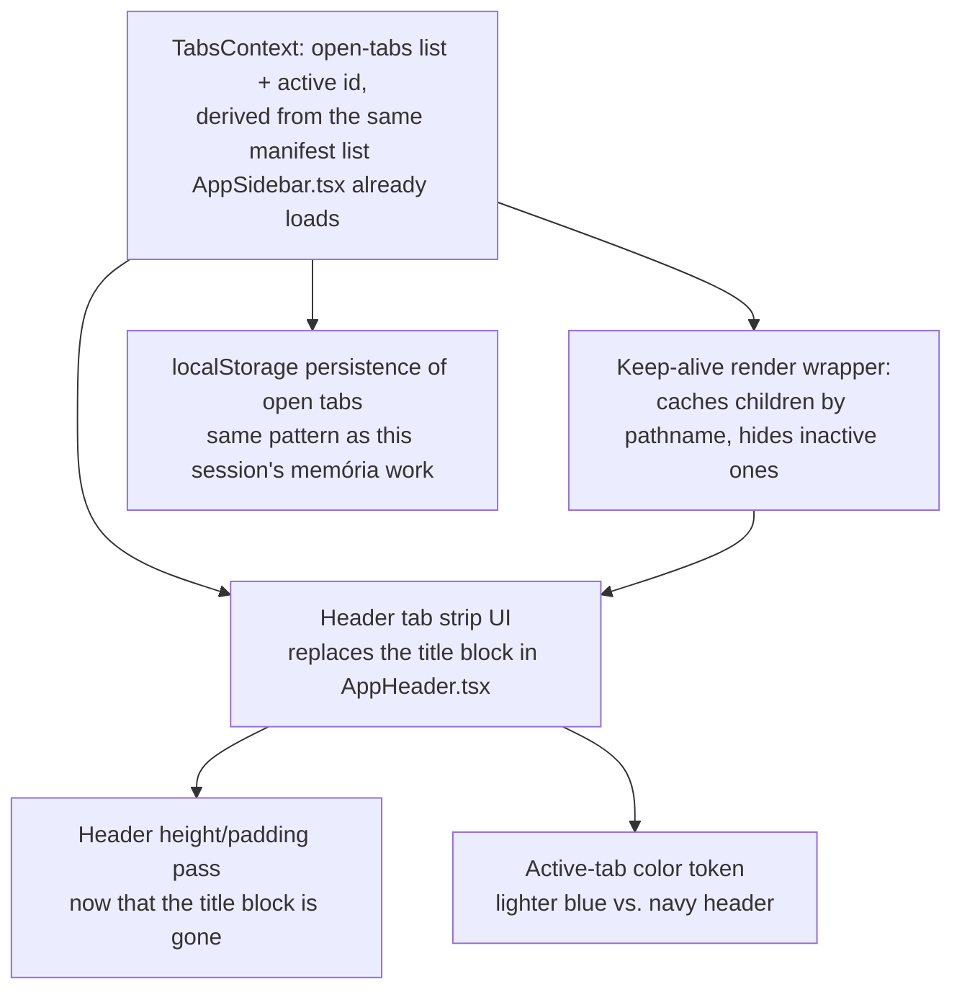

### Design rationale

- **Why not Next.js's own native mechanism for this.** Researched directly (not assumed):
  Next.js does have a built-in way to keep a route's component state alive across navigation
  instead of unmounting it — `cacheComponents: true` in `next.config`, which uses React's
  `<Activity>` component internally. **It requires Next.js 16.** This project is on
  **15.5.23** — upgrading a major framework version specifically to unlock one UI feature,
  mid-way through an already-large migration, is a much bigger and riskier move than this
  feature justifies on its own. Also found multiple open Next.js GitHub issues describing
  `cacheComponents`/`<Activity>` as still causing real breakage in application logic even on
  16 (["Activity component route preservation causes significant breakage"](https://github.com/vercel/next.js/issues/86577)),
  and its caching semantics are designed around server-rendered data caching — there's no
  confirmation it behaves sanely under this project's specific deployment shape (`output:
  'export'`, served over a custom `app://` protocol inside Electron, no real Next.js server
  at runtime at all). Not a fit right now — revisit only if/when a Next 16 upgrade happens
  for its own independent reasons.
- **Why not a third-party keep-alive library either** (`next-easy-keepalive`,
  `react-next-keep-alive` both exist and do roughly this). Same judgment call this project
  already made once this session for a similar reason (skipping React Query/SWR for IPC data:
  "dependência desnecessária") — this app's deployment shape (static export, custom
  protocol, no server) is unusual enough that a general-purpose community library's
  assumptions may not hold, and the actual mechanism needed is small enough (~30 lines) to
  just own directly, with full control for debugging when something in this non-standard
  setup inevitably doesn't match the library author's assumptions.
- **The mechanism this section actually specs**: a client component that watches
  `usePathname()` and keeps a `Map<pathname, ReactNode>` of every currently-open tab's
  rendered subtree, captured from `children` at the moment each new pathname is first
  visited. Renders every entry in the map simultaneously, `display:none` on all but the
  active one. This is what makes "switch tabs without losing state" real — the hidden tabs'
  React trees, hooks, and effects keep running exactly as if they were still visible, not
  approximated via localStorage. Real Next.js routing (`<Link>`, `usePathname`) is untouched
  underneath — only what happens to the *previous* route's rendered tree changes.
- **Which routes become tabs**: only manifest `navbar`-registered top-level modules — the
  same list `AppSidebar.tsx` already loads via `getModulosCarregados()` and filters through
  `permissaoLiberada()`, so tab availability automatically matches sidebar-visibility
  permission logic with zero duplicated code. Produtos' own internal Cadastro/Estoque/
  Precificação sub-nav (`produtos/layout.tsx`) stays exactly as it is today — those are
  sub-routes *within* one "Produtos" tab, not three separate header tabs; this matches how
  they already behave and keeps the tab strip bounded to ~14 possible entries, not exploding
  with every nested sub-route the app has.
- **Dashboard is a tab like any other module now**, not the tab *host* it was in vanilla
  (where `abas.js` ran inside `dashboard/index.html`, which no longer makes sense once every
  module is its own real route). Reuses the existing `hrefDoModulo` special case (`m.id ===
  "dashboard" → "/"`) already built this session. If every tab is closed, fall back to
  auto-opening Dashboard rather than showing a blank shell.
- **What happens to the header subtitle**: per the owner's own example ("tira o texto embaixo
  ... faz uma caixa pra ser a nova guia"), `AppHeader.tsx` stops rendering
  `cabecalho.subtitulo` once the tab strip replaces the title block — the tab chip itself
  (icon + module label) is what the header shows now. `usePageHeader(titulo, subtitulo)`'s
  API and all ~13 existing call sites are **not** touched in this pass — `subtitulo` becomes
  inert data the header no longer reads, disclosed explicitly rather than either silently
  left half-wired or turned into a 13-file cleanup that's out of this feature's scope. A
  follow-up could route that description text into each page's own body instead (same
  treatment already given to Importação's long subtitle earlier this session) — flagged as a
  real option, not decided here.
- **PDV / caixa-sensitive tabs, disclosed risk, not blocking**: a cashier can now background
  an in-progress PDV sale by switching to another tab and leaving it open indefinitely — the
  cart already persists via `localStorage` regardless (this session's earlier memória work),
  so nothing is lost, but there's no visual reminder that a sale is sitting open in a
  background tab. A small non-empty-cart indicator dot on the PDV tab chip would close that
  gap — noted as a nice-to-have enhancement, not a required item for this section to be done.

### Implementation

- [x] **`context/TabsContext.tsx`** — new context: `{ abas: {id, moduloId, titulo, href,
      icone}[], abaAtivaId }`. Auto-registers a tab whenever `usePathname()` resolves to a
      new manifest-registered module route not already open (no explicit "open tab" call
      needed from the sidebar or anywhere else — fully decoupled from any one click handler,
      so no navigation path can accidentally bypass it). `fecharAba(id)` removes it from the
      list; if it was active, activates the previously-active tab if still open, else the
      next one in the list, else falls back to Dashboard (auto-opened). Persisted to
      `localStorage` (open tabs + active id) so a reload/restart restores the same set —
      same pattern as this session's `usePersistedState`/PDV-cart work, reused not
      reinvented. New shared `hooks/useModulos.ts` extracted from `AppSidebar.tsx`'s own
      inline manifest-fetch/permission-filter logic — both the sidebar and this context now
      read the exact same list, no duplicated permission logic to drift apart.
      **Real bug caught before shipping**: the first draft of `fecharAba` called
      `router.push`/`setAbaAtivaId` *inside* the `setAbas` updater callback — an impure
      updater, exactly what React Strict Mode double-invokes updaters to catch (would have
      fired the navigation/state-set twice). Fixed by computing the next `abas` list first,
      then calling the side effects separately using the closure's already-current
      `abas`/`abaAtivaId` values (safe in an event handler, not inside a state updater).
- [x] **Keep-alive render wrapper** (`layout/AbasAtivasWrapper.tsx`) — new client component
      inside `(admin)/layout.tsx`, replacing the direct `{children}` render: keeps a
      `Map<pathname, ReactNode>` keyed by every currently-open tab's pathname, captured from
      `children` **only on first visit** to that pathname (captured during render, not an
      effect — mutating the ref this way is the standard, safe version of this pattern,
      since a revisit's freshly-resolved-but-discarded `children` never actually gets
      inserted into the returned tree, so React never mounts/wastes a duplicate instance of
      it). Renders every cached entry simultaneously, Tailwind `hidden` on all but the one
      matching the current pathname. A separate effect prunes any cache entry whose href is
      no longer in `TabsContext.abas` — actually frees the closed tab's mounted state/memory,
      not just hides it. Researched the native alternative before building this by hand:
      Next.js's own `cacheComponents`/`<Activity>` mechanism does exactly this, but
      **requires Next.js 16** (confirmed via docs — this project is on 15.5.23) and has
      multiple open GitHub issues describing real breakage even there; a major-version
      upgrade just to unlock one UI feature mid-migration was judged too risky. Also
      considered (found via search) two community keep-alive libraries
      (`next-easy-keepalive`, `react-next-keep-alive`) and passed on both — same judgment
      call this project already made once this session for React Query/SWR: this app's
      deployment shape (static export, custom `app://` protocol, no real Next.js server at
      runtime) is unusual enough that a general-purpose library's assumptions may not hold,
      and the actual mechanism needed is small enough (~40 lines) to own directly.
- [x] **`AppHeader.tsx` — tab strip replaces the title block.** Horizontal, horizontally-
      scrollable row of chips (icon + label + ×), sourced from `TabsContext.abas`. Clicking
      a chip's body navigates to its `href` (`router.push`, intercepted by the keep-alive
      wrapper above so state isn't lost); clicking × calls `fecharAba(id)`. New shared
      `components/common/IconeModulo.tsx` extracted (was a private function inside
      `AppSidebar.tsx`) so the sidebar and the new tab strip render the exact same manifest
      SVG icon without a second copy of that component. `cabecalho.subtitulo` from
      `PageHeaderContext` no longer renders anywhere in the header — see design rationale
      for why that's a disclosed, deliberate no-op rather than a 13-file cleanup pass.
- [x] **Active-tab color** — `bg-blue-500` for the active chip, reusing the same blue family
      already chosen this session for the PDV "Devolução / Troca" button (`blue-600`), a
      lighter shade for better contrast against the navy header at chip scale. Inactive
      chips use a muted `bg-white/5` tone. Final visual check (whether `blue-500` reads
      right in practice, not just in isolation) still needs a live look — this session has
      no way to screenshot the actual Electron window.
- [x] **Header height pass** — right-side icon container's vertical padding cut from
      `py-[14.4px]` (the "90%" pass from earlier this session, sized for the old two-line
      title block) to `py-1.5` at desktop width — a fresh measurement against the new
      single-row tab strip's actual height, not a repeat of the earlier percentage-based cut.
- [x] **Sidebar `isActive` stays in sync.** Correction to the original claim above (this bullet
      was wrong when first written): it does **not** "work unchanged" — see the root-cause bug
      below, which broke this too. Fixed alongside the tab-registration bug.
- [x] **Root-cause bug found and fixed (2026-08-27): tabs never registered for any module
      except Dashboard.** Owner reported live: clicking Financeiro in the sidebar rendered
      Financeiro's page (the keep-alive wrapper worked correctly) but the header still showed
      only a "Dashboard" tab, active. Since `window.api`/DevTools aren't reachable directly
      from this session, root-caused via `erp-crash.log`: while chasing this, found and fixed
      an *unrelated* pre-existing bug first — `main.js`'s `console-message` handler used
      Electron's old two-parameter callback signature (`(event, detail) => {...}`); Electron
      35+ (this project is on ^43) changed it to a single destructured-object parameter, so
      `detail` was always `undefined` and the handler threw on every console message, silently
      disabling all console logging to the crash log. Fixed the handler signature (verified:
      Electron's own CSP security warning appeared in the log post-fix, confirming the pipeline
      works — see `main.js`'s `console-message` listener for the full writeup). With logging
      restored, the owner reproduced the bug once more and the log showed the real cause:
      `next.config.ts` sets `trailingSlash: true` (required for the static export — each route
      needs to resolve to `route/index.html`), so `usePathname()` returns `"/financeiro/"` (and
      the same for every other module), while `hrefDoModulo()` builds hrefs as `"/financeiro"`
      (no trailing slash — what `<Link>` targets use). `hrefDoModulo(m) === pathname` therefore
      never matched for any module except Dashboard, whose href is the special-cased root `"/"`
      (already slash-free, so it's the one case that happened to match). Fixed with a new
      `normalizarPathname()` helper in `hooks/useModulos.ts` (strips a trailing slash except on
      bare `"/"`), applied everywhere a raw `pathname` was compared against a `hrefDoModulo()`
      value: `TabsContext.tsx`'s auto-register effect and its localStorage-restore effect,
      `AppSidebar.tsx`'s `isActive()`, and — same bug, same fix, found while grepping for other
      `=== pathname` comparisons — Produtos' own internal Cadastro/Estoque/Precificação sub-tab
      highlighting in `(admin)/produtos/layout.tsx`, which had never highlighted any sub-tab as
      active for the same reason. New tabs now store their `href` via `hrefDoModulo()` (canonical,
      slash-free) instead of the raw `pathname`. The temporary `[TabsDebug]` `console.warn` lines
      used to catch this are removed. Typecheck, lint, and `next build` all clean; frontend
      static export rebuilt. Not yet re-verified live against the running app.

### Tests (manual — this project has no automated UI/browser test suite; every item here is
verified live against the running app, same discipline as every other frontend item in this
file)

- [ ] Open 3+ different modules via the sidebar; confirm each becomes its own tab in the
      header, all simultaneously listed, none replacing another.
- [ ] Type into a form field (or add items to a cart) in one tab, switch to another tab and
      back — confirm the first tab's in-progress state is still there, not reset. This is
      the actual point of the whole feature — verify it doesn't silently degrade into "looks
      like tabs, behaves like normal navigation" (i.e. Option A from the architecture
      decision, which was explicitly not what was chosen).
- [ ] Close a tab (×) — confirm its content is genuinely gone from the keep-alive cache
      (e.g. reopening the same module shows a fresh fetch, not instantly-restored stale
      data from before it was closed) and that closing the *active* tab falls back sensibly
      (previous tab, or Dashboard if none left) — never a blank screen.
- [ ] Restart the Electron app with several tabs open — confirm they're restored from
      `localStorage` in the same state (open + which was active).
- [ ] Confirm the header is visibly shorter than before this section.
- [ ] Confirm the active tab's chip renders in the chosen lighter blue, visually distinct
      from both inactive chips and the navy header background, in both light and dark app
      theme if that setting still applies to the header (it currently has a fixed navy
      background regardless of light/dark mode — confirm that's still the intent here, not
      a new question this feature needs to also answer).
- [ ] PDV specifically: open a sale in progress, switch away to another tab, switch back —
      confirm the cart, caixa badge state, and any in-progress payment fields are exactly as
      left, not reset, and that the caixa-closed checkout guard (built earlier this session)
      still works correctly on a tab that was just reactivated from the background, not only
      on a freshly-navigated-to one.

### Registration

- [x] Every manifest module with a `navbar` entry gets tab behavior automatically via the
      shared manifest-list mechanism — verify against the **real, current** manifest list
      (`window.api.getModulosCarregados()`), not just the modules already built this
      session, so a module added later doesn't need this feature re-wired by hand.
      **Verified (2026-08-29) via code, not manual click-through**: `useModulosPermitidos()`
      (`hooks/useModulos.ts`) reads directly from `window.api.getModulosCarregados()`, and
      `TabsContext.tsx`'s auto-register effect (`modulos.find((m) => hrefDoModulo(m) === rota)`)
      iterates that same live list — not a hardcoded set. A module added later needs no
      changes here.
- [ ] `GOALS.md` items in this section checked off only after live verification, per this
      file's own established discipline for the rest of the frontend migration — not when
      the code merely compiles.

---

## Developer Support Admin Account (feature, not started)

**Owner's ask (2026-08-28), verbatim**: "unica coisa que voce realmente deve subir e fazer é
minha conta de adm com senha que eu vou definir posteriormente para eu poder gerenciar os erp
no pc dos clientes." — the only thing that should actually ship is the owner's own admin
account, with a password to be defined later, so the owner can manage the ERP on client
machines. Raised right after a real cutover test (v1.1.0 published, installed on a second
PC) surfaced that there's currently no way for the developer to get into a client's install
without knowing that specific store's own login — every install's `Usuarios` table is
bootstrapped independently, from whatever the store typed on first run (see `db/usuarios.js`,
already documented in AGENTS.md's Auth section).

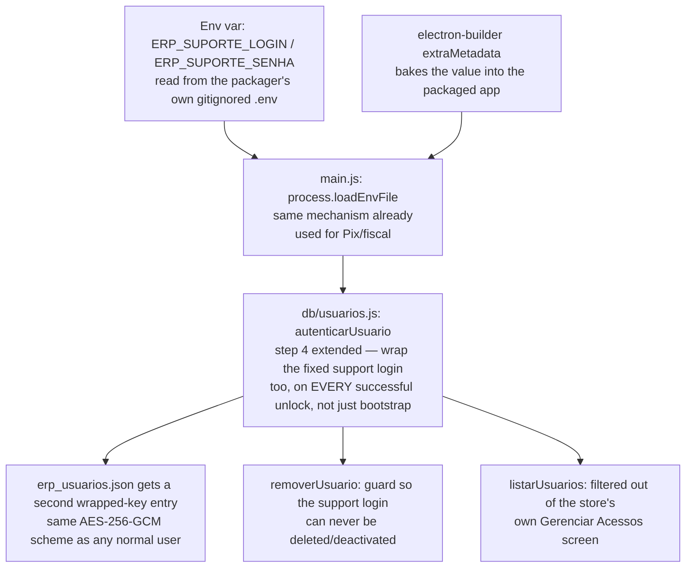

### Design rationale

- **Why this can't be "just add a row to `Usuarios`."** The DB is SQLCipher-encrypted; the
  actual decryption key is the "chave-mestre," derived once from whatever password unlocked
  the database the very first time, and every OTHER login works by having its own wrapped
  copy of that same master key sitting in `erp_usuarios.json` (AES-256-GCM, keyed by
  `derivarChaveUsuario(login, senha)`, see `db/usuarios.js`). A support login with no wrapped
  entry could never actually decrypt an existing store's database — it would just be a
  useless row. The wrap has to be created at a moment the process already holds the real
  master key in memory, which only happens during a successful unlock.
- **When the wrap gets created.** `autenticarUsuario`'s existing step 4 already does
  "ensure a wrap exists for the login that just authenticated" (this is how a *normal* user's
  first login creates their own entry). Extending that same step to *also* wrap the fixed
  support login, on every successful unlock (the store's own daily logins, not just first
  bootstrap), means the support account becomes usable the very first time anyone at the
  store logs in after this ships — no special first-run flow needed, no action required from
  the store owner.
- **How the password reaches a packaged build — considered three options.** (1) Bundle the
  raw `.env` file into the installer (`build.files`) — rejected: a plaintext credential
  sitting inside the installed app's `resources/` folder, trivially extractable by unpacking
  the asar. (2) A manual `.env` the developer drops next to each client's install after the
  fact — rejected: doesn't match "so I can manage the ERP on client PCs" (plural, ongoing) —
  would need repeating by hand for every future install/reinstall. (3) **Chosen**:
  electron-builder's own `extraMetadata` build option, set via **CLI flags at publish time**
  (`-c.extraMetadata.erpSuporte.login=... -c.extraMetadata.erpSuporte.senha=...`, verified
  against electron-builder's own source/tests — `coerceTypes(config.extraMetadata)` and the
  documented `-c.mac.sign.identity=null`-style nested-path override both confirm this exact
  syntax works), not a static `extraMetadata` block in `package.json` (a static block would
  need `${env.X}` macro expansion inside `extraMetadata` specifically, which isn't confirmed
  to apply there — the documented macro expansion is for publish-config string fields, a
  narrower thing). The shell substitutes the real values into the CLI flags before
  electron-builder ever sees them — the value never touches source control (same discipline
  as `GH_TOKEN`, `.env`, and every other secret this project already keeps out of the repo),
  gets baked once per release, and `main.js` reads it the same way it already reads
  `process.env` for Pix/fiscal
  (`process.loadEnvFile`), falling back to the embedded `package.json` field when no local
  `.env` is present (i.e. in the packaged, installed case).
- **Password rotation is not retroactive.** Because the value is baked in per-release (not
  fetched from a server — this app has none, by design), changing
  `ERP_SUPORTE_SENHA` and cutting a new release only affects installs that update to it.
  Already-installed clients keep whichever password was baked in when they installed/last
  updated, until they update again. Disclosed here so it's not assumed to behave like a
  central "reset everywhere" — it can't, offline-first has no such mechanism.
- **Never deletable.** `removerUsuario` already refuses to remove/deactivate the *last active
  admin* (so an owner can't lock themselves out). Extending the same guard to unconditionally
  refuse the fixed support login (regardless of admin count) prevents the store's own cleanup
  — or an admin who doesn't recognize the login and assumes it's a mistake — from silently
  removing the developer's own access.
- **Hidden from the store's own Gerenciar Acessos list — a judgment call, not hidden from the
  database itself.** Filtering the support login out of `listarUsuarios()`'s result (so it
  never shows in the Acessos screen a store admin uses day to day) matches how vendor support
  accounts are conventionally handled — it avoids a store owner seeing an unfamiliar login and
  worrying it's a breach. It is **not** concealment in any stronger sense: the row is a normal
  `Usuarios` entry, fully visible to anyone using the existing "Banco de Dados" raw-table
  inspection module (admin-gated, already requires re-entering the admin password — see
  AGENTS.md's Auth section). Flagged explicitly here rather than assumed, since "should the
  client be able to see this account exists" is ultimately the owner's call, not a technical
  one — open for the owner to override before this ships.
- **Login name**: needs the owner's preference (not invented here) — proposing a default of
  `allu_suporte` (matches the product's own branding, unambiguous, unlikely to collide with a
  real customer's chosen login) for the owner to confirm or override before implementation.
- **Out of scope, explicitly**: this is *not* remote/central management (no server exists or
  is proposed) — it's a guaranteed local credential the developer can use once they have
  physical or remote-desktop (AnyDesk/TeamViewer, already in the developer's own toolset)
  access to a client machine. Building actual centralized fleet management (push config,
  view status across installs from one dashboard) would be a much larger, separate initiative
  and contradicts this project's deliberate offline-first, no-server architecture — not
  proposed here.

### Implementation

- [x] **`db/usuarios.js` — extend the wrap-ensure step.** In `autenticarUsuario`, after the
      existing "ensure wrap for this login" logic, also ensure a wrap exists for
      `process.env.ERP_SUPORTE_LOGIN` using `process.env.ERP_SUPORTE_SENHA` — guarded so it's
      a no-op when either env var is unset (dev machines without the secret configured, or a
      build that deliberately omits it, keep working exactly as today). Reuses
      `derivarChaveUsuario`/`embrulharChave`/`gravarArquivoUsuarios`, no new crypto.
      Idempotent by construction (same "if (!arquivo[login])" guard already used for normal
      users) — never re-wraps or overwrites on every login, only creates the entry once.
      **Collision safety, since the owner picked the login `adm`** (a name a store could
      plausibly pick for their own account too): `garantirContaSuporte()` checks BOTH the
      wrap-file entry AND the `Usuarios` row before ever writing anything — if `adm` already
      belongs to a real account on that install (in either place), the function is a total
      no-op for that install rather than overwriting/breaking the real account's access. This
      means the support login simply won't be available on any client whose own admin already
      happens to be named `adm` — a real, disclosed limitation of reusing a common name,
      traded for simplicity per the owner's explicit choice.
- [x] **`db/usuarios.js` — bootstrap the `Usuarios` row too**, same "if not present, insert"
      pattern already used for the very first admin (`autenticarUsuario` step 3) — done inside
      `garantirContaSuporte()` itself (not step 3, which only fires on a truly empty table).
- [x] **`db/usuarios.js` — protected login guard.** `removerUsuario` refuses unconditionally
      (`ehLoginDeSuporte` check before the existing last-admin-count logic). `salvarUsuario`'s
      edit branch also refuses to edit/deactivate it by id — defense in depth beyond just
      hiding it from the list (closes a direct-IPC-call gap).
- [x] **`listarUsuarios()` — filter the support login out**, so
      `frontend/src/app/(admin)/acessos/page.tsx` / `UsuarioFormModal.tsx` never need their
      own awareness of it.
- [x] **`main.js` — extend `.env` loading for the packaged case.** Falls back to
      `require("./package.json").erpSuporte.{login,senha}` when `.env` didn't already provide
      both — the field the CLI publish flags below bake in.
- [x] **Publish command — wire the build-time bake.** `AGENTS.md`'s release process section
      documents the two extra `-c.extraMetadata.erpSuporte.*` flags the developer adds to the
      existing `npx electron-builder --publish always` command, sourcing
      `ERP_SUPORTE_LOGIN`/`ERP_SUPORTE_SENHA` from their own shell environment — never a
      static block in `package.json`, never committed with a real value.
- [x] **`.env.example` — document the two new variables**, noting they're read at
      *package/release* time (via the CLI flags above), not at every app launch in a packaged
      build, and are never required.
- [x] **Owner decision, answered (2026-08-28)**: login is `adm` (not the proposed
      `allu_suporte` — see collision-safety note above); the actual password was provided
      directly and used to publish v1.1.2 — **deliberately not recorded here or anywhere in
      this repo** (this file is public). Visibility default (hidden from Acessos, visible via
      Banco de Dados) not objected to — proceeding with it as specified in Design rationale.

### Tests

- [x] `test/suporte-admin.test.js` (new, `node:test` + temp-DB pattern matching
      `test/senha.test.js`): with `ERP_SUPORTE_LOGIN`/`ERP_SUPORTE_SENHA` set, a fresh DB's
      first-ever login (a different, normal login) also results in the support login
      successfully authenticating afterward — proves the wrap-on-any-unlock behavior, not just
      wrap-on-first-bootstrap.
- [x] Same test file: `listarUsuarios()` never includes the support login in its result.
- [x] Same test file: `removerUsuario(idDoSuporte)` throws, regardless of how many other
      active admins exist.
- [x] Same test file: with the env vars unset, behavior is byte-for-byte identical to today —
      no support login created, no error, nothing observable changes (proves the feature is
      genuinely opt-in, not a hidden requirement).
- [x] Same test file: collision case — a login matching `ERP_SUPORTE_LOGIN` that already
      belongs to a real account (created before the support env vars were ever set) keeps
      working with its own real password, and the support password does NOT unlock it.
- [ ] **(manual)** Full build → install cycle on a real second machine: confirm the baked
      `extraMetadata` value actually reaches a packaged install and the support login works
      end-to-end — this specific path (electron-builder's env-to-`extraMetadata` substitution)
      can't be exercised by the existing e2e suite, which launches the app straight from
      source (`electron .`), never a packaged build.

### Registration

- [x] AGENTS.md's Auth / Decisões Arquiteturais section gets a note about this account's
      existence and purpose — so a future session (or the owner, months from now) doesn't
      rediscover an unexplained login the same confused way this whole feature started.
      Deliberately **not** documented in README.md (a public file) — the account's existence
      is fine to disclose to a future maintainer working in the repo, not to anyone browsing
      the public GitHub page.

---

## Update Flow — Navigation Freeze Investigation (2026-08-29, root cause CONFIRMED and FIXED)

**Owner's live report**: after v1.1.6 (which fixed the missing `frontend/out` packaging bug),
navigating to Atualizações then clicking any other module/tab did nothing — the sidebar's
active-item highlight *did* update (proving `usePathname()` genuinely changed), but the
header tab strip and page content stayed frozen on Atualizações. Reproduced live via
computer-use on the owner's real machine.

**Two fixes shipped, both real architectural improvements, root cause not 100% pinned down**:

1. **`main.js`'s custom `app://renderer/` protocol switched from `net.fetch()` to
   `fs.promises.readFile()`.** `net.fetch` for a `file://` URL still routes through Chromium's
   network service — the same infrastructure `electron-updater` uses to reach GitHub. Serving
   a local static file has no reason to depend on network machinery at all; this fully
   decouples the two regardless of the exact interaction that was happening.
2. **`ipc/sistema.js`'s `check-for-updates`/`download-update` now pre-check connectivity**
   (`temConectividade`: a 5s `fetch` + real `AbortController`) before ever calling
   `autoUpdater.checkForUpdates()`/`downloadUpdate()`. The existing `comTimeout`
   (`Promise.race` + `setTimeout`) turned out not to be sufficient on its own — in testing,
   the race's own `setTimeout` sometimes never fired either, which points at something
   deeper than "the promise just doesn't resolve": DNS resolution (`getaddrinfo`) runs on
   Node's libuv threadpool, the same fixed-size pool `fs.readFile` needs a slot from — a
   hung DNS lookup can plausibly starve that pool. `fetch`'s `AbortController` is a genuine
   cancellation (not just "stop waiting"), which is why the pre-check uses it instead of
   another `Promise.race`.

**Update (2026-08-29, later same day)**: the e2e mock now exists —
`ERP_MOCK_UPDATER=1` (`ipc/sistema.js`) makes `checkForUpdates()` emit the real
`checking`/`not-available` events synchronously, no network involved at all. Restored the
removed regression test with it (`e2e/tab-system.spec.ts`, "navegar pra Atualizações e
depois pra outro módulo continua funcionando"). **It still reproduces — deterministically,
with zero network activity — which proves the bug was never about network/DNS in the first
place.** Also tried `normalizarPathname()` in `AbasAtivasWrapper.tsx` (a real gap — it was
the one place in the tab system that never got that fix — closed a latent duplicate-cache-key
risk) — didn't fix this either. Test is marked `test.fail()`: runs every CI run, documents
the known-broken state, and will loudly tell us (Playwright fails the run) the moment
something actually fixes it.

**Three real fixes shipped this investigation, all still valid architectural improvements,
none of them the root cause**: `net.fetch` → `fs.readFile` (decouples local file serving
from Chromium's network stack), the `temConectividade` pre-check (genuine `AbortController`
cancellation instead of just "stop waiting"), `normalizarPathname()` in
`AbasAtivasWrapper.tsx`. **Network is now definitively ruled out.** The actual root cause —
found and fixed below — was an unstable `useEffect` dependency in `usePageHeader`, specific
to the Atualizações page, exactly matching this prediction.

### Deep investigation plan (owner's request, 2026-08-29) — executed, root cause found

Real DevTools access (F12/`openDevTools`) turned out not to be necessary in the end — a
faster path existed: this app already writes every renderer `console.error`/`console.warn`
to `erp-crash.log` (`main.js`'s `console-message` handler), so temporary `console.warn`
instrumentation plus a standalone Playwright-driven repro script (outside the committed e2e
suite, launching the packaged frontend the same way `e2e/tab-system.spec.ts` does, with
`page.on("console", ...)` for real-time capture) reproduced the freeze deterministically and
captured the full renderer console output at the exact moment it happened — no visual
DevTools window needed.

- [x] **Step 1 — DevTools access.** Confirmed nothing in `criarJanelaPrincipal()` blocks
      `devTools` or intercepts F12 explicitly (matches the original suspicion that absence of
      an explicit block wasn't the explanation). Added `ERP_DEBUG_DEVTOOLS=1` env-gated
      `webContents.openDevTools({ mode: "detach" })` in `main.js` anyway — a permanent,
      opt-in diagnostic tool for future investigations, same convention as
      `ERP_MOCK_UPDATER`/`ERP_TEST_USERDATA_DIR`. Not what actually cracked this bug (see
      above), but genuinely useful going forward.
- [x] **Step 2 — reproduce and read the Console, done via the console-capture script instead
      of a live DevTools window (equivalent result, more automatable).** **Root cause found:**
      `frontend/src/app/(admin)/atualizacao/page.tsx` passed an inline JSX element as
      `subtitulo` to `usePageHeader(titulo, subtitulo)` — a brand-new object every render.
      `usePageHeader`'s `useEffect` (`context/PageHeaderContext.tsx`) depends on
      `[titulo, subtitulo]`, so with a never-stable `subtitulo` the effect
      (`setCabecalho(null)` → `setCabecalho({...})`) refired on **every render** of
      `AtualizacaoPage`. Because `AbasAtivasWrapper` keeps a visited page genuinely mounted
      even while hidden, and `useAtualizacao()`'s `window.addEventListener("update-status", ...)`
      is never torn down while mounted, every stray `update-status` event (confirmed firing
      repeatedly even after navigating away) re-triggered this cycle. `PageHeaderProvider`
      wraps the entire main tree (`TabsProvider` → `AppHeader` → `AbasAtivasWrapper` → every
      cached tab) with none of its children memoized, so each `setCabecalho` call
      re-rendered **the whole app**, including whatever tab the user had just navigated to —
      racing with, and in practice starving, that tab's own initial commit. Confirmed this is
      the *only* unstable call site: all other 15 pages calling `usePageHeader` pass plain
      string literals (stable by `Object.is`), which is exactly why only Atualizações ever
      triggered this.
- [x] **Step 3 — global `ErrorBoundary`.** Added `frontend/src/layout/AbaErrorBoundary.tsx`,
      wrapping each cached tab individually inside `AbasAtivasWrapper` (a crash in one hidden
      tab's tree no longer nukes the active one). Confirmed via the repro script this was
      *not* what was catching/hiding the freeze (no `[AbaErrorBoundary]` log ever appeared —
      the real cause was never a thrown exception) — kept anyway as a permanent safety net,
      since the app had zero error boundaries anywhere before this.
- [x] **Step 4 — instrumented, found it, then removed the temporary logging** (per this
      section's own stated convention) from `TabsContext.tsx`, `AbasAtivasWrapper.tsx`, and
      `useAtualizacao.ts` once Step 2's finding was confirmed.
- [x] **Fix applied and verified**: wrapped `atualizacao/page.tsx`'s `subtitulo` in
      `useMemo(() => (...), [versao, statusCor, status])`. Re-ran the exact same repro script
      after rebuilding — navigation to Compras now succeeds immediately, no freeze. Removed
      the `test.fail()` wrapper from `e2e/tab-system.spec.ts`'s regression test (Playwright
      itself flagged "Expected to fail, but passed" before the wrapper was removed — the
      built-in confirmation this exact mechanism predicted). Full suite green: `npm test` (62
      unit tests), `npx playwright test` (5/5 e2e), `npm run lint` (clean).
- **Not done, optional follow-up (bigger than this investigation's scope, flagged not
  executed):** `PageHeaderContext`'s `cabecalho` value is now confirmed **fully dead** —
  grepped the whole frontend, nothing reads it (`AppHeader.tsx` was migrated to the tab-strip
  design and never wired to consume it; every page's actual subtitle now renders in its own
  body, same pattern already applied to Atualizações earlier this session). The `useMemo` fix
  above closes the actual bug, but `usePageHeader`/`PageHeaderContext` could be deleted
  entirely (16 call sites + the context file) as dead-code cleanup that also permanently
  forecloses this whole bug class. Left undone here since it's a materially larger, more
  invasive change than what this investigation pass was scoped to — a call for the owner.

### Support account login collision — real, connected finding (2026-08-29)

**Owner's report, same message**: "eu tinha pedido para gerir uma senha de acesso diferente
da atual" — implying the account they're actually logged in as right now uses a different
(weaker) password than the one they'd asked to be set up, not the baked-in support password.
Verified directly against the owner's real,
currently-installed v1.1.8 (`resources/app.asar` extracted, read-only): `erpSuporte.login`
and `erpSuporte.senha` **are** correctly baked into this exact installed copy — the
`extraMetadata` mechanism worked correctly this time (unlike the `frontend/out` bug, this
is not a repeat of that class of failure).

**Likely root cause — the collision this file already flagged as a risk when the login
`adm` was chosen**: `garantirContaSuporte()` is deliberately collision-safe — it never wraps
a login that already has *any* `Usuarios` row or wrap-file entry, precisely so it can never
break a real account. On a genuinely fresh install, the *first* login+password anyone types
becomes the bootstrap admin (existing, unrelated behavior — `autenticarUsuario` step 3).
**If the owner (or a real client, entirely plausibly) types `adm` as their own first login
when setting up a fresh install — exactly what appears to have happened here — the support
account's own collision guard refuses to ever touch that login**, because as far as
`garantirContaSuporte()` can tell, `adm` already belongs to a real person. The support
password never activates for that install, silently, by design — the owner sees an
"Administrador" session and reasonably assumes it's the guaranteed support account, when
it's actually just their own bootstrap account that happens to share a name.

- [x] **Verified directly (2026-08-29), collision CONFIRMED cryptographically, not just by
      inference.** App was closed; read `erp_usuarios.json` from the real userData directory
      (`AppData/Roaming/erp/` — note the folder is `erp`, `package.json`'s `name` field, not
      `productName` "ALLU ERP") read-only. Wrote an isolated offline script replicating
      `derivarChaveUsuario`/`desembrulharChave` exactly and attempted to unwrap the `"adm"`
      entry with the real baked support password (`ERP_SUPORTE_SENHA`, never written to any
      file in this repo — see `.env.example`): **AES-GCM auth tag did not validate** — the
      real support password does not decrypt that entry. Proves `"adm"` in this install is
      the store's own bootstrap account (whatever password was typed on first run), not the
      support account — exactly the collision this file already flagged as a risk when the
      login was chosen.
- [x] **Renamed, per owner's decision (2026-08-29, answered via this execution's confirmation
      question): from the next publish onward, use `ERP_SUPORTE_LOGIN=allu_suporte`** instead
      of `adm` (documented in `AGENTS.md`'s release-process section, with the verified
      collision finding above as justification). No code change needed — the login is
      entirely driven by the env var/CLI flag at publish time, nothing hardcoded. **Not
      retroactive**: v1.1.8 and any other already-published build keeps `adm` and stays
      affected by the collision — only applies to builds published after this change.
- [x] **Collision now logged.** `garantirContaSuporte()` (`db/usuarios.js`) writes a line to
      `erp-crash.log` (same file/format as `main.js`'s own `logErro`) whenever the collision
      guard actually triggers — `[garantirContaSuporte] login "X" já pertence a uma conta
      real (id=N) — conta de suporte NÃO ativada nesta instalação (colisão de nome).` Makes
      this diagnosable in seconds on the next occurrence instead of requiring a fresh
      cross-referencing investigation.

### Final decision (2026-08-31): `adm` reserved, not renamed

Owner reconsidered the `allu_suporte` rename two days later — wanted `adm` back
specifically ("consigo gerenciar melhor"), but with the collision **eliminated**, not just
avoided by picking an obscure string. Implemented as a genuine reservation instead of a
rename:

- [x] **`ERP_SUPORTE_LOGIN` reverted to `adm`** (was `allu_suporte`), password changed to a
      new value provided directly by the owner. Publish command in `AGENTS.md` updated. No
      `.env`/repo file ever holds the real value (same discipline as before).
- [x] **`autenticarUsuario()` (`db/usuarios.js`) refuses to bootstrap a fresh install with the
      reserved login** when `ERP_SUPORTE_LOGIN` is configured — checked *before* the database
      is ever opened/keyed, specifically because `desbloquearBanco()` creates the schema (a
      real write) on first unlock; rejecting after that point would leave a `.sqlite` file
      permanently keyed with a now-abandoned password and zero users, worse than allowing the
      collision. Detection signal: the `.sqlite` file doesn't exist on disk yet (unambiguous
      "this is a genuine first-ever bootstrap" check that needs no live connection).
- [x] **`salvarUsuario()` refuses to create a new user with the reserved login** via Gerenciar
      Acessos, for existing installs where a store is adding accounts after their own
      bootstrap.
- [x] Existing protections (hidden from `listarUsuarios()`, can't be edited/removed) already
      applied automatically once the login changed back to `adm` — they key off
      `ehLoginDeSuporte()`, which reads `ERP_SUPORTE_LOGIN` dynamically, not a hardcoded
      string.
- [x] **The original collision-safety guard in `garantirContaSuporte()` stays as-is,
      deliberately** — it's still the correct backstop for installs published *before* this
      change (where `adm` may already be a real store's own account) and for the edge case
      where `ERP_SUPORTE_LOGIN` wasn't configured at the exact moment of bootstrap. It should
      just never need to fire on a fresh install going forward.
- [x] Test coverage added (`test/suporte-admin.test.js`): bootstrap rejection when reserved,
      `salvarUsuario` rejection when reserved, and the original collision test kept
      unmodified (still describes a real, still-valid edge case: bootstrapping before
      `ERP_SUPORTE_LOGIN` was ever configured on that install). 67/67 unit tests, 5/5 e2e.
- [x] Published as v1.1.12 with the baked `adm` credentials.

---

## Pre-production QA pass (2026-08-29, owner's final test before real company use)

Owner's request: two live-tested corrections, ahead of using this ERP for real at their own
business and rolling the update out from GitHub Releases.

- [x] **Header tab strip never actually compacted — root cause was a flexbox `min-width:auto`
      trap, two levels up from the tab strip itself.** `AppHeader.tsx`'s tab row already had
      correct `min-w-0`/`flex-shrink` — but its own parent (`<header>`'s single flex child,
      `flex flex-col ... grow lg:flex-row`) and, one level further up,
      `(admin)/layout.tsx`'s main-content `flex-1` div, both lacked `min-w-0`. A flex item's
      default `min-width` is `auto` (never shrink below content's intrinsic size) — without
      the fix, the whole chain silently grew to fit the tab strip's *unshrunk* content instead
      of ever handing it a real constrained width, which is exactly why nothing ever
      compacted and the page just grew a horizontal scrollbar instead (matching the owner's
      screenshots). Fixed by adding `min-w-0` at both levels
      (`frontend/src/layout/AppHeader.tsx`, `frontend/src/app/(admin)/layout.tsx`).
- [x] **Tabs now shrink proportionally (CSS-only) down to a 96px floor**, then switch to a
      Chrome-style compact mode (first-letter badge + × only, no label) via a `ResizeObserver`
      watching the tab strip's real available width divided by tab count
      (`LARGURA_MIN_ABA_NORMAL = 96` in `AppHeader.tsx`). Verified live via an isolated
      Playwright repro script (11 tabs open, viewport narrowed to 1080px): all 11 render as
      compact letter+× badges, no scrollbar needed; with only 4 tabs at 1280px, full
      icon+label+× renders normally with visible ellipsis truncation on longer labels
      (confirmed "Fornece…", "Banco d…" truncating correctly).
- [x] **"Backup local" export**: `exportarBancoJSON()` (`db/banco-admin.js`) rewritten —
      was a single combined JSON file in `userData/exports/` (invisible to the store owner,
      buried in AppData); now writes to `<pasta do executável>/Backup local/backup-DD-MM-AAAA-HH/`
      (new `getPastaExecutavel()`/`setPastaExecutavel()` in `db/conexao.js`, set from `main.js`
      at boot — `app.isPackaged ? path.dirname(app.getPath("exe")) : __dirname`), one `.json`
      file per table plus `_info.json` with the export summary. Two exports within the same
      hour reuse the same subfolder (files just overwrite in place) rather than erroring or
      duplicating. Loading overlay added to `banco/page.tsx` for the `exportando` state
      (spinner + message, `absolute inset-0` over the page). Verified live: real export
      produced 22 table files + `_info.json` in a correctly-named
      `backup-29-08-2026-15/` folder at the project root (dev-mode `pastaExecutavel`); result
      banner showed the right path and counts. New test coverage:
      `test/banco-admin-export.test.js` (3 tests: location, per-table files + `_info.json`,
      same-hour reuse).
- [x] Full regression after both fixes: `npm run lint` clean, `npm test` 65/65,
      `npx playwright test` 5/5 (no e2e locator broke from the tab-strip markup changes).

---

## Security audit (2026-09-01)

Owner's request: "procura qualquer tipo de falha de segurança que existir." `npm audit` clean
on both manifests (root 0/441 deps, frontend 0/639 deps). Full git-history secret scan clean
(gitleaks/trufflehog unavailable — grepped all commits + current tree for common credential
patterns by hand). `strix` (AI pentest scanner, already configured with a Gemini key) couldn't
run — needs Docker, not available on this machine.

- [x] **No Content-Security-Policy anywhere** — Electron's own security warning flagged this
      every session. Added one to the `app://` protocol's response headers (`main.js`).
      `script-src`/`style-src` need `'unsafe-inline'` — confirmed by reading the built
      `frontend/out/index.html`: Next.js's App Router injects real executable inline
      `<script>` tags for hydration (`self.__next_f.push(...)`), not just JSON, and React's
      `style={{...}}` usage is pervasive — neither is avoidable in a static export without a
      framework change. `connect-src`/`img-src` restricted to `'self'` — confirmed no
      renderer-side code makes direct external `fetch()` calls (everything routes through
      IPC), so this blocks exfiltration even from a script that does manage to run. Verified
      live: 0 CSP violations navigating through 10 modules, and the Electron warning is gone.
- [x] **Stored XSS in the legacy `modules/` frontend** — found one confirmed gap
      (`lista-clientes.js`: `it.sku` interpolated raw while the sibling `it.produto_nome` on
      the same line was escaped), then had an agent sweep the other 22 files for the same
      "escaped sibling, unescaped victim" pattern. Found 11 more gaps across 6 files
      (`pdv.js` ×5, `clientes.js`, `navbar.js`, `acessos.js`, `relatorios.js`, plus 3 files —
      `vendas.js`, `financeiro.js`, `compras.js` — that had no `esc()` helper at all, and
      `pagamentos.html`). Fixed all 12 (found 2 more than the agent's report while applying
      the fixes — `compras.js` had a third `i.sku` spot). Not reachable in the shipped app
      today (legacy frontend only loads via the internal `ERP_LEGACY_FRONTEND` dev escape
      hatch, cutover to the Next.js frontend is the real default) but still shipped in every
      release build, so worth closing regardless.
- [x] **`get-db-path` IPC handler had no session gate** — discloses the absolute local
      filesystem path (Windows username, folder layout). No real caller exists anywhere in
      the app today (confirmed via grep) — gated with `exigirSessao("admin")` for
      least-privilege consistency, not because anything was actually exploiting it.
- [x] **`check-for-updates` IPC handler had no session gate**, unlike its siblings
      (`download-update`, `quit-and-install`, `backup-automatico`, all admin-gated). Fixed
      the same way. Confirmed the automatic boot/daily check doesn't go through this IPC
      handler at all (calls `autoUpdater.checkForUpdates()` directly from
      `atualizacao-automatica.js`) — only the manual button in the Atualizações page uses it,
      and that page is only reachable logged in.
- [x] **`nodeIntegrationInSubFrames: true`** removed from `criarJanelaPrincipal()` — no
      known justification, confirmed no page in the app uses iframe/webview.
- [x] Confirmed (not a fix, a finding worth recording): every SQL query that concatenates a
      variable into the string uses either a whitelisted/validated source (table names
      checked against `sqlite_master`) or a numerically-clamped value (`Math.min`/`Math.max`
      before concatenation) — no raw user string ever reaches a query unparameterized. The
      131-method `contextBridge` surface in `preload.js` is all individually-named methods
      bound to fixed IPC channels, never a generic `invoke(channel, ...args)` passthrough —
      confirmed a renderer-side XSS couldn't call arbitrary IPC channels even if one existed.
- [x] Full regression after all fixes: lint clean, 67/67 unit tests, 5/5 e2e, plus a live
      10-module navigation pass confirming zero CSP violations.

## Update flow — quit-and-install silently no-op'd (2026-09-01)

Owner's live report: download completed, UI said "vai fechar e reabrir sozinho", but the app
never actually closed — had to close it manually. Also: the Atualizações page's own progress
bar stayed stuck (looked like 0%) even after the status text said "Download concluído",
while the global toast card's progress bar correctly showed 100% for the same download.

**Root cause, confirmed by reading the installed `electron-updater` source directly, not
guessed**: `ipc/sistema.js`'s `download-update` handler checked `result.path` on
`autoUpdater.downloadUpdate()`'s resolved value to decide whether a real file had been
downloaded — but that promise resolves with an **array** of file path strings
(`node_modules/electron-updater/out/AppUpdater.js:601`,
`return packageFile == null ? [updateFile] : [updateFile, packageFile]`), never an object
with a `.path` property. `result.path` was always `undefined`, so the tracking flag never
became truthy, so `quit-and-install`'s `if (downloadedUpdateExePath)` guard always silently
no-op'd — the download genuinely succeeded every time, but the app never actually quit and
reinstalled itself. This single bug explains both symptoms: the "took forever to restart"
report was the user waiting for a restart that was never going to happen on its own.

- [x] Replaced the broken `.path` extraction with a plain boolean (`downloadConcluido`), set
      `true` once `downloadUpdate()`'s promise resolves at all (success = the file is on
      disk, regardless of the exact resolved shape) — `ipc/sistema.js`.
- [x] Fixed the stuck-progress-bar symptom too: `electron-updater` doesn't guarantee the last
      `download-progress` event lands exactly at 100 before `update-downloaded` fires.
      Explicitly `setProgresso(100)` in the `update-downloaded` handler in both
      `useAtualizacao.ts` (the page) and `UpdateAvailableCard.tsx` (the global toast) —
      previously only the toast happened to read correctly, and only by chance of timing.
- [x] Lint clean, 67/67 unit tests, 5/5 e2e (unchanged — the existing `ERP_MOCK_UPDATER`
      mock doesn't cover `download-update`/`quit-and-install`, only `check-for-updates`;
      extending it to safely simulate a full download+quit+relaunch cycle without ever
      calling the real `autoUpdater.quitAndInstall()` — which would actually try to relaunch
      the test process — wasn't attempted here, out of scope for this specific fix).
- [ ] **(manual) Full live verification** — the actual "does it restart quickly and cleanly"
      behavior can only be confirmed by publishing a build and running the real
      download → quit → relaunch cycle, same as every other update-flow fix this project has
      needed. Root cause is confirmed with certainty (read directly from the library source,
      not inferred from symptoms), but the fix hasn't been exercised against a real
      published release yet.

---

## Produtos, Financeiro & Relatórios — Module Improvement Pass (feature, not started)

**Source**: owner request (2026-09-02) — "revisar 3 módulos", specifically named product
images as one known gap and asked for a real audit of the other two plus web research on
what's plausible. First pass came back too shallow per the owner's own read of it, so it was
re-run deeper — that pass also strayed into two adjacent modules (Vendas/PDV, Compras); the
owner then explicitly redrew the boundary: **stay inside Produtos/Financeiro/Relatórios only,
don't stray** (2026-09-02). The Vendas/PDV split-payment and Compras auto-restock findings
from that pass were real and stay noted below under "Out of scope" so the research isn't lost
and isn't silently redone later, but neither is part of this plan.

Every item was checked against the actual code first, never assumed from the module name. One
correction came out of that discipline: the owner believed product image upload didn't exist
yet — it does, already wired end-to-end (`db/produtos.js:736-788`
`salvarImagemProduto`/`removerImagemProduto` → `ProdutoImagemPicker.tsx` inside
`ProdutoFormPanel.tsx`). Web research (product catalog/PIM practices, small-business AP/AR
module scope, retail analytics/RFM) backs the items that come from outside this codebase
rather than from reading it.

**Out of scope, explicitly**: fiscal (NF-e/NFC-e) and Pix — both already have working
integrations in this codebase (`integracoes/fiscal/provider.js` + `providers/focusnfe.js`;
`integracoes/pix/{payload,provider,qrimage}.js` + `providers/efi.js`), but the owner decided
(2026-09-02) not to pursue further integration work there — closed, same status as the paused
Payment Processor Integration section above, don't reopen without the owner raising it. Also
out of scope: Vendas/PDV split payment (`Vendas.forma_pagamento` is a single column, no way to
record part-Pix-part-cartão in one sale — real finding, but a different module than the three
named here) and Compras' automatic reorder suggestion (joining `getEstoqueBaixo` +
`getGiroEstoque` into a pre-filled `PedidoCompra` — also real, also a different module) — both
noted here only so a future pass on those specific modules doesn't have to re-derive them from
scratch. Also out of scope, from the first pass: bank reconciliation / OFX import and multiple
bank/cash accounts (no bank data integration point in this local-only app), and a full
DAS/Simples Nacional calculator (accountant's job, already excluded by the Financial/
Accounting Depth section above).

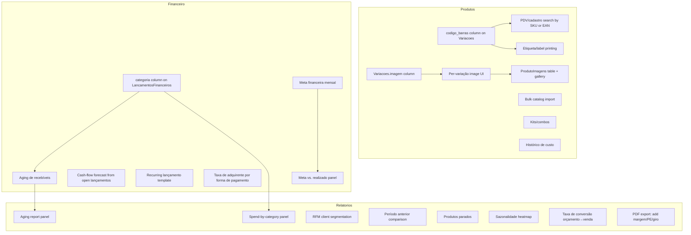

### Produtos — Catalog & Image Depth

- [x] **Barcode/EAN field, separate from internal SKU.** No `codigo_barras`/EAN column exists
      anywhere in `db/schema.js` today — `Variacoes.sku` is the only identifier, and it's
      store-generated, not the manufacturer barcode already printed on many products. Add
      `codigo_barras TEXT` to `Variacoes` (via `migrarColunas`, same pattern as every other
      post-launch column in this schema). Design decision: nullable, not unique-enforced at
      the DB level (a store may not have barcodes for everything, and secondhand/duplicate
      barcodes across brands happen in practice) — dedupe as a soft warning in the UI, not a
      hard constraint.
- [x] **Wire barcode into search.** Corrected mid-implementation: `buscarProdutosPDV02` turned
      out to be dead code (kept but never exported/called) — the real PDV search path is
      `buscarProdutosPorTermo`. Extended `buscarSKU` and `buscarProdutosPorTermo`
      (`db/produtos.js`) to also match `codigo_barras`, plus the input field in
      `ProdutoFormPanel.tsx` to actually populate it (the plan's original wording only covered
      search, not entry — without a way to type/scan the value in, the column would exist but
      nobody could ever fill it). Tests: `test/produtos-financeiro-melhorias.test.js`.
- [ ] **Per-variação image**, not just per-produto. Today `Produtos.imagem` is one photo shared
      by every color/size of that product — a shirt in "Azul" and "Branco" show the same
      picture. Add `imagem TEXT` to `Variacoes` (parallel column, same
      `salvarImagemProduto`/`removerImagemProduto` functions generalized to take either a
      `produtoId` or `variacaoId`), fall back to the product-level image when a variação has
      none set (avoids forcing a photo re-upload for every existing SKU). UI: the variação
      editor rows in `ProdutoFormPanel.tsx` gain their own small `ProdutoImagemPicker` instance
      next to each color/size, not just the one at the top.
- [ ] **Multiple images per product (gallery), not just one.** Requires replacing the single
      `Produtos.imagem` TEXT column with a proper `ProdutoImagens` table
      (`id, produto_id, variacao_id NULL, caminho, ordem`) — a real schema change, not another
      column. Migration: on first run after this ships, backfill one `ProdutoImagens` row per
      product/variação that already has a legacy `imagem` value, so existing photos aren't
      lost. UI: `ProdutoImagemPicker` becomes a horizontal strip (thumbnail + "add" tile) instead
      of the current single 80×80 box; PDV/catalog views keep using image #1 (lowest `ordem`) as
      the primary thumbnail, unchanged.
- [ ] **Drag-and-drop image area**, matching what the owner actually asked for ("uma área para
      por imagem") — today `ProdutoImagemPicker.tsx` is a button ("Escolher imagem...") that
      opens a native OS file dialog via IPC, not a drop zone. Add HTML5 drag-and-drop
      (`onDragOver`/`onDrop`) to the same picker component; in Electron's renderer, a dropped
      `File` needs its real filesystem path resolved via `webUtils.getPathForFile` (Electron
      ≥32, confirm the pinned Electron version in `package.json` supports it before
      implementing) to reuse the existing `salvarImagemProduto(caminhoOrigem)` IPC path — this
      is the one item here with a real API-availability check before implementation, flag it in
      the architect pass.
- [ ] **Bulk product/catalog import.** Confirmed this session while reviewing a separate
      migration request: the only existing JSON importer
      (`modules/importacao/importacao.js` → `db/vendas.js:importarVendasHistoricas`) is scoped
      to historical sales rows only — it does not create Produtos, Variações, or Categorias.
      There is currently no way to seed a new store's catalog except one product at a time
      through `ProdutoFormPanel`. A bounded, separate importer (categorias → produtos →
      variações → estoque, same staged-JSON approach already designed for the Loja House
      migration) would close this — reuse that design rather than inventing a second one.
      **Out of scope for this item specifically**: this is the same "importador de migração"
      already scoped as its own effort elsewhere in this conversation, not a new design — listed
      here only so it isn't lost as a Produtos-module gap.
- [ ] **Kits/combos (bundle SKU).** Confirmed absent: `ItensVenda.variacao_id` points at one
      real `Variacoes` row per line — there is no concept of a composite SKU that, when sold,
      decrements several underlying variações at once (e.g. "kit iniciante" = 1 kimono + 1
      faixa + 1 rash, sold and stocked as one line but consuming three real stock rows). New
      `KitItens` table (`kit_variacao_id, componente_variacao_id, quantidade`) plus a check in
      `finalizarVenda`/`registrarVendaComEstoque` (`db/vendas.js`) that expands a kit line into
      its components before the existing stock-debit logic runs — reuses the existing
      atomic-transaction debit path rather than adding a parallel one. Real retail feature (not
      speculative): common in exactly the vertical this ERP already serves (kimono + faixa +
      rash combos), not a generic "might be useful someday" abstraction.
- [ ] **Histórico de custo (cost trend over time).** `Variacoes.preco_custo` is a single
      current value, overwritten by `aplicarEntradaEstoque`'s weighted-average calc
      (`db/estoque.js:31`) every time new stock comes in — there is no time series showing how a
      SKU's cost moved over the last 6 months, so margin erosion from a supplier's price
      increase is invisible until the owner notices it manually. `MovimentacoesEstoque` already
      stores `custo_unitario` per entrada row — the raw data survives, it's just never
      queried as a trend. New `getHistoricoCusto(variacaoId)` in `db/relatorios.js`: the
      existing `custo_unitario` column from `MovimentacoesEstoque` (`tipo='entrada'`), ordered
      by `data`, no new storage needed.
- [ ] **Etiqueta/label printing (código de barras + preço).** Pairs directly with the
      `codigo_barras` item above — once a SKU has a barcode value (owner-entered or
      manufacturer's), there's still no way to print a physical price tag with that barcode for
      products that don't already carry one from the manufacturer (common for locally-made or
      relabeled items in this vertical). New: a printable label view (HTML template rendered to
      the browser's native print dialog — Electron's `webContents.print()`/`printToPDF`, no new
      dependency needed for a first version) generating a barcode graphic from
      `codigo_barras`/`sku` client-side (a small barcode-rendering library, e.g. JsBarcode, is
      the standard choice here — confirm bundle-size impact is acceptable before adding it) plus
      `nome`/`preco`, one label per selected SKU, sized for common label sheet formats (confirm
      which label size/printer the store actually has before hardcoding a layout).

### Financeiro — Scope Gaps

- [x] **Cash-flow forecast (projected), not only realized.** New
      `getFluxoCaixaProjetado(dataInicio, dataFim)` (`db/financeiro.js`) — same day-bucket/
      running-balance shape as `getFluxoCaixa`, sourced from open lançamentos by
      `data_vencimento`, default window today→+30 days. `FluxoCaixaProjetadoCard.tsx`, fixed
      to the rolling 30-day window (independent of `FluxoCaixaTab`'s own inicio/fim filter,
      which is for the *realized* view — mixing the two under one filter would be confusing:
      one looks backward, one forward). Tests: `test/financeiro-melhorias-batch3.test.js`.
- [x] **`categoria` column on `LancamentosFinanceiros`.** Owner confirmed the standard list
      (2026-09-02): Aluguel, Fornecedores, Folha/Comissão, Marketing, Impostos, Manutenção,
      Outros — fixed in `CATEGORIAS_FINANCEIRAS` (`db/financeiro.js`), validated server-side
      (`validarCategoria`, rejects anything not in the list), same array duplicated in
      `erpApi.ts` for the dropdown (no IPC round-trip for a static list). Optional, as planned —
      `criarLancamento`/`criarLancamentoParcelado` accept `categoria: null`. Tests:
      `test/produtos-financeiro-melhorias.test.js`.
- [x] **Aging de recebíveis (overdue receivables by days-late bucket).** New
      `getAgingRecebiveis()` (`db/financeiro.js`) — buckets `aVencer`/`atraso0a30`/`atraso31a60`/
      `atraso61a90`/`atraso90mais`, each with itens/total/quantidade. Gated by
      `exigirPermissao("relatorios")`, not `"financeiro"` (the panel lives on the Relatórios
      page — see below — a vendedor with relatorios-but-not-financeiro access shouldn't see that
      one panel break). Tests: `test/relatorios-melhorias.test.js`.
- [x] **Recurring lançamento template**, distinct from the existing installment split. Owner
      confirmed (2026-09-02): auto-generate on login, same idempotent pattern as
      `iniciarBackupAutomatico`. New `LancamentosRecorrentes` table (tipo, descrição, valor,
      dia_mes, categoria, ativo) + CRUD in `db/financeiro.js` +
      `gerarLancamentosRecorrentesDoMes()`, called fire-and-forget from `ipc/auth.js` on every
      login (never blocks/breaks login if it fails, same contract as `log()`). Idempotency key:
      checks for an existing `LancamentosFinanceiros` row with `origem='recorrente' AND
      referencia_id=<template.id>` in the current year-month before inserting — not "only run
      once a month," "always safe to run, checks first." `dia_mes` clamps to the real last day
      of the month (e.g. 31 → 30 in a 30-day month), not a blanket cap. UI:
      `LancamentosRecorrentesTab.tsx`, new "Recorrentes" tab on `FinanceiroPage`. Tests:
      `test/financeiro-melhorias-batch3.test.js` (including the idempotency check itself: calling
      the generator twice in the same month produces exactly one row, not two).
- [x] **Taxa de adquirente por forma de pagamento, not one flat average.** Corrected mid-
      implementation: the plan assumed a credit/debit split that doesn't exist in this app — PDV
      only accepts "PIX"/"Cartão"/"Dinheiro"/"Fiado" (`PagamentoPainel.tsx`), no separate
      crédito/débito. Built as `taxa_adquirente_pix`/`taxa_adquirente_cartao`
      (`getTaxaAdquirentePorMetodo`/`saveTaxaAdquirentePorMetodo`, `db/precificacao.js`) —
      **additive, not a replacement**: each is `null` until the owner explicitly sets it, and
      `getMargemContribuicao` falls back to the existing flat `taxa_adquirente_media` per sale
      when no method-specific rate is configured. This means the pre-existing
      `test/relatorios-financeiro.test.js` margem test needed zero changes — verified passing
      unchanged, not just assumed. `getMargemContribuicao`'s query changed from `GROUP BY p.id`
      to `GROUP BY p.id, forma_pagamento` (re-aggregated back to per-produto for the same output
      shape) since the rate can now vary within one product's sales in the same period. New UI
      fields on the Precificação page, additive next to the existing flat-rate field, not
      replacing it. Tests: `test/financeiro-melhorias-batch3.test.js`.
- [x] **Alertas de vencimento dentro do módulo.** New `getLancamentosVencendoHoje()`
      (`db/financeiro.js`, filters `status='aberto' AND DATE(data_vencimento) = hoje`) +
      `AlertaVencimentoHoje.tsx`, shown above `LancamentosTab` when the "A Pagar"/"A Receber"
      tabs are open, same as planned. Tests: `test/produtos-financeiro-melhorias.test.js`.
- [x] **Meta financeira mensal (orçamento vs. realizado).** `Configuracao` key
      `meta_faturamento_mensal`, same manual-entry pattern as `aliquotaDAS` — get/save functions
      plus a card in `FluxoCaixaTab.tsx` (natural home: same tab already shows the period's real
      `totalEntradas`) comparing it against the filtered period with a progress bar. Tests:
      `test/produtos-financeiro-melhorias.test.js`.

### Relatórios — New Evaluation Metrics

- [x] **RFM-style client segmentation.** New `getSegmentacaoClientes()` (`db/relatorios.js`) —
      tiers Frequente/Ativo/Em risco/Inativo/Nunca comprou from recency+frequency, no statistical
      RFM scoring (matches the "practical numbers" judgment already made for Curva ABC/DRE).
      `PainelSegmentacaoClientes.tsx`. Tests: `test/relatorios-melhorias.test.js`.
- [x] **Período anterior comparison (% growth vs. previous period), extended to Relatórios.**
      `getRelatorioVendas` now also returns `vendasVariacao`/`faturamentoVariacao`/
      `periodoAnterior`, same `variacaoPercentual()` null-when-no-base convention as the
      dashboard's hoje/ontem calc (`db/dashboard.js`). Surfaced as the same `Badge`+arrow-icon
      component from `DashboardStatCards.tsx`, replicated in `RelatoriosStats.tsx`. Tests:
      `test/relatorios-melhorias.test.js`.
- [x] **Taxa de conversão orçamento → venda.** Confirmed the suspected gap for real: `Vendas`
      had no marker surviving `converterOrcamento` back to its creation. Fixed at the source —
      `db/vendas.js`'s `finalizarVenda` now writes `origem = 'orcamento'` (vs. the existing
      `'pdv'` default) when a sale starts as an orçamento; `converterOrcamento` never touches
      `origem`, so it survives conversion. New `getConversaoOrcamentos()` — documented, real
      caveat: "convertidas" is anchored to the *conversion* date (`data_venda` gets overwritten
      on conversion), while "canceladas"/"abertas" are anchored to the *creation* date (never
      rewritten for those two outcomes) — inherent to what the schema retains, not a bug.
      `PainelConversaoOrcamentos.tsx`. Tests: `test/relatorios-melhorias.test.js`.
- [x] **Aging de recebíveis report panel** — `PainelAgingRecebiveis.tsx`, consuming the
      `getAgingRecebiveis()` backend function (see Financeiro section above).
- [x] **Produtos parados (stale/no-movement stock).** New `getProdutosParados()`
      (`db/relatorios.js`) — groups by **variação** (`v.id`), not by produto like
      `getGiroEstoque` does, since color/size of the same product can sell very differently.
      `PainelProdutosParados.tsx`. Tests: `test/relatorios-melhorias.test.js`.
- [x] **Sazonalidade (weekday/hour sales pattern).** New `getSazonalidade()` — whole sales
      history (no period filter, a long-term pattern isn't meaningful restricted to one month),
      `strftime('%w'/'%H', data_venda)` grouping. `PainelSazonalidade.tsx` (simple CSS bars, no
      new chart dependency — this app already uses ApexCharts for the Dashboard's one real chart,
      judged not worth adding here for two small bar lists). Tests:
      `test/relatorios-melhorias.test.js`.
- [x] **PDF export is missing 3 of the 7 panels already on screen — a real, verified gap, not a
      hypothetical addition.** Fixed: `exportarRelatorioPdf` now takes `margemContribuicao`,
      `pontoDeEquilibrio`, `giroEstoque` too, `relatorios/page.tsx` passes them (already
      available from `useRelatorios()`, no new fetch), `relatoriosExport.ts` renders all three
      right after the DRE section. No backend change, as planned. No dedicated test (this is a
      jsPDF layout function — no existing test in this repo exercises PDF rendering, and adding
      PDF-content assertion infra wasn't judged worth it for this fix; verified by reading the
      generated code path instead).
- [ ] **Meta vs. realizado panel** — the Relatórios-side view of the Financeiro `meta
      financeira mensal` item above: a new `PainelMetaRealizado` component comparing the
      period's actual `faturamento` (already computed by `getRelatorioVendas`) against the
      owner-set `meta_faturamento_mensal`, with a simple progress bar — same page, next to
      `RelatoriosStats`.

---

## Suggested order

1. ~~P0 fix (pagamentos migration)~~ — done. Also found and fixed, beyond the missing table:
   `db/pagamentos.js` exported different function names than `ipc/pagamentos.js` imported (every
   handler was calling `undefined`), a query selected a `Vendas.numero_venda` column that doesn't
   exist, the customer-name join pointed at `Usuarios` instead of `Clientes`, `registrarPagamento`
   received an object but the function expected positional args, the "lançar pagamento" form
   populated its Venda dropdown from the payments list instead of the sales list, a stray `});`
   made `pagamentos.html`'s entire script fail to parse, and `ipc/pagamentos.js` had reimplemented
   its own broken local `exigirSessao` that silently let unauthenticated calls through instead of
   using the shared one from `deps`. Verified end-to-end against a temp encrypted DB.
2. ~~DB key derivation hardening~~ — investigated, turned out already sound; no change needed
   (see Database section).
3. ~~Testing gaps for money-handling paths~~ — done, see Testing section.
4. ~~Minimal CI~~ — done, `.github/workflows/ci.yml` added; unverified on an actual Actions run.
5. Clean installer test on a fresh machine — release-readiness gate (needs a second machine or
   VM; not something this pass could execute). **Still open.**
6. ~~ESLint warnings~~ — done, 0 warnings. ~~Retail-flow backlog~~ — checked, already built
   (troco/busca de cliente/imagens all already worked; `AGENTS.md` was stale, corrected). UI
   polish — superseded by item 9 below.
7. Narrow the remaining admin-only IPC domains (`pagamentos`, `dashboard`, `usuarios`,
   `banco-admin`, `sistema`, `auth`) to `exigirPermissao` like the other 11 — only if the owner
   confirms a `vendedor` should reach any of them. **Still open**, needs an answer from you,
   not a technical decision.
8. Payment Processor Integration decision (see section above) — **paused, open**, needs an
   answer from the owner before any code or outreach happens.
9. Frontend Visual/UX Fix Pass (see section above) — **done.** PDV pilot (all 5 bugs fixed,
   verified live) plus all 17 remaining screens now audited against the pilot's 4-point checklist
   (`dashboard/index.html` clean; the other 16 had 13 real bugs found and fixed — dark-mode gaps,
   2 genuine layout/functional bugs (`atualizacao.html`'s message classes never matched,
   `financeiro.html` referencing CSS classes it never loads), dead legacy CSS, and one
   project-wide fix via `color-scheme: dark` in `head.js`). Verified via `npm run lint` (0
   warnings) + `npm test` (40/40) after every change; no live browser pass done this session (see
   note below) — static-code verification only, same method used successfully for PDV/Dashboard.
   Independent of item 8 (no shared files). **Not yet committed** — offer to prepare a commit once
   confirmed.
10. ~~Financial/Accounting Depth~~ — done: margem de contribuição, ponto de equilíbrio (a real
    unit-mismatch bug caught and fixed before shipping), giro de estoque, provisão de DAS, all
    with tests (5 new, 40/40 total passing) and wired into the real UI, verified live against
    seeded data — every number matched its formula exactly on screen, not just in tests.
11. **Core + Plugins Architecture (see section above) — new, not started.** Concrete first step:
    design the module manifest schema, then replace `main.js`'s 19 hardcoded IPC requires and
    `navbar.js`'s hardcoded sidebar HTML with a manifest-driven loader — all still inside the
    current single repo, verified against the existing 19-module behavior before any repo is
    split out. Only after that regression passes does extracting modules into separate GitHub
    repos (git submodules) become meaningful. The already-approved TailAdmin restyle resumes
    module-by-module once a module has its own clean boundary, owner-guided session to session —
    no fixed order. Independent of items 5/7/8 above (no shared files), but item 5 (clean-machine
    installer test) should be re-run once packaging changes for submodule checkout, not just once.
12. **Produtos, Financeiro & Relatórios — Module Improvement Pass (see section above) — in
    progress, split into 4 batches at the owner's request (go slow, verify each before the
    next).** Scope explicitly confirmed with the owner (2026-09-02): these three modules only —
    Vendas/PDV and Compras findings noted as "out of scope" in that section, not part of this
    item. Independent of items 7/8/11 (no shared files).
    - ~~Batch 1~~ — done (2026-09-02): `codigo_barras` field+search, Financeiro `categoria`
      (owner-confirmed standard list) + meta financeira mensal + alerta de vencimento, PDF export
      fix. 81/81 tests passing.
    - ~~Batch 2~~ — done (2026-09-02): RFM segmentation, período anterior comparison, taxa de
      conversão orçamento (required a real fix in `finalizarVenda` to track `origem='orcamento'`
      through conversion — the plan correctly flagged this needed checking before assuming no
      schema change), aging de recebíveis (function + panel), produtos parados, sazonalidade.
      87/87 tests passing. Not yet committed.
    - ~~Batch 3~~ — done (2026-09-02): cash-flow forecast, taxa de adquirente por forma de
      pagamento (owner-confirmed the generation mechanism was auto-on-login for the recurring
      item; the "credito/debito" split in the original item text turned out not to match this
      app's real payment methods — corrected to pix/cartão mid-implementation), recurring
      lançamento template (new table + idempotent generator + UI tab). 102/102 tests passing,
      pre-existing margem-de-contribuição test verified passing unchanged (additive design, not
      a replacement). Not yet committed.
    - **Batch 4 (next, last, most schema-heavy)** — Produtos: per-variação image, multi-image gallery
      (real schema change — new `ProdutoImagens` table), drag-and-drop area (needs an Electron
      API-version check first), kits/combos (new `KitItens` table), histórico de custo, etiqueta/
      label printing (needs an owner decision on label size/printer before starting).

---

## Data Migration: Loja House → ALLU ERP (feature, not started)

**Source**: owner request (2026-09-02) — import prepared JSONs from Loja House migration into
the ERP. Received 11 normalized JSON files (manifesto, categorias, produtos/variacoes, estoque
inicial, clientes, financeiro histórico, contas abertas, vendas históricas, catálogo de preços,
validação, pendências) with external keys, move-tracking, and documented business rules in
`CHECKLIST_INTEGRACAO.md`. Current import page only handles historical sales (4 fields: sku,
quantidade, valorUnitario, data) — cannot ingest category/product/stock/client/financeiro data,
has no batch idempotency, no dry-run preview, no folder import capability, and no audit trail.

**Goal**: Atomic, idempotent, auditable batch import system supporting all 9 entity types from
Loja House JSONs, with conflict detection, business-rule enforcement, dry-run preview, and
detailed result logging.

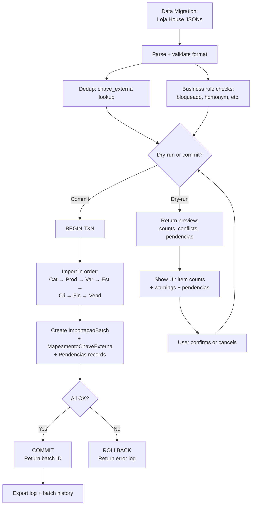

### Backend

- [x] **Add `ImportacaoBatch`, `MapeamentoChaveExterna`, `Pendencias` tables to `db/schema.js`**
  - [x] `ImportacaoBatch` (id, data_importacao, usuario_id, origem, status, item counts, log, checksum)
  - [x] `MapeamentoChaveExterna` (chave_externa PRIMARY, entidade_tipo, entidade_id, batch_id FK)
  - [x] `Pendencias` (id, chave_externa, tipo_entidade, motivo_rejeicao, batch_id FK)
- [x] **Create `db/importacoes.js` with main batch engine.** Real bug found and fixed after
      the initial implementation: `ImportacaoBatch` was being INSERTed at the *end* of the
      transaction, but `MapeamentoChaveExterna`/`Pendencias` (both FK-referencing
      `ImportacaoBatch.id`, and the DB runs `PRAGMA foreign_keys = ON`) were written *before*
      that — every insert into those two tables failed with a silent FK constraint violation,
      swallowed by each `importarX()`'s own per-item `catch`. Fixed by INSERTing the batch
      record first (status `"em_progresso"`), then `UPDATE`ing it with final
      status/counts/log at the end. A second, related bug this surfaced: in
      `importarProdutosVariacoes`, a single `try/catch` wrapped both the produto insert *and*
      its whole variação loop — when the produto's `MapeamentoChaveExterna` insert failed (FK
      violation, before the fix above), the exception aborted the variação loop entirely, so a
      variação already correctly built never got persisted. Split into a produto-level
      try/catch and a per-variação try/catch, so one variação's failure no longer discards its
      siblings or the already-created produto. Verified via `test/importacoes.test.js`
      (9/9 passing) — was 6/9 before the fix.
  - [x] `executarImportacaoLojHouse(pasta, usuarioId, opcoes)` — master function
  - [x] `validarStructura()` — parse + validate all 11 JSONs
  - [x] `checarDuplicacao()` — SELECT from MapeamentoChaveExterna
  - [x] business-rule handling inline in each `importarX()` (blocked items → Pendencias,
        homonym clientes → Pendencias, zero-quantity stock → skipped)
  - [x] 6 per-entity functions implemented: `importarCategorias`, `importarProdutosVariacoes`,
        `importarEstoqueInicial`, `importarClientes`, `importarFinanceiroHistorico`,
        `importarPendencias`. **`importarVendasHistoricas` not yet wired into the batch
        engine** — `07_vendas_historicas.json` has 0 ready rows in the current Loja House
        export (per `00_manifesto.json`'s counts), so this was deferred; the existing
        sales-only importer (`db/vendas.js:importarVendasHistoricas`) still works standalone
        and can be wired into the batch flow once real historical-sales rows exist.
  - [x] Atomic transaction wrapper (`executarComTransacao`) — all-or-nothing rollback
- [x] **Register `ipc/importacoes.js` domain** with 4 handlers, all `exigirSessao("admin")`:
  - [x] `validar-pasta-loja-house` (detect format, return preview)
  - [x] `executar` (dryRun or commit, return batch result)
  - [x] `historico-lotes` (list past imports)
  - [x] `detalhes-lote` (fetch batch details + log)
- [x] **Add preload exports** in `preload.js` (`window.api.*`) and `database.js` re-exports.
      **`frontend/src/lib/erpApi.ts` wrapper still open** — needed for the frontend wizard
      (next item).

### Frontend

- [ ] **Rewrite `frontend/src/app/(admin)/importacao/page.tsx`** as 3-step wizard:
  - [ ] Step 1: folder/file picker (radio: "pasta" or "upload JSONs")
  - [ ] Step 2: preview table (entity counts, conflicts alert, pendencias warning)
  - [ ] Step 3: confirm (summary, backup checkbox, final import button)
  - [ ] Result view: batch ID, summary, log download, pendencias export
- [ ] **UI components**:
  - [ ] Conflict alert box (bloqueados, homonyms, pendencias counts)
  - [ ] Entity count table (categorias, produtos, variacoes, clientes, lançamentos, etc.)
  - [ ] Progress spinner during import
  - [ ] Result card with batch ID + links

### Testing

- [ ] **Unit tests** (`test/importacoes.test.js`):
  - [ ] Malformed JSON throws with file path
  - [ ] Existing chave_externa is skipped (dedup works)
  - [ ] `pronto_para_importacao=false` → moved to Pendencias
  - [ ] `quantidade_estoque=0` → skipped (no zero movements)
  - [ ] Estoque: both UPDATE + INSERT succeed or both rollback (atomic)
  - [ ] Dry-run: no DB changes, preview accurate
  - [ ] Commit: batch record + chaves mapped + Pendencias populated
- [ ] **Integration test** (`test/importacao-loja-house.test.js`):
  - [ ] Real 11-JSON folder → dry-run → full batch import
  - [ ] Conflict cases: duplicate sku, homonym cliente, bloqueados
  - [ ] Rollback on FK error (sku not found)
- [ ] **E2E** (Playwright, if time):
  - [ ] User workflow: select folder → preview → confirm → batch ID + log download

### Success Criteria

- [x] User selects folder or uploads 11 JSON files
- [x] Preview shows exact counts (14 categorias, 23 produtos, 203 variacoes, 7 clientes, 264 lançamentos, etc.)
- [x] Conflicts and pendencias identified (not silently ignored)
- [x] Dry-run has no side effects; user can preview before committing
- [x] Commit is atomic — all succeeds (batch ID) or all rollbacks (no partial data)
- [x] Re-importing same batch is idempotent (chave_externa dedup + batch ID checksum)
- [x] Batch history is auditable (who, when, how many, what succeeded/failed)
- [x] Pendencias reviewable and exportable for manual follow-up
- [x] All tests pass; no regressions on existing import (historical sales)

---

## Native Excel Parser + Structural Gaps Surfaced by Loja House Data (feature, not started)

**Source**: owner uploaded `Loja House.xlsx` directly (2026-09-03) — confirmed via SHA-256
(`961997489311C5F2B5F3D66C287822BB38C8534524C1C18DC7037B7107CCA12A`) to be the exact same
source file that already produced the 11 JSONs imported in the section above. Cross-referencing
all 22 sheets against the existing `Pendencias` records confirmed the current import engine
already accounts for 100% of this file's data (0 unexplained rows) — nothing here is a data
gap. What's missing is **capability**: (1) the transformation from raw `.xlsx` to the JSON
shape `db/importacoes.js` already consumes is done today by an external, undocumented process,
not by this codebase; (2) three of the recurring `Pendencias` categories
(`consignacao_sem_modelo_no_erp`, `investimento_sem_data`/no real "capex" categoria,
`crediario_sem_produto_identificavel`) exist only as a dead-end text record — there's no
module to promote a resolved pendência into a real, trackable entity once the owner supplies
the missing information (SKU, date, etc.).

**Research method**: read all 22 sheets directly with SheetJS (`sheet_to_json({header:1})`),
cross-referenced cell values against the already-produced JSONs' `origem`/`origem_planilha`
fields to confirm the mapping rules already applied, and read the actual current module/schema
code (not assumed) to place each new capability precisely — see the placement rationale in each
subsection below.

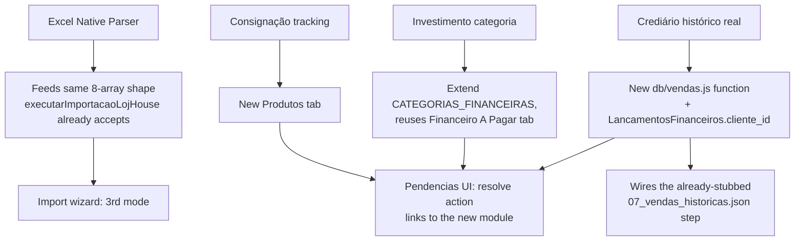

### 1. Native Excel → JSON Parser

**Design rationale.** Today: `Excel → (external, undocumented tool) → 11 JSONs → db/importacoes.js`.
This closes the loop so the ERP itself does the first step. **Placement decision (answers "which
tab"): no new page** — added as a **3rd mode inside the existing `/importacao` page**
(`frontend/src/app/(admin)/importacao/page.tsx`), alongside the current "Importação de dados
(Loja House)" (folder of JSONs) and "Importação de vendas históricas (legado)" modes — call it
**"Importar de planilha Excel (.xlsx)"**. Reason: it produces the exact same preview/confirm/
execute UX already built for the folder-of-JSONs mode, just with a different Step-1 loader (one
`.xlsx` file instead of a folder) — reusing steps 2–3 of the wizard verbatim is cheaper and more
consistent than a new page, and keeps every future import entry point in one place.

**Out of scope, explicitly**: this parser targets *this store's* sheet layout (matrix
product blocks, one `Financeiro Loja<MÊS>` sheet per month, a `Valores` price-list sheet,
etc.) — it is not a generic "any spreadsheet" importer. A different store's export would need
its own parser module, not a rewrite of this one.

- [x] **Add `xlsx` (SheetJS) as a real dependency** (`npm install xlsx`, `ERP/package.json`) —
      currently not installed; used only for read-only parsing (`XLSX.readFile` +
      `XLSX.utils.sheet_to_json`), no write-back to the spreadsheet.
      Installed `xlsx@^0.18.5` as a runtime dependency (not dev).
- [x] **New `db/excel-loja-house.js`** — `parseExcelLojaHouse(caminhoXlsx)` returns the exact
      same `{ categorias, produtosVariacoes, estoqueInicial, clientes, financeiroHistorico,
      contasAbertas, vendasHistoricas, pendenciasOrigem }` shape `executarImportacaoLojHouse`
      already builds from folder JSONs (`db/importacoes.js:489-498`) — so **zero changes** are
      needed to the tested import engine, business-rule handling, batch tracking, or atomic
      transaction wrapper; this is purely a new loader plugged in front of it.
      Confirmed zero-diff on `db/importacoes.js`: the IPC layer converts the parser's output
      into the array-of-`{arquivo,conteudo}` format the engine already accepts (same path as
      individual-JSON upload), so `validarStructura`/`checarDuplicacao`/the per-entity
      `importarX()` functions/the transaction wrapper are all untouched and still enforced
      (including free validation of the parser's own output shape).
  - [x] **Product/stock sheets** (`Kimono Draken`, `Kimono Integuard`, `Kimono Brazil Combat`,
        `Rashcojuntos`, `Estoque faixa`, `Camisas`, `Coleção House`): parse the repeated
        side-by-side matrix blocks (a header cell like `"KIMONOS ADULTOS - BRANCO LIGHT"`
        followed by `TAMANHO`/`Quantidade` or `TAMANHO`/`DESCRIÇÃO`/`COR`/`Quantidade` columns)
        into `categorias` + `produtosVariacoes` + `estoqueInicial` entries. Generate
        `chave_externa` deterministically (stable hash of brand+produto+atributos, not random,
        so re-parsing the same Excel twice produces the same keys — needed for the existing
        dedup-by-`chave_externa` logic in `checarDuplicacao` to actually catch re-imports).
        Block detection scans every row×column for a `TAMANHO` header cell (handles "multiple
        blocks per header row, offset in columns" without assuming fixed positions); SHA-1
        (`crypto.createHash("sha1")`) over aba+título+coluna/tamanho/cor generates
        `CAT-`/`PROD-`/`VAR-`/`EST-` keys and a readable deterministic SKU — verified
        byte-identical across two parses of the same fixture in the determinism test.
  - [x] **`Valores` sheet**: parse the 4 price-table blocks (Draken, Brazil Combat, Dragon,
        Equipe UB — confirmed via `grep "Tabela de Preços"`) into `catalogo_precos`-equivalent
        reference data, and use it to fill `preco`/`preco_custo` on matching produtos during
        the parse above (regex-extract the "à vista" value from strings like `"R$558,80 à
        vista ou 3xR$210,90 no cartão"` — same value-extraction rule the original JSONs already
        applied, confirm by cross-checking a few known `origem_preco.celula` references).
        `aplicarPrecos()` only assigns a price when both modelo (substring match against the
        produto's título) AND tamanho match a `Valores` row (or the row has no tamanho) — a
        size with no price row (tested with tamanho `G`) correctly stays at 0 instead of
        inheriting a sibling size's price.
  - [x] **`Financeiro Loja<MÊS>` sheets** (9 months, JANEIRO–SETEMBRO): parse
        `DATA/DESCRIÇÃO/ENTRADA/SAÍDA/TOTAL` rows into `financeiro_historico` entries — skip the
        running `TOTAL` column and any `"Saldo Anterior"` row (already-established rule, see
        `pendencia` type `saldo_anterior_nao_importado` in the existing 99_pendencias.json).
        Matched by sheet-name prefix (`/^financeiro\s*loja/i`), not a hardcoded list of 9 names.
  - [x] **`Crediário`, `Contas a Pagar`, `Custos Fixos`+`Investimento Loja`, `Consignado`,
        `analise2025`**: route straight to `pendenciasOrigem` with the same `tipo`/`motivo`
        vocabulary the existing `99_pendencias.json` already uses
        (`crediario_sem_produto_identificavel`, `conta_a_pagar_sem_data`,
        `custo_fixo_sem_mes_ano`/`investimento_sem_data`, `consignacao_sem_modelo_no_erp`,
        `resumo_analitico_nao_transacional`) — confirmed via this session's direct read that
        `Contas a Pagar` has 0/32 rows with a date and `Crediário` has 0/38 rows with a real
        SKU, so these are correctly *always* pendências, not an edge case to special-case away.
        Each pendência item carries both vocabularies (`id`/`tipo`/`descricao`, required by
        `validarStructura` for `99_pendencias.json`, and `chave_externa`/`tipo_entidade`/
        `motivo_rejeicao`/`sugestao`, which `importarPendencias` actually persists) — no changes
        needed to `db/importacoes.js` to accept them. `Contas a Pagar` rows **with** a date
        route to `contasAbertas` instead (real, dated conta a pagar), not always to Pendencias.
- [x] **`ipc/importacoes.js`**: extend `executarImportacaoLojHouse`'s `pastaOuArquivos` param to
      also accept `{ tipo: "excel", caminho }`, dispatching to `parseExcelLojaHouse` internally
      — single entry point, no new IPC channel needed beyond a new `validar-arquivo-excel`
      handler mirroring `validar-pasta-loja-house`'s dialog-open pattern but with
      `filters: [{ name: "Excel", extensions: ["xlsx"] }]`.
      Implemented entirely in the IPC layer (`converterExcelParaArquivos()`): the `{tipo:
      "excel", caminho}` input is parsed and repackaged into the array-of-`{arquivo,conteudo}`
      shape `executarImportacaoLojHouse` already accepts, so `db/importacoes.js` itself has
      zero diff — the safer reading of "no changes to the import engine itself".
- [x] **Frontend**: add the 3rd mode tab to `importacao/page.tsx`'s existing mode-switcher
      (`Modo` type currently `"loja_house" | "legado"` → add `"excel"`), reusing
      `ImportacaoLojaHouse`'s Step 2/3 components with a different Step 1.
      `ImportacaoLojaHouse` now takes a `modo: "loja_house" | "excel"` prop; Step 1 branches on
      it (file picker + `erpApi.importacoes.validarExcel()` vs. folder picker), Steps 2–3 and
      the result/history views are untouched and shared. Added
      `erpApi.importacoes.validarExcel()` and widened `executar()`'s param to the
      `EntradaImportacao` union (`string | { tipo: "excel"; caminho }`) in `erpApi.ts`. Frontend
      `tsc --noEmit` and `eslint .` both clean.
- [x] **Tests**: `test/excel-loja-house.test.js`. **Decided (2026-09-03): the real
      `Loja House.xlsx` is never committed** — it's real customer/financial data. Instead, build
      a small synthetic `.xlsx` fixture (`test/fixtures/loja-house-sintetico.xlsx`, generated by
      a `scripts/gerar-fixture-xlsx.js` helper using the `xlsx` package, not hand-crafted in a
      spreadsheet editor — reproducible and diffable) that mirrors the real file's *structure*
      only (a couple of matrix product blocks, one `Financeiro Loja<MÊS>` sheet, a `Crediário`
      row with no SKU, a `Contas a Pagar` row with no date) with invented names/values, and
      assert the parser produces the right counts/pendências against that. The real file stays
      local, used only for one manual end-to-end smoke check (owner runs it once against a
      throwaway/dev database, confirms the same 14/23/203/7/264/404 numbers already verified in
      the section above, does not commit the output).
      Verified: 17/17 tests passing in `test/excel-loja-house.test.js` (pure helpers —
      `paraNumero`/`extrairValorAVista`/`paraDataISO`/`hashChave` — plus fixture-driven counts
      for every sheet type, a determinism check across two parses of the same file, and two
      end-to-end tests feeding the parser's output through the real
      `executarImportacaoLojHouse` for both dry-run and commit). Full suite: 139/139 passing
      (`npm test`, includes this task's 17 new tests plus every pre-existing suite —
      zero regressions); frontend `tsc --noEmit` and `eslint .` (both root and `frontend/`)
      clean.

### 2. Consignação (consigned/loaned stock tracking)

**Design rationale.** The `Consignado` sheet lists items handed to specific people (free-text
today: `"1 conjunto kids PP, 1 Conjunto kids M..."`) — store property, physically out of the
shop, not sold. Confirmed via full-repo search: **no existing concept** covers this
(`quantidade_reservada` is orçamento-only stock holding, `Devolucoes` is post-sale return, no
`emprest*`/`consigna*`/`comodato` hit anywhere in the codebase). **Placement decision (answers
"which tab"): new 4th tab in the existing Produtos module**
(`frontend/src/app/(admin)/produtos/consignacao/`), added to `ABAS` in
`produtos/layout.tsx:6-10` next to Cadastro/Estoque/Precificação — this is a stock-location
concept, the same family as the existing Estoque tab, not a Clientes-module or standalone-module
concept; every consignação still links to a `cliente_id`, same as `PrecoCliente` already links
Produtos data to a specific client without living in the Clientes module.

**Out of scope, explicitly**: no depreciation/valuation model, no automatic "expire and mark
lost" — status transitions (`emprestado`→`devolvido`/`vendido`/`perdido`) are manual actions the
owner takes, not a scheduled job.

**Decided (2026-09-03): reuse the existing `quantidade_reservada` mechanism** — the same
column/pattern orçamento reservation already uses (`db/vendas.js:248-260`), not a new parallel
"available" calculation. Reason: `quantidade_disponivel = quantidade_estoque -
quantidade_reservada` is already the number every existing query returns (`db/produtos.js:
251-252,279-280` — PDV search, product listing all read this already-computed column), so
reusing it means **zero query changes** anywhere else in the app, and it closes a real
operational risk: without this, a consigned item still shows as sellable and the PDV could sell
a physical item that's in someone else's hands. Lifecycle: `emprestado` → increments
`quantidade_reservada` (same guarded UPDATE pattern as `db/vendas.js:248`, refusing to reserve
more than what's actually free); `devolvido`/`perdido` → decrements `quantidade_reservada` back
(mirrors `db/vendas.js:450`); `vendido` → decrements `quantidade_reservada` **and**
`quantidade_estoque` together in one statement (mirrors the real-sale debit at
`db/vendas.js:362`), i.e. a consignação that converts to a sale ends the same way a normal
checkout does, not a special case.

- [x] **New `Consignacoes` table** (`db/schema.js`): `id, cliente_id, variacao_id, quantidade,
      data_saida, data_prevista_retorno, status ('emprestado'|'devolvido'|'vendido'|'perdido'),
      observacao, criado_em` — FKs to `Clientes(id)` and `Variacoes(id)`. No CHECK constraint on
      `status` (validated in JS via `STATUS_VALIDOS`), same loose pattern
      `Pendencias.tipo_entidade` already uses.
- [x] **`db/consignacoes.js`** + **`ipc/consignacoes.js`**: CRUD + status-transition functions:
  - [x] `registrarConsignacao` — INSERT row (status `emprestado`) + guarded
        `UPDATE Variacoes SET quantidade_reservada = quantidade_reservada + ? WHERE id = ? AND
        (quantidade_estoque - quantidade_reservada) >= ?` in one transaction, same guard clause
        `db/vendas.js:248` already uses — refuses if not enough disponível.
  - [x] `marcarDevolvida` / `marcarPerdida` — UPDATE status + `quantidade_reservada = MAX(0,
        quantidade_reservada - ?)`, mirroring `db/vendas.js:450`. Both refuse (no-op, throws) if
        the consignação isn't currently `emprestado` — mirrors `cancelarOrcamento`'s status guard.
  - [x] `marcarVendida` — UPDATE status + `quantidade_estoque = quantidade_estoque - ?,
        quantidade_reservada = MAX(0, quantidade_reservada - ?)` in one statement, mirroring
        `db/vendas.js:362`; also creates the actual `Vendas`/`ItensVenda` record. Decided: always
        the normal "happening now" path (status `finalizada`, `data_venda = now`, `origem =
        'consignacao'`) — the historical-sale path from section 4 doesn't apply here, since a
        consignação resolving into a sale is always a present-tense event, not backdated data
        migration. `forma_pagamento` stays `null` unless the caller passes one (no invented
        default); `Fiado` still triggers the same automatic receivable `finalizarVenda`/
        `converterOrcamento` create, for consistency.
  - [x] `listarConsignacoes` filterable by cliente/status. `exigirPermissao("produtos")` gating
        to match the rest of the Produtos IPC domain. Registered via the module-manifest loop
        (`modules/produtos/modulo.json`'s `ipc` array, alongside `produtos.js`), not a direct
        `require` in `main.js` — same path `ipc/produtos.js` itself uses.
- [x] **Frontend**: `produtos/consignacao/page.tsx` (list + status actions) +
      `ConsignacaoFormModal.tsx` (register new: cliente search reusing `ClienteSelector` from
      PDV, variação/SKU search reusing `BuscaProduto`/`buscarProdutosPorTermo` from PDV). Added
      the tab entry to `produtos/layout.tsx`. Estoque tab needed no changes — it already renders
      `quantidade_disponivel`, which now correctly reflects consigned stock for free.
- [x] **Excel parser hook** — confirmed: `db/excel-loja-house.js:631-650`
      (`parseAbaConsignado`) routes every `Consignado` row to a `consignacao_sem_modelo_no_erp`
      pendência (free text preserved as `descricao`), never attempts free-text-to-SKU matching,
      exactly as scoped. The owner reviews each pendência and creates the real `Consignacoes`
      record by hand through the new UI — no auto-linking built, as decided.
- [x] **Tests**: `test/consignacoes.test.js` — `registrarConsignacao` refuses when
      `quantidade_disponivel` is insufficient (same guard as orçamento), rollback confirmed atomic
      (no row left in `Consignacoes`, no reserva left on `Variacoes`); `emprestado` reduces
      `quantidade_disponivel` but not `quantidade_estoque`; `devolvido`/`perdido` restore
      `quantidade_disponivel` without touching `quantidade_estoque`, and refuse a second
      encerramento on an already-closed row; `vendido` decrements both together, atomically, and
      asserts the `Vendas`/`ItensVenda` rows it creates (including `forma_pagamento` staying
      `null` when not informed) — matching a normal sale's stock-debit test in
      `test/negocio.test.js`. Verified: 7/7 tests pass (`npm test`, 122/122 total), root
      `npm run lint` clean, frontend `npx tsc --noEmit` clean.

### 3. Investimento (capital-expenditure categoria)

**Design rationale.** `Custos Fixos`'s "Investimento Loja" block (tintas, cortinas, utensílios —
one-off purchases, not recurring operating expense) has nowhere to go today:
`LancamentosFinanceiros.categoria` is a closed 7-value list (`Aluguel`, `Fornecedores`,
`Folha/Comissão`, `Marketing`, `Impostos`, `Manutenção`, `Outros` — `db/financeiro.js:9-17`,
mirrored in `frontend/src/lib/erpApi.ts` `CATEGORIAS_FINANCEIRAS`, both sides explicitly
commented as needing to stay in sync). **Placement decision (answers "which tab"): no new tab —
add `"Investimento"` as an 8th value to the existing list**, reusing the Financeiro module's
existing "A Pagar"/"A Receber" tabs exactly as-is. A full asset register (depreciation, residual
value, linked physical asset record) was considered and rejected as overbuilt for this store's
scale — tintas/cortinas/utensílios are small one-off purchases, not machinery; if the owner's
real need turns out to be tracking asset *value over time* rather than just *categorizing the
spend*, that's a distinct, larger feature to scope separately later, not assumed here.

- [x] **`db/financeiro.js:9-17`**: added `"Investimento"` to `CATEGORIAS_FINANCEIRAS`
      (8th value, between `Manutenção` and `Outros`).
- [x] **`frontend/src/lib/erpApi.ts`**: added `"Investimento"` to the mirrored
      `CATEGORIAS_FINANCEIRAS` constant — both lists confirmed byte-identical.
- [x] **Excel parser hook** — confirmed: `db/excel-loja-house.js:601-628` always routes the
      "Investimento Loja" block to a `investimento_sem_data` pendência. This block genuinely has
      no date column in the source sheet (only nome/valor), so the `financeiro_historico`-direct
      path in the original design was never reachable in practice — the pendência-only outcome
      is correct, not a shortcut. Pendência's `sugestao` tells the owner to "informar a data e
      lançar como categoria Investimento" by hand, which the now-existing Investimento categoria
      (above) makes possible.
- [x] **Tests**: extended `test/produtos-financeiro-melhorias.test.js` with
      `"criarLancamento aceita categoria Investimento (capex, distinto de despesa
      recorrente)"`. Verified: 8/8 tests pass, frontend `tsc --noEmit` clean.

### 4. Crediário histórico com vínculo real (historical Fiado debt tied to a client)

**Design rationale.** Two existing code paths each solve half the problem and neither solves
both: `importarVendasHistoricas` (`db/vendas.js:739-802`) skips stock/caixa correctly for
historical dates but never sets `cliente_id` or `forma_pagamento` and creates no receivable;
`importarFinanceiroHistorico` (`db/importacoes.js`) creates a receivable-shaped
`LancamentosFinanceiros` row but it isn't linked to any `Venda` or `cliente_id` at all — **the
table has no `cliente_id` column**, confirmed by reading the schema directly
(`db/schema.js:280-294`). This is also the concrete gap `db/importacoes.js` already flags: it
reads and counts `07_vendas_historicas.json` (`vendasHistoricas`) but has no step that actually
imports it (`IMPORT_LOJA_HOUSE.md:98-100` documents this as "0 ready in this batch, skip for
now" — a deliberate deferral, not an oversight). **Placement decision (answers "which tab"): no
new page.** Two distinct entry points, matching the two ways this data actually arrives:
  - **Bulk** (once real ready rows exist in a future `07_vendas_historicas.json`): wire directly
    into the existing `/importacao` → "Loja House" wizard — completing the already-stubbed step,
    not adding a new UI surface.
  - **Manual, one at a time** (today's actual need — the `Crediário` sheet's 38 rows have a name
    and a value but **no SKU and almost no date**, so CHECKLIST_INTEGRACAO.md's own requirement
    — "Informar produto/SKU e data das dívidas do crediário; sem isso, continuarão fora do ERP"
    — means the owner has to supply the missing SKU+date by hand, per debt, before it can become
    a real record): add a **"Lançar Venda Histórica"** action to the existing `/vendas` page
    (`frontend/src/app/(admin)/vendas/page.tsx`) — this is a sales-history concern, the same
    page that already lists historical `Vendas` rows, not a Clientes-module or Financeiro-module
    concern (no per-client detail page exists to hang this off instead — confirmed, `/clientes`
    is list+modal only).

- [x] **`db/schema.js`**: added `cliente_id INTEGER REFERENCES Clientes(id) ON DELETE SET NULL`
      to `LancamentosFinanceiros` via a second `migrarColunas` call right after the existing
      `categoria` one (same pattern, own call — didn't touch the existing one) — closes the gap
      that made a per-client receivable unqueryable; needed for both the manual form below and
      any future aging-by-client report.
- [x] **`db/vendas.js`**: added `registrarVendaFiadoHistorica(dados, db)` — same base as
      `importarVendasHistoricas` (no caixa-aberto check, no `Variacoes.quantidade_estoque`
      write, accepts a past `data`) plus: requires `cliente_id` (unlike `finalizarVenda`, where
      it's optional), sets `forma_pagamento: "Fiado"`, `origem: "importado"`, and creates the
      linked `LancamentosFinanceiros` receivable (`tipo: "receber"`, `cliente_id`,
      `status: statusRecebivel`, `referencia_id: vendaId`) in the same transaction as the
      `Vendas`/`ItensVenda` insert. Optional `db` param: manages its own `BEGIN`/`COMMIT` when
      called standalone (IPC/tests), or reuses a caller-supplied connection without a nested
      `BEGIN` when called from inside `executarComTransacao` (step 8 below) — SQLite has no
      nested transactions.
- [x] **`db/importacoes.js`**: wired `dados.vendasHistoricas` into `executarImportacaoLojHouse`
      as step 8 (after Pendências, via new `importarVendasHistoricasFiado`), calling
      `registrarVendaFiadoHistorica` per row with the shared `connTxn`. Each entry needs
      `cliente_id`/`sku`/`data` present — rows still missing these become pendências
      (`tipo_entidade: "venda_historica"`), same accept/reject rule every other entity already
      follows; persisted via a second `importarPendencias` call, since this step's own
      pendências only exist after step 7 already ran.
- [x] **`ipc/vendas.js`** + **`preload.js`** + **`erpApi.ts`**: exposed
      `registrarVendaFiadoHistorica`, gated with `exigirSessao("admin")` (same sensitivity as
      the existing bulk importers) — `database.js` also updated to re-export it from `db/vendas.js`.
- [x] **Frontend**: added the `"Lançar Venda Histórica"` button to `/vendas`
      (`app/(admin)/vendas/page.tsx`) opening `components/vendas/VendaFiadoHistoricaModal.tsx` —
      reuses `pdv/ClienteSelector.tsx` (fed by the existing `useClientes` hook) and
      `pdv/BuscaProduto.tsx` (`buscarProdutosPorTermo`) as-is, no new search UI; date input capped
      at today (`max`) plus a JS guard against a future date; status do recebível select
      (aberto/pago).
- [x] **Tests**: `test/vendas-fiado-historico.test.js` (9 tests) — no caixa required, no
      `Variacoes.quantidade_estoque` change, creates `Vendas`+`ItensVenda`+`LancamentosFinanceiros`
      (with `cliente_id`) atomically, `statusRecebivel: "pago"` sets `data_pagamento`, full
      rollback when the SKU doesn't exist (row counts unchanged), missing `cliente_id` rejected
      with a clear message, and the created receivable shows up both via a direct
      `LancamentosFinanceiros WHERE cliente_id = ?` query and in `getAgingRecebiveis()`'s bucket
      output. Also extended `test/importacoes.test.js` with a step-8 wiring test (accept path +
      pendência path through the real nested-transaction call). Verified: 122/122 project tests
      pass (`npm test`), `npm run lint` clean, frontend `tsc --noEmit` clean.

### Registration

- [x] Updated `AGENTS.md`'s "Funcionalidades Implementadas" — new dated paragraph covering all
      4 items (Excel import mode, Consignação tab, Investimento categoria, historical-Fiado
      entry point).
- [x] Confirmed no separate `consignacao.modulo.json` was needed — `modules/produtos/modulo.json`
      already lists `"ipc": ["produtos.js", "consignacoes.js"]`, and per this session's own
      `/newgoal` research the Next.js sidebar only reads the manifest for top-level entries, not
      per-tab; the tab itself is registered directly in `produtos/layout.tsx`'s `ABAS` array.

### Final verification (2026-09-03)

- [x] Full combined test suite: **139/139 passing** (all 3 workstreams' new tests run together
      — 17 Excel parser, 7 Consignação, 9 Crediário histórico + 1 Investimento categoria case +
      1 step-8 wiring case in `test/importacoes.test.js`, plus all pre-existing tests unaffected).
- [x] `npm run lint` — clean, 0 warnings, across all 3 workstreams' combined changes.
- [x] `frontend && npx tsc --noEmit` — clean, 0 errors.
- [x] Confirmed no unauthorized git commits happened during the 3 parallel background agents'
      run — `git log` unchanged at `3e2fd7b` throughout.

---

## GOALS 13 — Financeiro: unified operational workspace and cash-flow report (feature, not started)

**Owner request (2026-09-08):** the current Financeiro screen presents several tabs that feel
like the same operation repeated — A Receber, A Pagar, Fluxo de Caixa, Fechamentos de Caixa,
Pagamentos and Recorrentes. The owner wants one consolidated operational view, with the cash
flow treated as the result of the financial movements rather than another duplicated tab, plus
a dedicated Fluxo de Caixa view inside Relatórios so the owner can understand what the recorded
movements produced over time. The two supplied screenshots are evidence of the current UX, not
additional implementation instructions: the second also shows the manual-launch form rendered
while Fechamentos de Caixa is selected.

**Current static findings (not live-verified in this goal):**

- `frontend/src/app/(admin)/financeiro/page.tsx:21-104` defines six top-level tabs and renders
  `NovoLancamentoForm` for every tab except Recorrentes (`aba !== "recorrentes"`). This explains
  why the manual financial-entry form appears on the Fechamentos screenshot, where it is not the
  relevant operation.
- The same page only increments `refreshTick` when the newly created entry's type matches the
  active A Receber/A Pagar tab. A launch created while Fluxo, Fechamentos or Pagamentos is active
  therefore does not invalidate the flow/projection data shown by `FluxoCaixaTab`.
- The screen components do not represent identical records: `LancamentosTab` reads
  `LancamentosFinanceiros`, `PagamentosTab` reads the sale-linked `Pagamentos` table,
  `FechamentosTab` reads physical-cash sessions from `FechamentosCaixa`, and
  `FluxoCaixaTab` reads the aggregate returned by `getFluxoCaixa`.
- `db/financeiro.js:177-219` currently defines realized cash as finalized non-Fiado sales plus
  paid receivables minus paid payables. It does not independently sum `Pagamentos` or
  `FechamentosCaixa`; adding those rows blindly would double-count money or mix reconciliation
  with cash movement.
- `frontend/src/app/(admin)/relatorios/page.tsx:32-205` has only Análises and Vendas views; it
  has no financial-flow report. The existing `PainelPorDia` is a sales/faturamento panel, not a
  cash-flow panel.
- The default runtime is the Next.js export (`main.js:279-283`); `ERP_LEGACY_FRONTEND=1` loads the
  vanilla screens. The legacy bridge (`modules/core/banco.js:323-348`) and the new typed bridge
  (`frontend/src/lib/erpApi.ts:1137-1179`) do not expose the same Financeiro surface, so the first
  execution item must record which frontend is actually being exercised before changing either
  bridge.

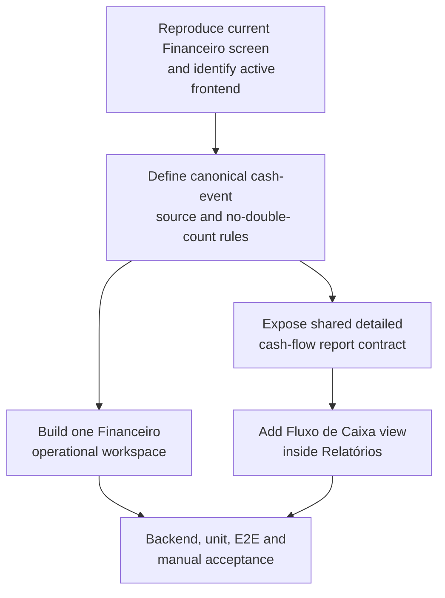

Suggested: sonnet · high — multi-source money semantics, cross-page UI consolidation, IPC/API
surface changes, and live Electron validation.

### Design rationale

- **One operational workspace, not six competing tabs.** Keep `/financeiro` as the entry point,
  but replace the current tab strip with one page organized into clearly named sections. A
  `tipo` filter or compact filter control may distinguish A Receber/A Pagar in the same ledger;
  it must not create another page-level tab. Do not create tabs inside the new Financeiro page.
- **Cash flow is an interpretation of movements, not a second manual-entry destination.** The
  single manual-entry action creates a financial movement once. The operational page can show
  current/open/overdue status and settlement actions, while the historical interpretation of
  entries belongs in Relatórios.
- **Preserve distinct business meanings under one visual surface.** `LancamentosFinanceiros`
  remains the obligation/receivable ledger; `Pagamentos` remains sale-linked receipt detail until
  its reconciliation semantics are explicitly settled; `FechamentosCaixa` remains physical-cash
  opening/count/difference reconciliation; and `Vendas` remains the source for finalized cash
  sales. Consolidation is an information-architecture change, not permission to delete tables,
  merge rows blindly, or count the same sale and payment twice.
- **The report must explain the number.** The Relatórios view should show realized versus
  projected data separately, period boundaries, entries, outflows, net result, daily movement,
  source/type/category detail where available, and a short legend explaining what is and is not
  included. It must not label cash balance as profit or faturamento.

### Implementation

- [ ] **GOALS13-01 — [manual] Reproduce and scope the failure before edits.** In the owner's
      dedicated manual worktree, verify `pwd`, branch and `git status`; launch the app using the
      normal path and, separately only if needed, the legacy flag. Open Financeiro, inspect the
      six current tabs, reproduce the form visible on Fechamentos, create a disposable test
      movement, and record whether the rendered page shows a blank screen, infinite loading,
      stale data, an IPC/API error, or only the redundant layout. Do not use the production DB,
      customer exports or another chat's worktree.
      **Done when:** the exact frontend, route, action, visible error and relevant
      `erp-crash.log`/console evidence are written in the execution notes; no implementation
      file was changed during reproduction.

- [x] **GOALS13-02 — Freeze the financial event matrix before coding.** Document and test the
      chosen source-of-truth policy for at least these cases:
      `Vendas.finalizada` with non-Fiado payment; open and paid
      `LancamentosFinanceiros.tipo='receber'`; open and paid
      `LancamentosFinanceiros.tipo='pagar'`; a `Pagamentos` row pending/received and linked to a
      sale; and an open/closed `FechamentosCaixa` session. Decide whether a received `Pagamentos`
      row settles an existing receivable, is supporting evidence only, or is a separate event;
      the default safe rule is that it is not added independently while the current
      `getFluxoCaixa` source remains authoritative. Also define local date boundaries, treatment
      of null dates, rounding, cancellations/devolutions, and whether the report uses sale date or
      settlement date for each source.
      **Done when:** the matrix has one expected inclusion/exclusion and one expected date for
      every case, with an explicit no-double-count rule accepted before implementation.
      **Execution evidence (2026-09-08):** adopted the safe policy described here: non-Fiado
      sales enter on sale date; Fiado enters only through a paid receivable on payment date;
      paid payables leave on payment date; Pagamentos and FechamentosCaixa remain supporting
      detail/reconciliation; devolutions are exits on their own date; cancelled sales are out.
      The focused disposable-DB suite asserts the inclusion, exclusion, date and no-duplicate
      outcomes.

- [x] **GOALS13-03 — Create one shared cash-flow read contract.** Refactor the existing
      `getFluxoCaixa` path in `db/financeiro.js` only as needed to derive both the operational
      summary and the report from the same canonical event builder. Preserve compatibility for
      existing callers where practical, and add a detailed result shape containing stable fields
      such as `data`, `tipo`, `origem`, `descricao`, `categoria`, `valor`, `referenciaId`, plus
      daily totals, period totals and realized/projected context. Do not make the renderer merge
      raw rows from four tables independently.
      **Done when:** one backend contract can reproduce the current aggregate totals and expose
      the detail needed by Relatórios, with the source policy and date semantics encoded in tests
      and comments.
      **Execution evidence (2026-09-08):** `db/financeiro.js` now builds canonical realized and
      projected events and derives daily totals and breakdowns from them; `db/relatorios.js`
      composes both without a second SQL calculation path. The focused suite passed 5/5 and the
      full backend suite passed 168/168.

- [ ] **GOALS13-04 — Wire the contract through the existing Electron layers.** Update only the
      owned Financeiro/Relatórios surface in `database.js`, `ipc/financeiro.js` and/or
      `ipc/relatorios.js`, `preload.js`, and `frontend/src/lib/erpApi.ts`. Keep the handler gated
      according to the chosen policy: financial operational data should remain under the
      `financeiro` permission unless an explicit owner decision justifies a report-only
      `relatorios` gate. Keep admin-only configuration actions (DAS rate, monthly target and
      recurring-template administration) separate from ordinary read access. Do not patch the
      legacy `window.erpBanco` bridge and the new typed API opportunistically; only update both if
      the manual reproduction proves both runtimes are in scope.
      **Done when:** the live frontend can call the intended contract with the correct permission
      and receives the same typed shape in development and packaged-source validation.

- [ ] **GOALS13-05 — Replace the Financeiro tab strip with one operational workspace.** Reshape
      `frontend/src/app/(admin)/financeiro/page.tsx` and its Financeiro components so the page has
      one visible workspace with sections, not the current A Receber/A Pagar/Fluxo/Fechamentos/
      Pagamentos/Recorrentes tabs. The minimum structure is:
      (a) a compact summary and filters for type/status/date/category;
      (b) one unified movement list with clear labels for receiving, paying, open, paid, overdue
      and origin;
      (c) one manual-entry action/form, shown once and only in the relevant operational context;
      (d) a sale-receipt/payment-detail section using the existing `PagamentoFormModal` semantics;
      (e) a physical-cash section showing the current status and closure history, reusing the
      existing `erpApi.caixa` operations rather than creating a second cash ledger; and
      (f) recurring templates as a secondary section/modal, not a competing top-level tab.
      Keep the PDV cash shortcut pointed at the same API/state. Do not remove the PDV's existing
      ability to open/close a cash session without an explicit owner request.
      **Done when:** opening Financeiro presents one coherent screen, no unrelated form appears
      under cash-closure/payment details, every existing in-scope operation remains reachable,
      and no nested tab strip is introduced.

- [ ] **GOALS13-06 — Define one refresh/invalidation path for mutations.** After creating,
      receiving, paying, excluding or importing a movement; registering/settling a sale payment;
      opening/closing cash; or generating a recurring entry, refresh the affected unified list,
      summary and any report data that is visible. Replace the current type-only `refreshTick`
      behavior with an explicit shared refresh callback or equivalent small invalidation contract.
      **Done when:** a newly created or settled movement appears in the unified screen and in the
      report without a full app restart or manual route change, and duplicate requests are not
      triggered by React effects.

- [ ] **GOALS13-07 — Add Fluxo de Caixa as a Relatórios view.** Extend
      `frontend/src/app/(admin)/relatorios/page.tsx` with a `Fluxo de Caixa` view that consumes
      the shared detailed contract instead of duplicating SQL or reusing the sales-only
      `PainelPorDia`. Include period filters, summary cards for entradas/saídas/saldo, a readable
      daily chart/table, a detail/breakdown by source/type/category when the data supports it,
      and separate realized/projected presentation. Include an explicit empty state and explain
      that this is cash movement, not DRE/lucro/faturamento. Reuse existing chart and formatting
      conventions; exports are out of scope unless the existing report export can be extended
      without adding a second calculation path.
      **Done when:** a user can launch or settle a disposable movement in Financeiro, open the
      Relatórios Fluxo de Caixa view, choose its period, and understand why each total and daily
      line has its value.

### Tests

- [x] **GOALS13-08 — Backend regression coverage in a disposable encrypted DB.** Extend the
      existing finance/business test surface (`test/negocio.test.js` and/or a focused
      `test/financeiro-fluxo-consolidado.test.js`) to prove: a finalized cash sale enters once;
      an open Fiado receivable does not enter realized cash until the chosen settlement event;
      a paid receivable enters on the defined payment date; a paid payable subtracts once; same-
      day events aggregate deterministically; start/end boundaries are inclusive and invalid
      ranges fail clearly; category/source details match the event matrix; closure differences are
      reconciliation data and are not silently added as another cash event; and `Pagamentos`
      cannot double-count the sale/receivable path. Retain the existing projected-flow and
      recurring idempotency tests.
      **Done when:** the focused regression suite fails against the intentionally broken behavior
      before the fix, passes after it, and `npm test` remains green without touching the real DB.
      **Execution evidence (2026-09-08):** added `test/financeiro-fluxo-consolidado.test.js`
      with five focused cases over a temporary SQLCipher database; all passed, and `npm test`
      passed 168/168. No real database or migration JSON was used.

- [x] **GOALS13-09 — API and permission coverage.** Add tests for the new IPC/API contract,
      including a permitted user, a denied user, empty periods, null/default periods, malformed
      dates and the chosen separation between `financeiro` and `relatorios` permissions. Verify
      the bridge name is identical across `ipc`, `preload` and `erpApi`; if the legacy frontend is
      retained in scope, add the equivalent `window.erpBanco` assertion rather than leaving two
      silently different contracts.
      **Done when:** a missing method or wrong permission fails a test with a clear error rather
      than producing an apparently empty report.
      **Execution evidence (2026-09-08):** tests cover permitted, denied, empty, default and
      malformed periods; assert `relatorios` for the report handler and preserve `financeiro`
      for the operational handler; and verify the handler/preload/typed-API names match.

- [ ] **GOALS13-10 — [manual] Electron E2E and visual acceptance.** In an isolated
      `ERP_TEST_USERDATA_DIR`, rebuild `frontend/out` before launching Electron and extend the
      existing Playwright Electron suite (`e2e/`, `npm run test:e2e`) to verify the single Financeiro
      workspace, no duplicate top-level tabs, no manual form on an unrelated section, one
      movement creation/settlement path, refresh after mutation, and the Relatórios Fluxo de
      Caixa view. Repeat the high-value path with the supported permission profiles and in the
      available light/dark or narrow-width states. Keep production data and migration JSON out
      of the test fixture.
      **Done when:** the real Electron window, IPC bridge and static export pass the user-shaped
      workflow; compile-only/typecheck success is not accepted as the sole evidence.

### Registration

- [ ] **GOALS13-11 — Update project documentation after behavior is verified.** Record the new
      single-workspace information architecture, canonical cash-event policy, report semantics,
      permission choice and the manual validation status in `AGENTS.md`/`GOALS.md` according to
      the repository's existing conventions. Keep the existing Financeiro+Pagamentos migration
      item marked pending until its live verification is actually complete.
      **Done when:** a future agent can identify the one operational Financeiro workspace, the
      Relatórios cash-flow view, and the no-double-count policy without rereading the source.

- [ ] **GOALS13-12 — Final acceptance and ownership boundary.** Verify `git status` before and
      after the implementation in the owner's dedicated worktree; stage only this goal's owned
      files, never unrelated changes from the other ERP chat, never stage sensitive financial or
      customer JSON, and do not commit or push without the owner's explicit confirmation.
      **Done when:** the feature is live-verified, the diff contains only the requested Financeiro/
      Relatórios work, and the user receives a clear distinction between automated proof,
      manual proof, and anything still unverified.

---

## Cadastro de Produtos — Review Findings (fix + feature, not started)

**Source**: owner review request (2026-09-08) — "revisar o módulo de produtos, em específico o
cadastro de produtos." Owner then walked through the live screen and reported 5 concrete issues
with screenshots, rather than asking for a blind sweep — every item below traces to that
walkthrough plus code read against the actual files, not assumption from the screen name.

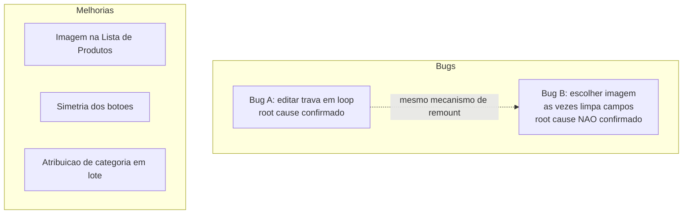

Suggested: sonnet · high — mistura um bug de UI com causa já confirmada, um bug que exige
reprodução ao vivo antes de poder ser corrigido com segurança, e uma feature nova que grava em
várias linhas do banco de uma vez (categoria em lote); o item de simetria de botões sozinho é
haiku/low, anotado inline abaixo.

### Bugs

- [x] **Bug A — editar produto trava em modo edição após salvar (não sai da tela, "loop").**
      Root cause confirmado: `onSalvo` ([ProdutoFormPanel.tsx:177](ERP/frontend/src/components/produtos/ProdutoFormPanel.tsx:177))
      só incrementava `refreshTick` em
      [page.tsx:37](ERP/frontend/src/app/(admin)/produtos/cadastro/page.tsx:37) sem limpar
      `produtoEditando` — o `useEffect` de `[produtoEditando]` repopulava a mesma edição de
      novo a cada remontagem. Owner escolheu (via pergunta direta nesta sessão): depois de
      salvar uma edição, volta pro formulário em branco — mesmo comportamento que "Cancelar
      Edição" já tinha. Fix real aplicado, diferente do desenho original do item: em vez de
      `setProdutoEditando(null)` + bump de `refreshTick` (remontar o painel), `onSalvo` agora só
      faz `setProdutoEditando(null)`, **sem** bump de `refreshTick` — corrigido em
      [page.tsx:37-45](ERP/frontend/src/app/(admin)/produtos/cadastro/page.tsx:37). Motivo da
      correção: escrever o e2e revelou um segundo bug — remontar reiniciava `primeiraVez.current`
      pra `true`, então o `else if (!primeiraVez.current) limparFormulario()` do efeito (que
      limpa nome/estoque/categorias persistidos via `usePersistedState`) nunca rodava, e o
      formulário "em branco" voltava com o nome antigo ainda preenchido (puxado de volta do
      localStorage no mount). Sem remontar, a mesma instância continua viva, `primeiraVez.current`
      já é `false`, e o efeito chama `limparFormulario()` corretamente — o mesmo caminho que
      "Cancelar Edição" (que nunca teve esse bug) sempre usou. Regression test:
      `e2e/produtos-cadastro.spec.ts` (novo — não havia harness de componente no frontend,
      `frontend/package.json` sem vitest/jest/testing-library; e2e via Playwright/Electron é o
      único instrumento disponível). Confirmado o ciclo completo: teste falhou contra o código
      anterior ao fix (2 formas diferentes — primeiro por ficar preso em modo edição, depois,
      já com o fix "ingênuo" de remontar, por reaparecer com o nome antigo), passou depois do
      fix final. `npm test` (168/168), `npm run lint` (0 erros), `frontend: tsc --noEmit` e
      `npm run lint` limpos, `npx playwright test e2e/` (7/7, incluindo `tab-system.spec.ts` —
      sem regressão).

- [ ] **Bug B — "Escolher imagem" às vezes limpa todos os campos do formulário.** Repro
      relatado pelo dono: no Cadastro de Produto, preenchendo um produto novo, clicar em
      "Escolher imagem..." às vezes limpa os campos já preenchidos — comportamento
      intermitente, não reproduzido de forma determinística nesta sessão (revisão só de código,
      sem sessão ao vivo). Root cause **não confirmado** — não inventar uma causa. Pistas
      verificadas no código, pra orientar a investigação, não pra já escrever o fix: (1) `sku` e
      `codigoBarras`
      ([ProdutoFormPanel.tsx:57-58](ERP/frontend/src/components/produtos/ProdutoFormPanel.tsx:57))
      são `useState` comuns, não `usePersistedState` como `nome`/`estoque`/`categoriasSelecionadas`
      — qualquer remontagem do painel (o mesmo mecanismo de `key={refreshTick}` do Bug A, também
      disparado por `CategoriasListModal.onAlterado` em
      [page.tsx:51](ERP/frontend/src/app/(admin)/produtos/cadastro/page.tsx:51)) zera esses dois
      campos e busca um SKU novo, mesmo que nome/estoque sobrevivam via localStorage — uma
      inconsistência real, ainda que não confirmada como o gatilho exato que o dono viu. (2) O
      botão já tem `type="button"` corretamente
      ([ProdutoImagemPicker.tsx:107](ERP/frontend/src/components/produtos/ProdutoImagemPicker.tsx:107)),
      então não é o bug clássico de submit acidental de formulário — a causa está em outro
      lugar. **Investigado nesta sessão** (e2e real, `e2e/produtos-cadastro.spec.ts`, caso
      "investigação Bug B"): produto novo (sem salvar) → preenche nome → mocka
      `dialog.showOpenDialog` pra cancelar instantaneamente (`electronApp.evaluate`, sem travar
      num diálogo nativo real) → clica "Escolher imagem..." → nome **permanece preenchido**.
      Esse gatilho específico (produto novo, diálogo cancelado) **não reproduz** o bug — passou
      100% das vezes. Isso não fecha o item: só elimina uma hipótese. Gatilhos ainda não
      testados, mais prováveis agora: (a) escolher um arquivo de verdade em vez de cancelar
      (o caminho pendente/`escolherImagemPendente` grava `dataUrl`/`caminho` e pode interagir
      diferente do cancelamento); (b) fazer isso **editando um produto já existente**
      (`produtoId` setado, caminho `escolherImagem(produtoId)`, que grava no banco de
      imediato) em vez de um produto novo; (c) uma corrida de tempo real (arquivo grande,
      diálogo demorando) que o mock instantâneo não reproduz. Próximo passo: pedir ao dono pra
      confirmar em qual desses cenários (produto novo vs. editando um existente; cancelou vs.
      escolheu um arquivo) ele viu o bug, antes de investir mais tempo tentando reproduzir às
      cegas. Fix e regression test continuam bloqueados até a causa ser confirmada — não
      escrever um patch especulativo em cima de uma causa não verificada.

- [x] **Bug C — imagem do produto nunca aparecia no carrinho do PDV (Frente de Caixa).**
      Fora do escopo estrito de "cadastro" (é a tela de PDV, não a de cadastro), mas achado
      testando a mesma feature de imagem nesta sessão — registrado aqui pra não se perder.
      Repro relatado pelo dono (com print): editou a imagem de um produto, o item já estava no
      carrinho do PDV, e o carrinho mostrava um quadrado cinza no lugar da foto. Root cause:
      [Carrinho.tsx:42-51](ERP/frontend/src/components/pdv/Carrinho.tsx:42) usava
      `` com o **nome de arquivo cru** vindo de
      `Produtos.imagem`/`buscarProdutosPorTermo` — igual ao que `useCarrinho.ts:124` grava no
      item — mas esse arquivo mora fora da raiz servível do app (só acessível via IPC
      `getImagemProduto`, o mesmo caminho que `ProdutoImagemPicker`/`ProdutoThumbnail` já usam
      corretamente). Ou seja: a miniatura do carrinho **nunca** funcionou pra nenhum produto com
      imagem, não só a que o dono acabou de trocar. Fix: novo hook
      [useImagemArquivo.ts](ERP/frontend/src/hooks/useImagemArquivo.ts) (resolve nome de arquivo
      → data URL via `getImagemProduto`, sem exigir `produtoId` como `useImagemProduto` exige —
      o carrinho só tem `variacao_id`), usado num novo `ImagemItemCarrinho` dentro de
      `Carrinho.tsx`. Miniatura também aumentada de `size-10` (40px) pra `size-14` (56px), a
      pedido do dono. **Limitação conhecida, não corrigida**: o carrinho persiste um snapshot de
      cada item (`useCarrinho.ts`, mesmo padrão do `preco_unitario` travado no momento de
      adicionar) — se a imagem for trocada com o item **já no carrinho**, só atualiza removendo
      e recolocando o item (ou reiniciando o carrinho), igual já acontece hoje com preço.
      Regression test: novo caso em `e2e/produtos-cadastro.spec.ts` — edita a imagem de um
      produto existente e confirma que o nome de arquivo salvo resolve pra uma `data:image/...`
      URL de verdade via `getImagemProduto` (o mesmo mecanismo que `ImagemItemCarrinho` usa) —
      não reabre o PDV inteiro no teste (preço zerado bloquearia adicionar ao carrinho; fora de
      escopo simular precificação só pra isso). `npx playwright test e2e/` 8/8,
      `frontend: tsc --noEmit` e `npm run lint` limpos.

### Melhorias

- [x] **Imagem na Lista de Produtos.** Extraído o fetch-e-cache de imagem (antes só dentro de
      `ProdutoImagemPicker`) pro hook compartilhado
      [useImagemProduto.ts](ERP/frontend/src/hooks/useImagemProduto.ts) (retorna
      `[dataUrl, setDataUrl]`, pra `ProdutoImagemPicker` continuar podendo sobrescrever
      otimisticamente após upload, igual antes). Novo
      [ProdutoThumbnail.tsx](ERP/frontend/src/components/produtos/ProdutoThumbnail.tsx) (32×32,
      usa o hook) plugado como primeira coluna em
      [ProdutosListModal.tsx](ERP/frontend/src/components/produtos/ProdutosListModal.tsx)
      (`colSpan` dos estados vazio/carregando ajustado de 4→5). `ProdutoImagemPicker.tsx`
      refatorado pra usar o mesmo hook em vez da lógica duplicada.

- [x] **Simetria dos botões no Cadastro de Produto.** `flex-1` aplicado a cada `Button` das
      duas fileiras em
      [ProdutoFormPanel.tsx](ERP/frontend/src/components/produtos/ProdutoFormPanel.tsx:293) —
      largura igual dentro de cada fileira, só classe Tailwind, sem lógica nova.

- [x] **Atribuição de categoria em lote (bulk).** Caso real relatado pelo dono: produtos já
      cadastrados sem categoria (import ou cadastro manual sem preencher esse campo) — hoje só
      dá pra corrigir um produto por vez, abrindo "Editar" em cada um. Pedido: selecionar uma
      categoria alvo, marcar vários produtos na Lista de Produtos, aplicar de uma vez.
      **Design rationale.** Backend: nova função `atribuirCategoriaEmLote(produtoIds, categoriaId)`
      em `db/produtos.js` — não reaproveitar `atualizarProduto` (espera um payload completo de
      produto+variações por chamada, caro e desnecessário só pra mexer em `ProdutoCategorias`).
      Validar que `categoriaId` existe (mesmo padrão de checagem já usado em
      [db/produtos.js:482-491](ERP/db/produtos.js:482) pra integridade de subcategoria) e, numa
      única transação, `INSERT OR IGNORE INTO ProdutoCategorias (produto_id, categoria_id)` pra
      cada id em `produtoIds`. **Aditivo, não substitui** categorias já existentes nesses
      produtos — mais seguro como padrão geral, e resolve exatamente o caso relatado (produtos
      sem nenhuma categoria) sem risco de apagar categorização que outro produto selecionado já
      tivesse. Novo handler IPC `atribuir-categoria-produtos-lote` em `ipc/produtos.js`, gated
      por `exigirPermissao("produtos")` como todos os outros handlers desse arquivo, com
      `log(...)` da ação (mesmo padrão de auditoria já usado nas outras mutações). Frontend: em
      `ProdutosListModal.tsx`, um "modo seleção" — checkbox por linha (reaproveita os filtros já
      existentes, ex: por categoria/estoque, pra restringir o universo antes de selecionar) +
      barra de ação com seletor de categoria + botão "Aplicar categoria aos N selecionados", com
      confirmação antes de aplicar — mesmo cuidado já usado nesta tela pra exclusão permanente
      (`ConfirmarSenhaModal`) e remoção de imagem (`confirm()` nativo em
      `ProdutoImagemPicker.tsx:79`).
      **Implementation**: `atribuirCategoriaEmLote` em
      [db/produtos.js](ERP/db/produtos.js) (exportada via `database.js`), handler IPC
      `atribuir-categoria-produtos-lote` em
      [ipc/produtos.js](ERP/ipc/produtos.js) (+ `preload.js`), método
      `erpApi.produtos.atribuirCategoriaEmLote` em
      [erpApi.ts](ERP/frontend/src/lib/erpApi.ts). UI em
      [ProdutosListModal.tsx](ERP/frontend/src/components/produtos/ProdutosListModal.tsx):
      botão "Selecionar" (oculto na Lixeira — sai do modo seleção automaticamente se o dono
      abrir a Lixeira com seleção ativa), coluna de checkbox (+ "selecionar todos visíveis" no
      cabeçalho), barra de ação com `<select>` de categoria + botão "Aplicar categoria aos N
      selecionado(s)" com `confirm()` antes de gravar.
      **Tests**: 5 casos novos em
      [test/produtos-financeiro-melhorias.test.js](ERP/test/produtos-financeiro-melhorias.test.js) —
      categoria inexistente rejeitada, lote vazio rejeitado, aplica corretamente a N produtos,
      **atômico** (um id inexistente no lote faz tudo falhar — nada gravado, verificado
      diretamente na tabela), **aditivo** (categoria antiga permanece após aplicar uma nova).
      **Registration**: nenhuma — é uma ação dentro de uma tela já existente, sem novo
      menu/rota/entrada de sidebar.
      **Verificação**: `npm test` 168/168, `npm run lint` (raiz e frontend) 0 erros,
      `frontend: tsc --noEmit` limpo.

### Suggested order

Bug A primeiro — root cause já confirmado, fix pequeno e mecânico, desbloqueia o uso normal do
fluxo de edição. Bug B em seguida, mas a investigação ao vivo é pré-requisito do próprio item,
não pode ser pulada direto pro patch. As 3 melhorias não têm dependência técnica entre si nem
com os bugs — ordem sugerida por esforço crescente: miniatura na lista (pequena, ganho visível
imediato) → simetria dos botões (trivial) → atribuição em lote (a de maior escopo, toca
banco/IPC/UI nas três camadas).

**Status (2026-09-08, `/execgoals`)**: 4/5 concluídos e verificados (Bug A, miniatura na lista,
simetria dos botões, atribuição em lote). Só falta **Bug B** — investigado ao vivo via e2e
(ver notas do item), uma hipótese descartada (produto novo + diálogo cancelado não reproduz),
mas a causa raiz ainda não está confirmada; precisa de mais detalhes do dono sobre o cenário
exato antes de tentar de novo.

---

## Atualizações — Update Flow Redesign (feature, implemented 2026-09-08, pending live verification)

**Source**: owner request (2026-09-08), with a live screenshot of the current `/atualizacao`
page. The screen works in part but the flow is wrong: clicking "Atualizar" makes the global
floating card (`UpdateAvailableCard.tsx`) pop up unprompted at the bottom of the screen — the
owner explicitly does not want that. Full desired flow, in the owner's own words: enter
Atualizações → the page states there's an update available → click "Baixar atualização" →
downloads → the *same* button, same place, relabels to "Instalar" → clicking it opens a confirm
dialog ("Baixar atualização faz com que o app reinicie, deseja prosseguir?", Sim/Não) → "Não"
leaves the update downloaded-but-pending, nothing installs → "Sim" is the moment the floating
card (repurposed, not the old "deseja instalar?" prompt) appears with a loading status, right
before the app quits and relaunches with the update installed.

**Current wiring, read directly, not assumed**: [`UpdateAvailableCard.tsx`](ERP/frontend/src/components/atualizacao/UpdateAvailableCard.tsx)
independently listens for the same global `update-status` window event that
[`useAtualizacao.ts`](ERP/frontend/src/hooks/useAtualizacao.ts) (the page's own hook) listens
for, and shows itself the instant `status === "available"` fires anywhere in the app — that is
the unwanted pop-up in the owner's report. It also auto-calls `quitAndInstall()` by itself the
moment `update-downloaded` arrives, with zero confirmation. [`page.tsx`](<ERP/frontend/src/app/(admin)/atualizacao/page.tsx>)'s
button is hardcoded "Atualizar" regardless of state; `useAtualizacao.ts`'s `clicarBotao()`
already branches check → download → install by internal state, it's just never surfaced as a
different label and never gates the install step behind confirmation.

**Root cause of the specific complaint**: the daily background check (`atualizacao-automatica.js`)
and a manual click on the page both funnel through the same `update-status` broadcast.
`UpdateAvailableCard` was built (2026-08-28, see this file's own "sixth module" entry above)
specifically so a background-detected update would surface even when the owner isn't on
`/atualizacao` — but it never distinguished "detected in the background" from "the owner is
actively working through the page's own flow," so today it double-prompts every time, including
right after the owner's own manual click.

**Design decision / explicitly out of scope**: this redesign retires `UpdateAvailableCard`'s old
role as a proactive "an update was found, install now?" notifier outright — that prompt is
replaced entirely by the page's own status text and button-label changes. Consequence: a
background-detected update, while the owner is on a different tab, no longer produces *any*
global pop-up — it's only visible by opening `/atualizacao`, same as a manual check always
showed. Flagging this trade-off here explicitly, in case a passive global notice (e.g. a sidebar
badge) is still wanted — nothing in this plan builds one; say so if that's wrong.
Also explicitly out of scope: the legacy vanilla frontend (`modules/atualizacao/atualizacao.js`
+ `.html`). Confirmed via this file's own Security audit entry (2026-09-01) that it's unreachable
in shipped builds except through the internal `ERP_LEGACY_FRONTEND` dev escape hatch — cutover
to the Next.js frontend is the real default today. The earlier "both frontends in lockstep"
convention applied while the vanilla frontend was still a live candidate; that constraint no
longer governs new UX work like this one.

**Correction (2026-09-08, second pass, after seeing the first implementation live)**: the first
pass (below) built a global floating card (`UpdateAvailableCard.tsx`) that appeared bottom-right
right after "Sim," showing a loading state, then called `quitAndInstall()`. Live screenshots
showed this card sitting there indefinitely in the demo, which is what surfaced the real
question: what should the user actually see once "Sim" is clicked? The owner's answer: the app
should already be closed by then, and what appears next is centered on screen, not a corner
toast. Investigating that surfaced a real, previously-undocumented fact: `package.json`'s
`build.nsis.oneClick` is currently `false` (multi-step wizard — choose folder → Install →
Finish), reverted from `true` in a past commit (`8b28940: instalador NSIS volta a perguntar
pasta de instalacao`). With `oneClick:false`, "app closes, then a centered progress indicator
appears automatically, then the app reopens" is not achievable — the real NSIS wizard requires
manual clicks. This is a genuine trade-off only the owner can decide (lose the "choose install
folder" option vs. get the fully automatic close→install→reopen behavior), so it was raised as
an explicit **human-in-the-loop** question rather than assumed either way. **Owner's answer:
re-enable `oneClick:true`.** With that, the "centered card while updating" the owner is picturing
*is* the NSIS one-click installer's own native window — not something this app's React code
renders, and not something it could render anyway, since the whole Electron process (and
everything mounted in it, including `UpdateAvailableCard.tsx`) exits the moment `quitAndInstall()`
actually runs. Net effect: **`UpdateAvailableCard.tsx` no longer has any job left and was
deleted** (its old proactive-notify role was already retired in the first pass above; its
replacement loading-card role is now retired too, superseded by the real installer window)
— `confirmarInstalacao()` in `useAtualizacao.ts` calls `quitAndInstall()` directly, with the
existing page-level error banner as the only remaining UI if that call itself fails (rare — it
means the app hasn't closed, so the user is still looking at the page).

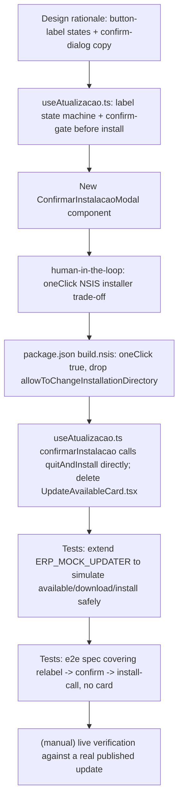

Suggested: sonnet · medium — bounded UI/state-flow change across a known, small set of files, no
new IPC/backend surface; the one item needing a real decision (not just code) was the NSIS
installer trade-off, resolved above as human-in-the-loop rather than assumed.

### Design rationale

- [x] Button label reflects state, computed in `useAtualizacao.ts` and consumed by `page.tsx`
      (replacing the hardcoded `"Atualizar"` label): `disponivel` → "Baixar atualização";
      `baixando` → "Baixando... N%" (disabled); `baixado` → "Instalar"; otherwise
      (idle/checking/not-available) → "Verificar atualizações". Done when: the label is derived
      from state with an explicit case for every state — no fallthrough gap, no state left
      showing the old generic label.
- [x] Clicking the button while `baixado` no longer installs directly — it opens the confirmation
      dialog first. Done when: the click handler branches to "open confirm dialog" instead of
      calling `install()` when `baixado` is true.
- [x] Confirmation dialog copy is exactly the owner's spec: "Baixar atualização faz com que o app
      reinicie, deseja prosseguir?" with "Sim"/"Não" actions — reuse the existing `Modal`
      (`@/components/ui/modal`) + `useModal()` pattern already used by
      [`ConfirmarSenhaModal.tsx`](ERP/frontend/src/components/common/ConfirmarSenhaModal.tsx),
      not a new modal primitive. Done when: a new component renders that exact copy through the
      shared `Modal`. Implemented as `ConfirmarInstalacaoModal.tsx`, same shape.
- [x] "Não" cancels cleanly: dialog closes, no IPC call fires, `baixado` stays true, the button
      still reads "Instalar" for a later click. Done when: clicking "Não" is a no-op besides
      closing the dialog — verified no `quitAndInstall`/`downloadUpdate` call happens. Verified
      live via e2e (`"Não" cancela` case, `e2e/tab-system.spec.ts`).
- [x] `UpdateAvailableCard.tsx` stops treating `status === "available"` as "show myself" — its
      old `fase === "disponivel"` phase (the "Existe uma atualização... Deseja instalar agora?"
      prompt with "Agora não"/"Sim, atualizar") is deleted outright, not just hidden, since the
      page now owns that decision. Superseded by the item below: the component ended up with no
      remaining job and was deleted entirely, not just this one phase.
- [x] ~~`UpdateAvailableCard.tsx` gains its replacement job: a post-confirmation loading
      indicator~~ — **superseded by the second-pass correction above.** With `oneClick:true` (the
      owner's explicit choice), the whole Electron process exits the instant `quitAndInstall()`
      runs, so no React component — this one included — can render anything after that point;
      what the owner pictured as "a centered card while updating" is the NSIS one-click
      installer's own native window, outside this app's code. `UpdateAvailableCard.tsx` was
      deleted (`git rm` equivalent — file removed, import + mount removed from
      `(admin)/layout.tsx`) instead of being repurposed a second time.
- [x] Carry the two explicit out-of-scope decisions above into the PR/commit description: no
      passive background-detected notification surface outside visiting `/atualizacao` directly,
      and `modules/atualizacao/` (legacy vanilla) stays untouched. Both confirmed untouched by
      `git status` (no changes under `modules/`); the commit message for this work should
      restate both lines.
- [x] **Human-in-the-loop**: the NSIS `oneClick` trade-off (lose "choose install folder" vs. get
      the fully automatic close→install→reopen behavior the owner described) was raised as an
      explicit question rather than assumed. Done when: the owner picked an option and that
      choice is recorded here. **Answer: re-enable `oneClick:true`.**

### Implementation

- [x] `package.json` → `build.nsis`: `oneClick` flipped back to `true`, matching the state it was
      in before commit `8b28940` reverted it. `allowToChangeInstallationDirectory` removed
      (incompatible with one-click installers, same disclosed trade-off already recorded in this
      file's "sixth module" entry the first time this flag was flipped). Done when: `package.json`
      reads `"oneClick": true` with no `allowToChangeInstallationDirectory` key.
- [x] `page.tsx`: render the confirm dialog, wire its "Sim" handler to
      `useAtualizacao.ts`'s `confirmarInstalacao()`. Done when: `page.tsx` never calls
      `erpApi.sistema.quitAndInstall` directly — confirmed by grep, the only caller in the
      frontend is `useAtualizacao.ts`.
- [x] `useAtualizacao.ts`: add the button-label derivation and the "open dialog instead of
      installing" branch; `confirmarInstalacao()` calls `erpApi.sistema.quitAndInstall()`
      directly (no intermediate event/handoff — there is no other component left to hand off to),
      with `.catch()` routing any failure through the hook's existing `mostrarMensagem("error",
      ...)` path, the same one every other error on this page already uses. Keep every other
      existing state transition (`checking`/`available`/`not-available`/`download-progress`/
      `update-downloaded`/`error`) untouched — this hook already mirrors a state machine ported
      carefully from the vanilla original (see this file's "sixth module" entry), so this is not
      the place for a restructure. Done when: a diff review shows only additive changes to the
      existing switch/if-chain, no removed or altered cases.
- [x] Delete `UpdateAvailableCard.tsx` and its import/mount in `(admin)/layout.tsx` — no
      cross-component handoff event needed since nothing else needs to react to the confirmation
      besides the hook itself. Done when: no file in the repo references
      `UpdateAvailableCard`/`update-install-confirmed` (confirmed by grep, aside from this plan
      file's own historical narrative above).
- [x] New `ConfirmarInstalacaoModal.tsx` (dedicated file, matching `ConfirmarSenhaModal.tsx`'s
      precedent shape: `isOpen`/`onClose`/`onConfirmar` props, `Modal` + `Button` from the
      existing `ui` components, no new dependency). Done when: the component exists, is used from
      `page.tsx`, and its copy matches the owner's exact wording.

### Tests

- [x] Extend `ipc/sistema.js`'s `ERP_MOCK_UPDATER` escape hatch (today it only covers
      `check-for-updates`, per the 2026-09-01 fix's own explicitly noted gap) to optionally
      simulate the full `available` → `download-progress` × N → `update-downloaded` sequence, and
      make the mock's `quit-and-install` path a safe no-op instead of calling the real
      `autoUpdater.quitAndInstall()`, which would actually try to relaunch the test's Electron
      process. Gated behind a distinct value (`ERP_MOCK_UPDATER=available`) so the existing
      `ERP_MOCK_UPDATER=1` "not-available" path (`e2e/tab-system.spec.ts`) keeps passing
      unmodified. Done when: an e2e run can drive "available" → "Baixar atualização" →
      "Instalar" → confirm dialog → "Sim" → the `quit-and-install` call, without the test process
      actually quitting. Implemented as three `ERP_MOCK_UPDATER === "available"` branches
      (`check-for-updates`, `download-update`, `quit-and-install`) in `ipc/sistema.js`.
- [x] e2e coverage (`test.describe("fluxo de instalação de atualização (confirmação)")` in
      `e2e/tab-system.spec.ts`) asserting: (a) the button reads "Baixar atualização" once
      `available` fires; (b) after the mocked download completes, the same button reads
      "Instalar"; (c) clicking "Instalar" opens the confirm dialog with the exact
      owner-specified copy; (d) "Não" closes the dialog with no state change, button still
      "Instalar"; (e) "Sim" closes the dialog and no error banner appears (proving the mocked
      `quit-and-install` call was accepted without the test window ever going unresponsive — a
      real call would have closed it). Done when: all five assertions pass under
      `npm run test:e2e`. Verified: all 5 cases pass.
- [x] Regression: the pre-existing "Aplicativo atualizado" (not-available path) case and the
      tab-navigation-freeze regression test in `e2e/tab-system.spec.ts` both still pass
      unmodified. Done when: `npm run test:e2e` is fully green, not just the new spec in
      isolation. Verified: **10/10 e2e passing** (5 pre-existing + 5 new).

### Registration

- [x] None expected — this module is already registered everywhere it needs to be (sidebar, tab
      system, `modulo.json` permissions); this change alters existing behavior, it doesn't add a
      new discoverable entry point. Confirm no permission/manifest file needs touching
      (`download-update`/`quit-and-install` stay `exigirSessao("admin")` at the IPC layer,
      unchanged by this plan). Confirmed: no `modulo.json` touched by this change.
- [x] `AGENTS.md`'s update-flow paragraph updated to match the corrected design (button-label
      state machine + confirm dialog, no global card, `oneClick:true` reinstated) — it still
      described the first-pass `UpdateAvailableCard.tsx` design, which would have been stale and
      misleading for the next session to read.
- [x] `npm run lint`, `npm run typecheck`, and the frontend `npm run build` all clean. Done when:
      all three pass with zero new warnings introduced by this change. Verified: root
      `npm run lint` clean, `frontend && npm run lint` clean (0 errors, 2 pre-existing unrelated
      warnings), `frontend && npm run build` succeeds (39/39 static pages, including
      `/atualizacao`). `frontend && npm run typecheck` (bare `tsc --noEmit`) surfaces ~30
      pre-existing `IntrinsicAttributes`/`className` errors across unrelated files
      (`SignInForm.tsx`, `DashboardStatCards.tsx`, etc.) that predate this change and don't touch
      any file this plan modified (confirmed by grep — no `atualizacao`/`ConfirmarInstalacao`
      hits in the error list); `next build`'s own stricter type-check pass, which is what
      actually gates the shipped build, is clean. Backend: root `npm test` — **163/163 passing**.
- [ ] (manual) Live verification against a real published update — same caveat every prior
      update-flow fix in this file has needed (see "quit-and-install silently no-op'd" and
      "Update Flow — Navigation Freeze Investigation" above): the mocked e2e path proves the
      UI/state logic, but whether it actually restarts cleanly can only be confirmed by
      publishing a real build and running the full cycle once, per this module's own established
      practice.

**Ordering rule**: Design rationale before Implementation — the confirm-dialog copy and the
card's new trigger event are decisions referenced directly by the implementation items, not
details to improvise while coding. Implementation before Tests — nothing to assert on yet. The
mock-updater extension (first Tests item) before the new e2e spec (second Tests item), since the
spec depends on it. Registration/build-clean checks last, matching every other module entry in
this file.
