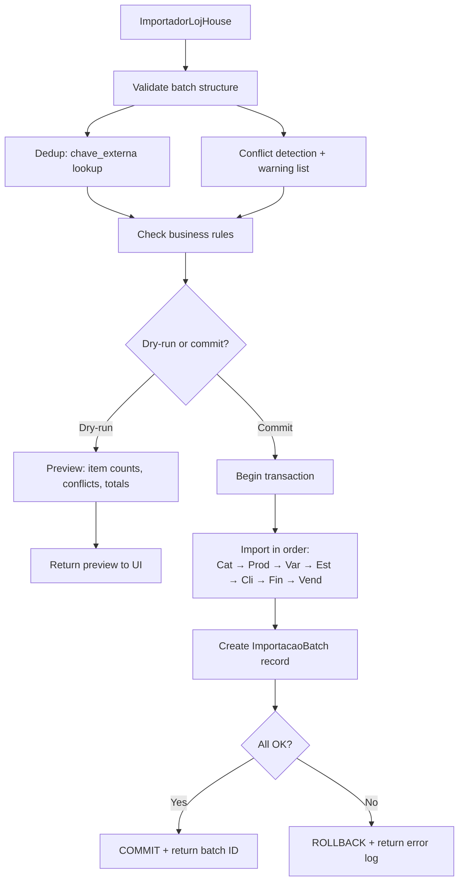
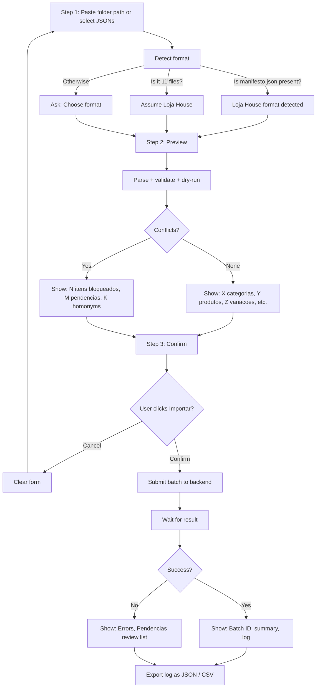

# GOALS — Data Migration: Loja House → ALLU ERP

Master plan for implementing a complete, idempotent, auditable data migration system to import the Loja House business data (categories, products, inventory, customers, financial history, and pending items) into ALLU ERP. Replaces the current import page, which only handles historical sales.

**Context**: Loja House prepared 11 normalized JSON files from an Excel source (Loja House.xlsx) using a structured format with external keys, move-tracking, and multi-step business rule enforcement documented in `CHECKLIST_INTEGRACAO.md`. The ERP import feature currently only accepts historical sales (4 fields: sku, quantidade, valorUnitario, data) — it cannot ingest the category/product/stock/client/financeiro data at all, and lacks batch idempotency, dry-run preview, and folder import.

**Why this exists**: owner needs to migrate real data into ERP in one atomic operation, with conflict detection, rollback on failure, and a clear record of what was imported. The current "single JSON file, sales only, no idempotency" design blocks this.

**Scope**: Backend batch import engine + idempotent batch tracking + frontend import wizard (folder picker, preview/validation, atomic commit, result log) + all 9 business entity types from the Loja House JSONs.

---

## Research: Loja House JSON Format & ERP Schema Fit

```mermaid
flowchart TD
    A[Read 11 JSONs + CHECKLIST] --> B[Map each entity to ERP table]
    B --> C1[Categorias -> Categorias]
    B --> C2[Produtos/Variacoes -> Produtos + Variacoes + Atributos]
    B --> C3[EstoqueInicial -> Variacoes.quantidade_estoque + MovimentacoesEstoque]
    B --> C4[Clientes -> Clientes]
    B --> C5[FinanceiroHistorico -> Lançamentos]
    B --> C6[ContasAbertas -> Lançamentos + status=aberto]
    B --> C7[VendasHistoricas -> Vendas + ItensVenda]
    B --> C8[CatalogoPrecos -> (validation reference, not a table)]
    B --> C9[Pendencias -> Pendencias table TBD or manual review]
    C1 --> D[Order: Categorias -> Produtos -> Variacoes -> Estoque -> Clientes -> Financeiro -> Vendas]
    C2 --> D
    C3 --> D
    C4 --> D
    C5 --> D
    C6 --> D
    C7 --> D
    D --> E[Identify conflicts & business rules]
    E --> F[Design batch table + idempotency key]
```

### Raw data structure (sample from JSONs):

**01_categorias.json**: `[{ chave_externa, nome, categoria_pai, ativo }, ...]`
- Maps to `Categorias` table — `categoria_pai` is a recursive hierarchy (handle NULL vs. string lookup)
- External key format: `CAT-<random_hex>` — store as `chave_importacao` for dedup

**02_produtos_variacoes.json**: Nested — products contain array of variacoes:
```
{
  chave_externa: "PROD-...",
  nome, categoria, subcategoria, marca,
  variacoes: [{
    chave_externa, sku, tamanho, cor,
    preco, preco_custo, quantidade_estoque, estoque_minimo,
    atributos: [{ chave, valor }],
    bloqueios: [], avisos: [], pronto_para_importacao: bool
  }, ...]
}
```
- Maps to `Produtos` (name/brand/category) + `Variacoes` (sku/price/quantity) + `Atributos` (many-to-many)
- **Conflict**: `variacoes.pronto_para_importacao=false` (119 blocked) must not be imported; warn user
- **Conflict**: `avisos` (price_custo ausente, preço_venda_ausente) → nullable columns, or halt?

**03_estoque_inicial.json**: Initial stock movements, one per sku:
```
{
  chave_externa, produto, sku, quantidade_saldo,
  pronto_para_importacao: bool,
  operacao: "definir_saldo_inicial",
  movimentacao: {
    tipo: "entrada", quantidade, custo_unitario, origem: "importacao_migracao",
    data_sugerida: "2026-09-02"
  }
}
```
- **Must** atomically: UPDATE `Variacoes.quantidade_estoque` + INSERT `MovimentacoesEstoque` in same txn
- saldo=0 → skip (no zero-qty movements)
- Origin: always "importacao_migracao", date: suggested date, user can override

**04_clientes.json**: `[{ chave_externa, nome, email, telefone, ... }, ...]`
- Maps to `Clientes` table — if nome already exists, warn (homonym check flagged in CHECKLIST)

**05_financeiro_historico.json**: Historical cash entries:
```
{
  chave_externa, tipo: "receber"|"pagar", descricao, valor,
  data_vencimento, data_pagamento, status: "pago",
  origem: "importacao_migracao"
}
```
- Maps to `Lançamentos` table — **NOT** a venda/sale, just bookkeeping
- All are status="pago" in this file — they're closed history, not AR/AP

**06_contas_abertas.json**: Open payables/receivables (incomplete in this batch):
```
{ chave_externa, tipo, descricao, valor, data_vencimento, status: "aberto" }
```
- Maps to `Lançamentos` table, status="aberto"
- CHECKLIST notes: 0 ready, many pending — likely user will provide later

**07_vendas_historicas.json**: Old sales (0 ready in this batch):
- Same as current import format once enabled
- CHECKLIST: 0 ready — skip for now

**08_catalogo_precos.json**: Reference only, not imported — used for validation

**09_relatorio_validacao.json**: Validation report — reference for reconciliation

**99_pendencias.json**: Items that couldn't be normalized (old receivables without SKU, duplicates, etc):
```
{ chave_externa, tipo, descricao, valor, motivo_rejeicao, sugestao }
```
- No table today — handle as manual review list, exported to CSV or shown in a UI panel for the user to fix + re-import later

### Business rules & conflicts (from CHECKLIST + running data):

| Rule | Handling |
|------|----------|
| 119 variações bloqueadas (`pronto_para_importacao=false`) | Skip with warning; don't halt entire batch |
| Preço de custo ausente (119 items) | Accept as NULL (existing Variacoes column already nullable) |
| Preço de venda ausente (some items) | Accept — user updates after; or halt? (TBD with owner) |
| Variações duplicadas | JSON shows `duplicatas: []` field — warn, suggest sum or discard |
| Clientes por nome (homonyms) | If nome exists in DB, warn before import |
| Crediário sem SKU real (210 pendências) | Move to `Pendencias` review table; don't try to create placeholder SKU |
| Saldos zero | Skip (no zero-qty movements) |
| Saldos iniciais + histórico coexist | Estoque inicial is separate from histórico — apply both in order |

---

## Backend: Batch Import Engine



### Database schema additions (new tables):

**ImportacaoBatch** — track each import run for idempotency + audit:
```sql
CREATE TABLE ImportacaoBatch (
  id TEXT PRIMARY KEY,  -- UUID or timestamp-based
  data_importacao DATETIME DEFAULT CURRENT_TIMESTAMP,
  usuario_id INT NOT NULL,
  origem TEXT,  -- "loja_house", "outro_erp", etc.
  status TEXT,  -- "sucesso", "erro", "parcial"
  total_itens INT,
  itens_importados INT,
  itens_ignorados INT,
  itens_erro INT,
  log TEXT,  -- JSON array of per-item results
  checksum TEXT  -- SHA256 of input file(s) for re-import detection
);
```

**MapeamentoChaveExterna** — dedup table, prevents double-import:
```sql
CREATE TABLE MapeamentoChaveExterna (
  chave_externa TEXT PRIMARY KEY,
  entidade_tipo TEXT,  -- "categoria", "produto", "variacao", "cliente", "lançamento", etc.
  entidade_id INT,
  data_criacao DATETIME,
  batch_id TEXT REFERENCES ImportacaoBatch(id)
);
```

**Pendencias** — items that failed business-rule checks, needing user intervention:
```sql
CREATE TABLE Pendencias (
  id TEXT PRIMARY KEY,
  chave_externa TEXT,
  tipo_entidade TEXT,
  descricao TEXT,
  valor DECIMAL,
  motivo_rejeicao TEXT,
  sugestao TEXT,
  batch_id TEXT REFERENCES ImportacaoBatch(id),
  data_criacao DATETIME
);
```

### Backend flow (main import logic in `db/importacoes.js`):

```javascript
// Signature
async function executarImportacaoLojHouse(
  pastaOuArquivosJSON,  // folder path or array of {arquivo, conteudo}
  usuarioId,
  opcoes = { dryRun: true, dataMovimentacao: "2026-09-02" }
)
// Returns: { batchId, preview: {categorias: 14, produtos: 23, ...}, conflitos: [...], pendencias: [...] }
//   OR on commit: { batchId, importadas: {...}, ignoradas: {...}, erros: [...] }

// Steps:
1. Parse all 11 JSON files
2. Validate structure (array, required fields per type) → halt if malformed
3. Dedup check: SELECT chave_externa FROM MapeamentoChaveExterna WHERE chave_externa IN (...)
   - Existing? Add to "ignoradas" list, warn
4. Business rule checks (bloqueado=true, duplicatas, homonyms, etc.) → move to "pendencias", continue
5. If dryRun: return preview (counts, conflicts, warnings) without touching DB
6. If commit:
   a. BEGIN TRANSACTION
   b. Create ImportacaoBatch record with status="em_progresso"
   c. Import in order (each type has its own function: importarCategorias, importarProdutosVariacoes, etc.)
   d. For each item, INSERT into MapeamentoChaveExterna on success
   e. For each item that failed rule checks, INSERT into Pendencias
   f. Update ImportacaoBatch: status="sucesso"|"parcial"|"erro", itens_importados/ignorados/erro counts
   g. COMMIT
   h. Return batch summary with batch ID for audit trail
7. Error path:
   - At any step, on constraint violation (FK, UNIQUE, etc.), catch, INSERT into Pendencias, continue
   - If >= N errors, or any blocking error: set status="erro", ROLLBACK entire txn
```

### Per-entity import functions (in `db/importacoes.js`):

1. **`importarCategorias(dados, batchId)`** — straightforward insert/upsert by nome
   - Handle `categoria_pai` NULL vs. name-based lookup (recursive parent reference)
   - Store chave_importacao for future dedup

2. **`importarProdutosVariacoes(dados, batchId, categoriasMapa)`** — nested loop
   - For each produto: INSERT into Produtos (nome, marca, categoria_id via mapa)
   - For each variação: INSERT into Variacoes (sku, preco, preco_custo, estoque_minimo)
   - For each atributo: INSERT into Atributos (chave/valor pairs)
   - Skip if `pronto_para_importacao=false` → add to Pendencias
   - On conflict (sku exists): Pendencias (duplicate suggestion)

3. **`importarEstoqueInicial(dados, batchId, variacoesMapa, dataMovimentacao)`** — atomic operation
   - For each item: 
     - If quantidade_saldo=0: skip
     - UPDATE Variacoes SET quantidade_estoque = quantidade_saldo WHERE sku = ...
     - INSERT into MovimentacoesEstoque (tipo="entrada", quantidade, origem="importacao_migracao", data)
     - Both in same transaction (wrapped at batch level)

4. **`importarClientes(dados, batchId)`** — with homonym warning
   - For each cliente: SELECT COUNT(*) FROM Clientes WHERE nome = ... LIMIT 1
   - If exists: Pendencias (homonym warning, suggest manual review)
   - Else: INSERT into Clientes

5. **`importarFinanceiroHistorico(dados, batchId)`** — categorize by tipo/status
   - For each lançamento:
     - INSERT into Lançamentos (tipo, descricao, valor, data_vencimento, data_pagamento, status="pago", origem="importacao_migracao")
     - No FK to Produtos/Clientes — pure bookkeeping

6. **`importarVendasHistoricas(dados, batchId, skuMapa)`** — if data provided
   - Same as current import: sku lookup, quantity check, insert Venda + ItensVenda

7. **`importarPendencias(dados, batchId)`** — final catchall
   - Store as-is in Pendencias table for manual review

---

## Frontend: Import Wizard (replaces current `importacao/page.tsx`)



### Page structure (`frontend/src/app/(admin)/importacao/page.tsx`):

**Component state**:
- `step`: 1 (folder/files) | 2 (preview) | 3 (confirm)
- `pasta`: string (folder path or files array)
- `formato`: "loja_house" | "outro"
- `preview`: { categorias: 14, produtos: 23, ... }
- `conflitos`: [ { tipo: "bloqueado", quantidade: 119 }, ... ]
- `pendencias`: [ { tipo: "homonym", cliente: "João Silva", sugestao: "..." }, ... ]
- `importando`: bool
- `resultado`: { batchId, importadas: {...}, ignoradas: {...}, erros: [...] }

**Step 1 — Input**:
- Radio: "Selecionar pasta" | "Fazer upload de arquivos JSON"
- If folder: text input + "Browse" button (Electron will handle folder picker via IPC)
- If files: `<input type="file" accept=".json" multiple />`
- Auto-detect format by filename pattern or manifesto.json presence
- Submit → Step 2

**Step 2 — Preview**:
- Table of entity counts (categorias: 14, produtos: 23, variacoes: 203, etc.)
- Alert box if conflicts:
  - "119 variações bloqueadas — serão incluídas em Pendências"
  - "8 clientes com homonym warning — revisar antes de confirmar"
  - "210 itens em Pendências — arquivo 99_pendencias.json"
- Checkbox: "Incluir histórico de vendas (07_vendas_historicas.json)" if present
- Checkbox: "Incluir contas abertas (06_contas_abertas.json)" if present
- Button: "Voltar" → Step 1 | "Confirmar Importação" → Step 3

**Step 3 — Confirm & Execute**:
- Summary: "Você está prestes a importar 14 categorias, 203 variações, 7 clientes, 264 lançamentos financeiros"
- Checkbox: "Criar backup antes de importar" (default: checked)
- Button: "Cancelar" → Step 1 | "Importar Agora" → submit, disable button, show spinner
- On result:
  - Success: "✓ Batch ID: <id> — 203 variações importadas, 119 pendências para revisão"
  - Error: "✗ Erro: <msg> — Log salvo"
- Link: "Exportar Log (JSON)" | "Exportar Pendências (CSV)"

### IPC endpoints (new in `ipc/importacoes.js`):

```javascript
ipcMain.handle("importacoes:validar-pasta-loja-house", async (event, pasta) => {
  // Returns: { formato: "loja_house", arquivos: [...], preview: {...} }
  // Or error: { erro: "Pasta vazia" | "manifesto.json não encontrado" }
});

ipcMain.handle("importacoes:executar", async (event, pasta, opcoes) => {
  // opcoes: { dryRun: true/false, dataMovimentacao, incluirVendas, backup: true/false }
  // Returns on dryRun: { preview, conflitos, pendencias }
  // Returns on commit: { batchId, importadas, ignoradas, erros, log }
  // Throws on error
});

ipcMain.handle("importacoes:historico-lotes", async (event) => {
  // Returns: [ { batchId, data, origem, status, itens_importados }, ... ]
});

ipcMain.handle("importacoes:detalhes-lote", async (event, batchId) => {
  // Returns: { batch, items_log: [...], pendencias: [...] }
});
```

### Preload (`preload.js`) additions:

```javascript
contextBridge.exposeInMainWorld("api", {
  // ... existing api ...
  importacoes: {
    validarPasta: (...) => ipcRenderer.invoke("importacoes:validar-pasta-loja-house", ...),
    executar: (...) => ipcRenderer.invoke("importacoes:executar", ...),
    historicoLotes: () => ipcRenderer.invoke("importacoes:historico-lotes"),
    detalhesLote: (id) => ipcRenderer.invoke("importacoes:detalhes-lote", id),
  }
});
```

---

## Testing

**Unit tests** (`test/importacoes.test.js`):
- Parse malformed JSON → throws with file path
- Dedup: existing chave_externa is skipped, not re-imported
- Business rule: `pronto_para_importacao=false` → moved to Pendencias
- Business rule: quantidade_estoque=0 → skipped (no zero movements)
- Atomic estoque: both UPDATE + INSERT succeed or both rollback
- Dry-run: no DB changes, but preview is accurate
- Commit: batch record created, chaves mapped, Pendencias populated

**Integration tests** (`test/importacao-loja-house.test.js`):
- Real folder of 11 JSONs → dry-run → full batch import
- Conflict cases: duplicate sku, homonym cliente, bloqueados items
- Rollback on FK error (sku not found in Variacoes after product import)

**E2E** (Playwright):
- User workflow: select folder → preview → confirm → see batch ID + log download

---

## Execution Checklist (for `/execgoals`)

### Backend

- [ ] Add `ImportacaoBatch`, `MapeamentoChaveExterna`, `Pendencias` tables to `db/schema.js`
- [ ] Create `db/importacoes.js`:
  - [ ] `executarImportacaoLojHouse(pasta, usuarioId, opcoes)`
  - [ ] 7 per-entity functions (importarCategorias, etc.)
  - [ ] `checarDuplicacao()`, `validarStructura()`, `executarComTransacao()`
  - [ ] Batch tracking & logging
- [ ] Register new IPC domain in `main.js` + `ipc/importacoes.js`
- [ ] Add preload exports in `preload.js`
- [ ] Add `erpApi.importacoes.*` wrappers in `frontend/src/lib/erpApi.ts`

### Frontend

- [ ] Rewrite `frontend/src/app/(admin)/importacao/page.tsx`:
  - [ ] 3-step wizard (folder → preview → confirm)
  - [ ] Folder/file picker (IPC call to Electron)
  - [ ] Preview table + conflict alerts
  - [ ] Batch result display + log export
- [ ] Update `modules/core/banco.js` if using old preload pattern (ensure consistency)

### Testing

- [ ] Unit: `test/importacoes.test.js` (dedup, business rules, dry-run, atomic estoque, rollback)
- [ ] Integration: `test/importacao-loja-house.test.js` (real JSONs, conflict cases, E2E batch)
- [ ] Verify: `npm test` (all pass), `npm run lint` (0 warnings)

### Docs

- [ ] Update `AGENTS.md`'s "Funcionalidades Implementadas" → Importação (expanded from sales-only)
- [ ] Document `docs/IMPORTACAO_LOJA_HOUSE.md` for future operators (how to re-import, batch ID lookup, pendencias resolution)

---

## Success Criteria

- [x] User can select a folder or upload 11 JSON files from Loja House export
- [x] Preview shows exact counts: 14 categorias, 23 produtos, 203 variacoes, 7 clientes, 264 lançamentos
- [x] Conflicts and pendencias are identified and shown (not silently ignored)
- [x] Dry-run has no side effects; user can preview before committing
- [x] Commit is atomic — either all succeeds (batch ID returned) or all rollbacks (no partial data)
- [x] Re-importing the same batch is idempotent (chave_externa dedup, batch ID + checksum)
- [x] Batch history is auditable (who, when, how many, what succeeded/failed)
- [x] Pendencias are reviewable and exportable for manual follow-up
- [x] All tests pass; no regressions on existing import (historical sales)

