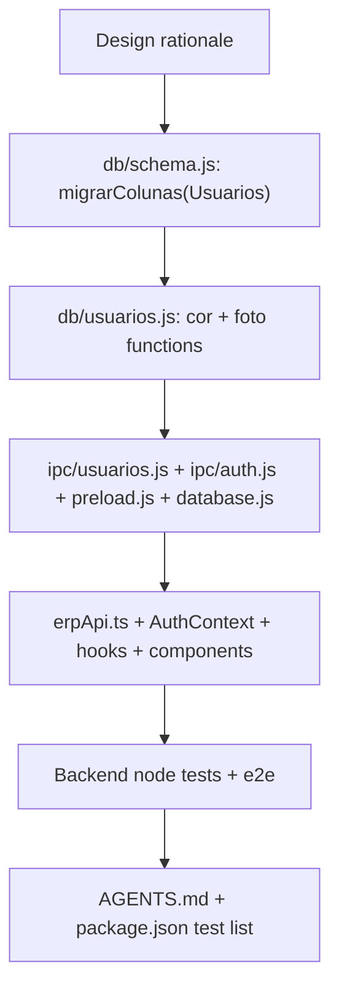

# Avatar do Usuário Logado — Cor e Foto de Perfil (feature, implemented 2026-09-10)

Owner's ask (2026-09-09): an area to give the logged-in user's header icon a random color, plus
the option to upload a photo instead. Today `UserDropdown.tsx` renders a fixed
`bg-gradient-to-br from-brand-500 to-brand-700` circle with initials — no per-user color, no
photo, no settings surface at all (confirmed by grep: `cor`/`foto`/`avatar` do not exist
anywhere in `db/schema.js` or the `Usuarios` table today).

Suggested: sonnet · medium — additive schema migration + a well-established file-image pattern
(`db/produtos.js`/`ipc/produtos.js`) copied 1:1 for a new entity; no new architecture, but touches
auth session shape end-to-end so keep effort above "low".

### Design rationale

- **Self-service, not admin-managed, in this pass.** The ask is about "o usuário logado" (any
  logged-in user), not about the admin curating other people's avatars from Gerenciar Acessos.
  `UsuarioFormModal.tsx` (the only place `salvar-usuario` is callable from — gated
  `exigirSessao("admin")` in `ipc/usuarios.js:21`) is **explicitly out of scope**: a vendedor
  can't reach that screen at all (it lives behind the `acessos` module), so building the color/
  photo picker there would miss the actual person who asked for it. Instead this adds a new
  "Meu Perfil" entry to `UserDropdown.tsx`'s own dropdown, reachable by every role.
- **Security: self-scoped by construction, never by trust.** The three new mutating IPC calls
  (save color, choose photo, remove photo) must resolve the target user from `getSessao().id`
  on the main-process side, never from an id argument sent by the renderer — otherwise any
  vendedor could pass another user's id and overwrite their avatar (an IDOR). Gate them with
  `exigirSessao()` (any authenticated session, no role check — deliberately weaker than the
  `exigirSessao("admin")` used everywhere else in `ipc/usuarios.js`, because this is the one
  self-service exception).
- **Color is a whitelist, not free-form hex.** Renderer never sends a raw color value that ends
  up interpolated anywhere — it sends one of 8 fixed palette keys reusing this project's
  existing Tailwind design tokens (`brand`, `pink`, `cyan`, `orange`, `green`, `purple`,
  `warning`, `error` — the same 8 hues `AvatarText.tsx` already uses for its unused template
  demo, see `frontend/src/app/(admin)/(ui-elements)/avatars/page.tsx`, confirmed dead/unreferenced
  elsewhere by grep). Validated against the whitelist server-side too
  (`db/usuarios.js:corAvatarValida`), so a crafted IPC call can't smuggle an arbitrary class name
  into the DOM. Solid `-500` background + white text (not `AvatarText`'s pastel-bg/colored-text
  style) because the header (`AppHeader.tsx:47`, `#0F172A`, deliberately theme-invariant per its
  own comment) needs contrast against a permanently dark background — pastel wouldn't read there.
  "Aleatória" = a shuffle button that `Math.random()`-picks one of the remaining 7 keys
  (excluding whatever's currently selected, so the button always visibly does something); the
  user can also just click a specific swatch instead of shuffling — more useful than forcing
  pure randomness with no manual override.
- **Default color when unset stays visually close to today.** `cor_avatar IS NULL` renders as
  `brand` (same hue family as the current fixed gradient), so the existing admin account in the
  screenshot doesn't visually jump the first time this ships.
- **Photo reuses the product-image convention exactly, new entity only.** `db/produtos.js:809-874`
  + `ipc/produtos.js:130-229` already solved "let the user pick a file via native dialog, copy it
  into `userData`, store only the filename in SQLite, serve it back as a base64 data URL because
  the renderer can't reach `file://` paths under this app's CSP/`app://` protocol
  (`useImagemArquivo.ts:5-9` explains why)." This plan copies that pattern 1:1 for
  `usuario-imagens/` instead of inventing a second way to store images.
- **Photo wins over color when both are set.** `foto` takes rendering priority; `cor_avatar` is
  still saved underneath so removing the photo falls back to the chosen color instead of the
  brand default.
- **Session must carry the new fields, or the header won't update without a re-login.**
  `ipc/auth.js`'s `unlock-with-profile` (`setSessao({...})`, lines 28-34) and `get-auth-session`
  (lines 66-74) both whitelist exactly which fields survive into the renderer's session — both
  need `corAvatar`/`foto` added explicitly, and `AuthContext.tsx` needs an exposed refresh so the
  new "Meu Perfil" modal can update `UserDropdown`'s avatar immediately after saving, without a
  full logout/login round-trip.
- **Out of scope (explicit, to prevent creep):** editing other users' color/photo from
  `UsuarioFormModal`/Gerenciar Acessos; free-form hex/RGB picker; client-side photo
  cropping/resizing (same as `produtos`, no cropper exists there either — rely on `object-cover`
  CSS + the same PNG/JPG/JPEG/WEBP extension whitelist); showing the photo/color anywhere besides
  the header (`UsuariosTable.tsx`'s admin list stays text-only, unchanged).

### Implementation

- [x] `db/schema.js` — extend the existing `migrarColunas(conexao, "Usuarios", {...})` call
      (currently at line 496, adds `comissao_percentual`/`permissoes`) with two more entries:
      `cor_avatar: "cor_avatar TEXT"` and `foto: "foto TEXT"`. Done when: a fresh DB and an
      upgraded pre-existing DB both end up with both columns (`PRAGMA table_info(Usuarios)` shows
      them either way — `CREATE TABLE IF NOT EXISTS` only helps new installs, `migrarColunas` is
      what backfills existing ones, same reasoning already written at schema.js:27-37).
- [x] `db/usuarios.js` — add:
      - `const CORES_AVATAR = ["brand","pink","cyan","orange","green","purple","warning","error"];`
        and `function corAvatarValida(cor) { return CORES_AVATAR.includes(cor); }`.
      - `async function atualizarCorAvatar(usuarioId, cor)` — throws if `!corAvatarValida(cor)`,
        else `UPDATE Usuarios SET cor_avatar = ? WHERE id = ?`.
      - `pastaImagensUsuarios()`, `salvarFotoUsuario(usuarioId, caminhoOrigem)`,
        `removerFotoUsuario(usuarioId)`, `getCaminhoFotoUsuario(nomeArquivo)` — copy
        `db/produtos.js:809-879`'s four functions verbatim, s/produto/usuario/,
        `usuario-imagens/` dir instead of `produto-imagens/`, `foto` column instead of `imagem`,
        filename pattern `"usuario-" + id + "-" + Date.now() + ext`. Same extension whitelist
        (`.png`/`.jpg`/`.jpeg`/`.webp`), same old-file cleanup on replace.
      - Extend the SELECT column lists in `autenticarUsuario` (lines 322-325 and the returned
        `usuario` literal at 337-344) and `getUsuario`/`listarUsuarios` (357-361, 379-382) to
        include `cor_avatar, foto`, and add `corAvatar: usr.cor_avatar, foto: usr.foto` to
        `autenticarUsuario`'s returned `usuario` object — this is what flows into `setSessao` at
        login.
      - Export the four new functions (plus `corAvatarValida` if useful for the IPC layer) from
        `module.exports` (currently lines 575-591).
      Done when: `atualizarCorAvatar` rejects an unknown key and persists a valid one;
      `salvarFotoUsuario`/`removerFotoUsuario` round-trip a real file on disk under
      `userData/usuario-imagens/`.
- [x] `database.js` — add the new `db/usuarios.js` exports to the explicit whitelist (matching
      how `salvarImagemProduto`/`removerImagemProduto`/`getCaminhoImagemProduto` are re-exported
      at lines 176-178): `atualizarCorAvatar`, `salvarFotoUsuario`, `removerFotoUsuario`,
      `getCaminhoFotoUsuario`. Done when: `require("./database").atualizarCorAvatar` etc. resolve
      (this file has no logic of its own, per its own header comment — it's a pure re-export
      whitelist, so a forgotten entry here is a silent `undefined` at the IPC layer, not a crash
      until called).
- [x] `ipc/auth.js` — `unlock-with-profile`'s `setSessao({...})` (lines 28-34) gains
      `corAvatar: resultado.usuario.corAvatar, foto: resultado.usuario.foto`; `get-auth-session`'s
      returned `usuario` object (line 72) gains `corAvatar: sessao.corAvatar, foto: sessao.foto`.
      Done when: after login, `window.api.getAuthSession()` returns both fields without a page
      reload.
- [x] `ipc/usuarios.js` — four new handlers, all `exigirSessao()` (no role arg) and all resolving
      the target user via `getSessao().id`, never a renderer-supplied id:
      - `salvar-minha-cor-avatar` (dados: `cor`) → `atualizarCorAvatar(getSessao().id, cor)`.
      - `escolher-minha-foto` → mirrors `ipc/produtos.js:132-153`'s `escolher-imagem-produto`
        (native `dialog.showOpenDialog`, same PNG/JPG/JPEG/WEBP filter) but calls
        `salvarFotoUsuario(getSessao().id, escolha.filePaths[0])` — no "pendente" two-step needed
        here (unlike a brand-new product, the logged-in user's id always already exists).
      - `remover-minha-foto` → `removerFotoUsuario(getSessao().id)`.
      - `get-foto-usuario` (nomeArquivo) → mirrors `ipc/produtos.js:217-229`'s
        `get-imagem-produto` (read file, return `data:image/<ext>;base64,...`), used to resolve
        the stored filename into something `` can actually load.
      Log each mutating call via the existing `log()` helper (`alterar-cor-avatar`,
      `alterar-foto-usuario`, `remover-foto-usuario`), same as every other handler in this file.
      **Real finding caught by the e2e spec below**: `getSessao()`/`setSessao()` (`main.js:92,
      393-396`) hold the session in memory for the life of the process — they are not re-read
      from the DB per call. The three mutating handlers must also call
      `setSessao({ ...sessao, corAvatar/foto: ... })` after a successful write, or
      `get-auth-session` keeps returning the value from login until the user logs out and back
      in, silently breaking the "no re-login needed" design goal.
      Done when: a logged-in vendedor session can call all four successfully, and a crafted call
      that tries to pass a different user's id (there's no id parameter to pass — confirms the
      self-scoping by construction) can't affect anyone else's row.
- [x] `preload.js` — expose `salvarMinhaCorAvatar(cor)`, `escolherMinhaFoto()`,
      `removerMinhaFoto()`, `getFotoUsuario(nomeArquivo)` under `window.api`, same
      `ipcRenderer.invoke(...)` one-liner style as every existing entry.
- [x] `frontend/src/lib/erpApi.ts` — extend the `Usuario` type (lines 53-63) with
      `cor_avatar: string | null; foto: string | null;`; add to the `usuarios` namespace (line
      1135): `salvarCorAvatar(cor: string)`, `escolherFoto()`, `removerFoto()`,
      `foto(nomeArquivo: string)` — same `invocar<T>(...)` wrapper every other method uses.
- [x] `frontend/src/lib/avatarCores.ts` (new) — the client-side mirror of `CORES_AVATAR`: an
      ordered array of the 8 keys plus a `Record<string, string>` mapping each key to its
      Tailwind classes (`"brand": "bg-brand-500 text-white"`, etc.). Duplicated by hand from the
      backend whitelist, same as `perfil`'s `"admin"|"dono"|"vendedor"` union is already
      independently duplicated between `erpApi.ts` and `db/usuarios.js` in this codebase — note
      the two lists in a one-line comment on each side so a future edit to one is easy to spot
      needing the other.
- [x] `frontend/src/context/AuthContext.tsx` — extend the local `Usuario` type (lines 12-16) with
      `corAvatar?: string | null; foto?: string | null;`; rename the internal `buscarSessao` call
      site so it's also exposed on the context value as `refreshSessao: () => Promise<void>`
      (add to `AuthContextType`, lines 25-32) — the new profile modal calls this after saving so
      the header updates immediately, matching how `login()` already calls `buscarSessao()`
      internally (lines 84-93).
- [x] `frontend/src/hooks/useFotoUsuario.ts` (new) — copy `useImagemArquivo.ts:1-33` verbatim,
      calling `erpApi.usuarios.foto` instead of `erpApi.produtos.imagem`.
- [x] `frontend/src/components/header/AvatarUsuarioLogado.tsx` (new) — shared render piece so
      `UserDropdown.tsx` and the new profile modal never duplicate the initials/photo logic:
      given `{ nome, corAvatar, foto, size }`, resolves `foto` via `useFotoUsuario` and renders
      either the photo (`object-cover`, rounded-full) or the initials circle
      (`avatarCores.ts` class lookup, default `"brand"` when `corAvatar` is null/unknown) — same
      `iniciais()` logic currently inlined in `UserDropdown.tsx:7-12`, moved here so both
      consumers stay in sync.
- [x] `frontend/src/components/header/UserDropdown.tsx` — replace the inline `` avatar
      (lines 41-43) with `<AvatarUsuarioLogado nome={nome} corAvatar={sessao.usuario?.corAvatar}
      foto={sessao.usuario?.foto} />`; add a "Meu Perfil" button inside the dropdown panel, above
      the existing "Sair" button (around line 80), that opens the new modal.
- [x] `frontend/src/components/header/MeuPerfilModal.tsx` (new, dedicated file — matching
      `ConfirmarInstalacaoModal.tsx`'s precedent shape per this file's own "Atualizações" section
      above, `isOpen`/`onClose` props, `Modal` from `@/components/ui/modal`): live
      `AvatarUsuarioLogado` preview; 8 clickable palette swatches (from `avatarCores.ts`) +
      "Cor aleatória" shuffle button; "Escolher foto" (calls `erpApi.usuarios.escolherFoto()`
      directly — no local file input needed, the native dialog already returns the saved result)
      and a "Remover foto" button shown only when a photo is currently set; on save, call
      `refreshSessao()` from `AuthContext` and close.

### Tests

- [x] `test/usuarios-avatar.test.js` (new, mirrors `test/usuarios-hierarquia.test.js:1-28`'s
      temp-DB setup): `atualizarCorAvatar` rejects an unknown key and persists a valid one;
      `autenticarUsuario`'s returned `usuario` object carries `corAvatar`/`foto` after login (null
      by default, the saved value after `atualizarCorAvatar`). **Deviation from the original plan,
      found while writing this**: `salvarFotoUsuario`/`removerFotoUsuario` call
      `app.getPath("userData")` (electron) — same as `db/produtos.js`'s
      `salvarImagemProduto`/`removerImagemProduto` already do — which isn't available under plain
      `node --test` (confirmed: `require("electron")` outside the Electron main process doesn't
      expose `app`). This project's own precedent for the product-image equivalent is to leave
      that half untested at the `node --test` layer and cover it only via Playwright e2e (real
      Electron process) instead — same split applied here, see `e2e/meu-perfil.spec.ts` below.
      Added `test/usuarios-avatar.test.js` to `package.json`'s `test` script (the explicit file
      list at line 9 — this repo doesn't glob, every file is named there). Verified: all 3 cases
      pass, plus the pre-existing 175 (178/178 total, `npm test`).
- [x] `e2e/meu-perfil.spec.ts` (new, mirrors `e2e/produtos-cadastro.spec.ts`'s
      `electronApp.evaluate(async ({ dialog }, caminho) => { dialog.showOpenDialog = ... })`
      mocking pattern, lines 120-126): open "Meu Perfil" from `UserDropdown`, click a color
      swatch, close, assert the header avatar's class reflects the chosen color; click "Cor
      aleatória", assert the class lands on one of the 8 valid tokens; mock the file dialog with a
      fake PNG, click "Escolher foto...", assert "Remover foto" appears and the header avatar
      becomes an ``; click "Remover foto", assert it falls back to the color+initials
      rendering. **Real bug this test caught and led to fixing** (not just a passing check written
      after the fact): the first run failed because `get-auth-session` kept returning the avatar
      fields from login time — `ipc/usuarios.js`'s mutating handlers weren't updating the
      in-memory session (see the Implementation item above), so `refreshSessao()` had nothing new
      to read. Fixed there, not worked around here. Verified: 3/3 passing, plus all 13 pre-existing
      e2e specs still pass (16/16 total, `npm run test:e2e`).
- [x] Regression: `npm test` (backend, 178/178) and `npm run test:e2e` (16/16) both fully green,
      not just the new specs in isolation — same bar every other module entry in this file holds
      itself to.

### Registration

- [x] `AGENTS.md` §"Funcionalidades Implementadas" (line 324) — append a dated
      "**Adicionado `<data>`**" paragraph (same convention already used there for the 2026-09-03
      entry at lines 328-335) describing the self-service avatar color/photo addition, so the
      next session reading this file's summary doesn't miss that it exists.
- [x] `npm run lint`, `npm run typecheck` (root + `frontend`), and `frontend && npm run build`
      all clean — zero new warnings introduced by this change, same bar as every other module
      entry in this file. Verified: root lint clean; `frontend && npm run lint` clean (same 2
      pre-existing unrelated warnings as the "Atualizações" entry above); `frontend && npm run
      build` succeeds (39/39 static pages); `frontend && npm run typecheck` (bare `tsc --noEmit`)
      shows the same ~27 pre-existing `IntrinsicAttributes`/`className` errors documented in the
      "Atualizações" entry above, none in any file this plan touched (confirmed by grep — no
      `avatarCores`/`AvatarUsuarioLogado`/`MeuPerfilModal`/`useFotoUsuario` hits); `next build`'s
      own stricter type-check pass, which actually gates the shipped build, is clean.

**Ordering rule**: Design rationale before Implementation — the self-scoping security decision
and the color-whitelist-vs-hex decision are referenced directly by the implementation items, not
details to improvise while coding. Within Implementation: schema migration → `db/usuarios.js` →
`database.js`/`ipc/auth.js`/`ipc/usuarios.js`/`preload.js` → frontend, since each layer's item
depends on the one before it existing. Tests after Implementation — nothing to assert on yet.
Registration last, matching every other module entry in this file.
