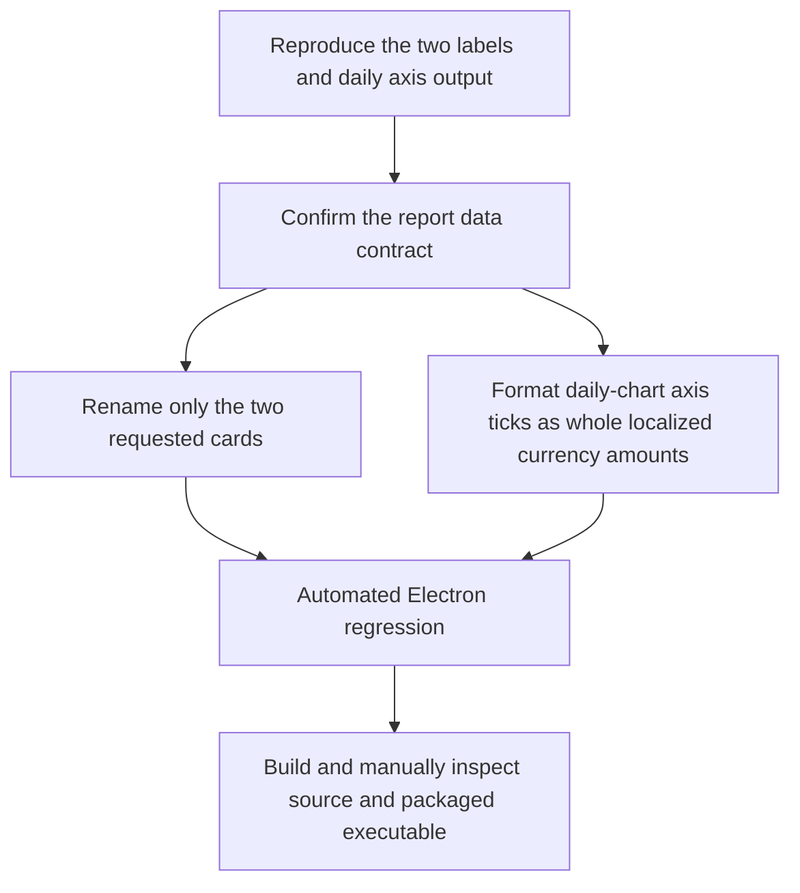

## GOALS 21 — Reports: gross-revenue labels and readable daily-chart scale (fix, completed)

**Owner-reported (2026-09-12):** the report shows the net sale total under inconsistent labels
(`Faturamento` / `Total faturado`), and the daily-sales chart emits axis ticks such as
`5000.0000000000000`. The requested presentation contract is **Faturamento bruto** for the two
identified amount cards, with no alteration to values, SQL, discounts, or cash-flow calculations.
`Vendas.total` is already the persisted sale total after its discount (and any applicable
commercial adjustment); therefore this is an owner-requested presentation-only rename, not a
financial definition or a correction to the amount.

The screenshots must not be used to infer a financial calculation change. In particular, the cash
flow tab intentionally differs from revenue: it has separate realized and projected event sets.
With the screenshot values, `R$ 5.966,47` realized entries and `R$ 0,00` realized exits produce a
realized balance of `R$ 5.966,47`; the separate projected balance of `-R$ 3.995,23` means that
open payable amounts due in that projection period exceed open receivable amounts due in the same
period by `R$ 3.995,23`. It is not subtracted from the realized balance and is not a profit/loss
calculation.

Suggested: gpt-5.6-terra · medium — this is a contained React/ApexCharts correction, but it must
preserve the established distinction between gross sales, discounts, realized cash, and projected
cash without changing financial data.

### Reproduction and root cause

- [x] **GOALS21-01 — Reproduce the exact rendered contract in an isolated Electron run.** Use a
  temporary user-data directory and finalized sample sales with a non-zero discount, then open
  Relatórios > Vendas. Capture the two requested cards and the `PorDiaChart` SVG tick text before
  any change. Also identify whether the currently installed/package resource is stale when it
  displays `Total faturado` although current source has `Faturamento` in `RelatoriosStats`.
  **Done when:** the implementation notes state which source component renders each card in the
  active frontend and whether the tested executable contains the current `frontend/out` asset.

- [x] **GOALS21-02 — Record the real causes before editing.** Confirm that
  `db/relatorios.js:getRelatorioVendas()` uses `SUM(Vendas.total)` for `resumo.faturamento` and
  reports `SUM(Vendas.desconto)` separately, while `Vendas.total` is the post-discount persisted
  sale total; no backend rename or accounting change is needed.
  Confirm that `frontend/src/components/relatorios/RelatoriosCharts.tsx:PorDiaChart` currently
  provides a tooltip formatter but no `yaxis.labels.formatter`, leaving ApexCharts to serialize
  its floating-point tick values. Confirm separately that `db/financeiro.js` builds realized from
  finalized non-Fiado sales, paid receivables, paid payables and refunds, whereas projected uses
  only open receivables/payables by due date.
  **Done when:** the change description names these mechanisms and explicitly excludes edits to
  `db/relatorios.js`, `db/financeiro.js`, IPC contracts, amounts, and discount formulas.

### Fix

- [x] **GOALS21-03 — Apply the two requested gross-revenue labels, and nothing semantic.** In
  `frontend/src/components/relatorios/RelatoriosStats.tsx`, render the sales-summary card as
  `Faturamento bruto`. In `frontend/src/components/vendas/VendasStats.tsx`, replace the separate
  `Total faturado` card label with the same exact text. These are separate Relatórios tabs and
  must be verified independently. Do not rename data fields, series data, database columns, PDF
  terms, or dashboard labels unless a fresh reproduction proves one is the same requested card.
  **Done when:** both target cards visibly say `Faturamento bruto` while their displayed amount,
  previous-period variation, ticket average, and discounts card are byte-for-byte/value-for-value
  unchanged for the same fixture.

- [x] **GOALS21-04 — Format only the report's daily-chart Y axis.** Add a local
  `pt-BR` number formatter to `PorDiaChart` in
  `frontend/src/components/relatorios/RelatoriosCharts.tsx`, with zero fractional digits, and use
  it as `yaxis.labels.formatter`. Keep the tooltip's existing `formatarMoeda` output, series data,
  chart scale selection, and other report/dashboard charts unchanged.
  **Done when:** every visible daily-chart Y-axis tick is a localized whole-number label (for
  example `5.000`, never `5000.0000000000000`) while the hover tooltip retains cent precision
  (for example `R$ 4.104,20`).

### Regression verification and packaged-app gate

- [x] **GOALS21-05 — Add an Electron UI regression test.** Add a focused Playwright Electron
  spec under `e2e/` that bootstraps an isolated admin, creates or seeds finalized sales including
  a cent value and a discount through supported test setup, asserts `Faturamento bruto` on
  Relatórios > Análises, then navigates to the separate Relatórios > Vendas tab and asserts its
  `Faturamento bruto` label. Read the rendered ApexCharts Y-axis SVG text and assert that no tick
  contains a decimal point followed by a long run of zeros, while a tooltip over a known bar still
  contains the cent-formatted amount. This test must fail against the
  current labels/axis configuration and pass after GOALS21-03..04.
  **Done when:** `npx playwright test <new-spec>` exits 0 in its disposable user-data directory
  and demonstrably protects both label and axis regressions.

- [x] **GOALS21-06 — Run static checks and verify the build artifact [manual].** Run
  `cd frontend && npm run lint`, `npm run typecheck`, and `npm run build`, then use
  `npx electron-builder --dir --win` and confirm
  `dist/win-unpacked/resources/frontend/out/index.html` is present and refreshed by the existing
  `beforePack` hook. Open that unpacked executable with a disposable user-data directory and
  manually inspect the same report after login. If a separate installed executable is available,
  inspect its version/resources too; do not modify, reinstall, move, or delete it.
  **Done when:** the source build and unpacked executable both show the two labels and clean axis;
  any installed-executable version mismatch is reported as a release/build freshness issue rather
  than silently attributed to the database.

**Done when:** the two specifically requested UI cards read `Faturamento bruto`, the daily revenue
chart no longer exposes floating-point noise on its axis, all monetary semantics remain unchanged,
and an isolated Electron check verifies both source build and packaged output.

**Ordering rule:** reproduce and establish the accounting/UI causes first (GOALS21-01..02), then
make the label-only and formatter-only changes (GOALS21-03..04). The focused Electron regression
(GOALS21-05) is the completion gate for the fix, followed by the static and packaged-artifact
verification (GOALS21-06); never rebuild or replace an installed customer application as part of
this goal.

**Execution status (2026-09-12):** The owner manually confirmed the labels, axis formatting,
regression behavior, and executable result after the source edits. GOALS21-01..06 are therefore
behaviorally verified; no financial or cash-flow semantics were changed.
